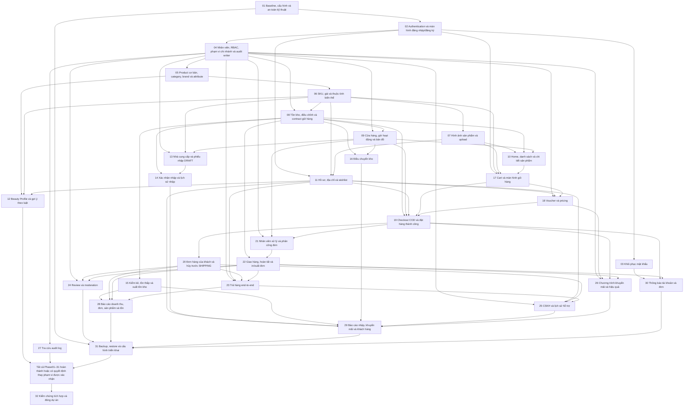

# Master Development Roadmap

> Phase04 follow-up 2026-10-08: gap direct Spring-service permission bypass ở catalog mutations/supplier/voucher đã **COMPLETED**; giữ **IMPLEMENTED_AND_TESTED_LOCAL**, D01/D02/matrix/single initial ADMIN và dependency02→04→05. Staff CRUD/scope/audit không dựng lại; Java21/H2 và PostgreSQL16.15 test riêng **69/69**, staff21, HTTP default PostgreSQL **18/18**, Edge demo **28/28**, package PASS. Phase05 dùng services có permission guards hiện hành và AuditWriter MANDATORY; D04/phần D16 chỉ chặn phần phụ thuộc. Legacy inventory/migration, last-admin concurrency stress và empty role/store UI states chưa được claim. [Completion report04](Phase04.md#phiên04--tái-kiểm-chứng-và-hoàn-thiện-gap-ngày-2026-10-08); dừng tại04.

> Phase03 follow-up 2026-10-08: capability reset-link/hash/expiry/one-time/rate-limit/rollback/revoke và SMTP/demo đã tồn tại; chỉ hoàn thiện CSRF recovery/reset sau session expiry. H2/PostgreSQL test riêng **61/61**, recovery17; Edge DOM/HTTP **26/26**, default PostgreSQL HTTP **11/11** và package PASS. Giữ **IMPLEMENTED_AND_TESTED_LOCAL**, D03/D01/D02 và dependency. `testConnection()` SMTP đã thành công theo report trước, delivery tới hộp thư vẫn UNVERIFIED; legacy inventory/migration còn pending. D11 chỉ Phase30, không mở notification scope. [Phase03 report](Phase03.md#phase-completion-report).

> Phase01 follow-up 2026-10-08: hoàn thiện đúng gap runner demo/DB guard/read-only inventory, giữ **IMPLEMENTED_AND_TESTED_LOCAL** và legacy inventory còn mở. Java21/H2 và PostgreSQL16.15 DB test riêng56/56 PASS; startup/schema validate/HTTP trên test16 và Supabase mới PASS. Supabase17.11 có38 bảng/55 FK orphan checks0, không thay cho dữ liệu DB cũ5432 chưa truy cập được. Contract test URL giờ yêu cầu host/database `_test` rõ và từ chối database/service overrides; Supabase `postgres` không được chạy create/drop test. [Evidence/handoff01](Phase01.md#tái-kiểm-chứng-phiên01-ngày-2026-10-08). D14 vẫn OPEN chỉ ghi phạm vi; không đổi domain decisions hoặc dependency DAG, không chạy Phase sau.

> Phase02 follow-up 2026-10-08: auth/session/CSRF/remember/revoke capability đã tồn tại; chỉ hoàn thiện hai gap UI và regression. Java21/H2 **56/56**, package PASS, Edge/HTTP **27/27** trên demo riêng; timed expiry 3/6 giây thực tế PASS. Giữ **IMPLEMENTED_AND_TESTED_LOCAL**, dependency và D01/D02; chưa chờ thời lượng mặc định/HTTPS thật hoặc inventory/migration legacy. Supabase schema mới/app local theo report ngày 08/10 không thay evidence legacy. [Completion report Phase02](Phase02.md#phase-completion-report); không thực hiện thêm Phase03/04 hoặc Phase sau trong phiên này.

> Update 2026-10-07: Phase01–04 **IMPLEMENTED_AND_TESTED_LOCAL** theo yêu cầu hoàn thiện phase1–4 và giao diện cơ bản để test. Java21/H2 và PostgreSQL16.15:52/52 tests pass; browser15 checkpoints pass. Xem [completion report](../PHASE_01_04_REPORT.md). Database cũ5432/migration dữ liệu deployed và SMTP thật chưa kiểm chứng. Các mô tả NOT_STARTED/source REST-only ở baseline bên dưới là lịch sử; Phase05–32 vẫn NOT_STARTED.

> Baseline: commit `1e27c8e0f91c3946262779bdc8a2b3c8234b05a0`; audit 2026-10-07. Đây là roadmap tiếp tục dự án hiện hữu, không phải dựng mới. Tất cả Phase hiện `NOT_STARTED`; tạo tài liệu không đồng nghĩa đã thực hiện Phase.

## 1. Mục tiêu và cách sử dụng

Đọc [Project Audit](00_PROJECT_AUDIT.md), chọn Phase có dependency đã hoàn thành, đọc toàn bộ Phase và xác minh lại Current State trước sửa code. Phase Completion Report là nguồn bàn giao sau thực hiện; ghi decision/deviation và cập nhật audit/roadmap theo thay đổi thật.

Chỉ sửa phần thiếu hoặc sai theo requirement. Giữ CRUD đã hoạt động, MapStruct/layer conventions, snapshots, voucher PERCENT/FIXED đã có test, purchase/transfer state guards và cart/wishlist operations đúng. UI/schema/auth đang mở gate không được tự suy diễn. Một Phase có gate mở có thể làm phần độc lập, nhưng không được báo COMPLETED toàn bộ.

Phạm vi documentation hiện tại: 35 file Markdown, không thay API/entity/DB/UI/dependency và không bắt đầu Phase01. Source hiện là REST API; không có Thymeleaf, Bootstrap, SiteMesh, JWT hoặc frontend đã triển khai. Những công nghệ này chỉ được dùng sau quyết định tương ứng.

## 2. Baseline và thứ tự ưu tiên

- Java21 compile và 9/9 test pass khi override H2; PostgreSQL localhost5432 refused. Xem evidence/commands/giới hạn tại Audit §1 và §17. H2 không chứng minh PostgreSQL runtime/schema hoặc E2E.
- Ưu tiên identity/ownership, data integrity và stock transaction trước checkout/fulfillment. UI bán hàng cần SKU/price/images/available contracts.
- Schema deployed hiện UNKNOWN. Mỗi migration phải kiểm kê duplicate/null/orphan/historical values trước thêm constraints; không reset DB hoặc thay composite/surrogate IDs chỉ vì biểu diễn khác.
- TECHNICAL RECOMMENDATION: versioned migration/runbook, test isolation, semantic errors và atomic stock/voucher workflows cần để tiếp tục an toàn; không đổi framework/DB hoặc refactor lớn.
- Checked exception sau một phần ghi dữ liệu là rủi ro cần regression theo workflow; không đổi blanket transaction policy chỉ vì mọi service có annotation. [Spring rollback defaults](https://docs.spring.io/spring-framework/reference/data-access/transaction/declarative/rolling-back.html).

## 3. Danh sách Phase và kết quả

Goal/Main Modules trong bảng là phần việc còn thiếu; chi tiết IN/OUT scope ở từng Phase. Complexity/Risk dùng LOW/MEDIUM/HIGH; không ước lượng thời gian khi chưa có thông tin.

| Phase | Goal | Depends On | Main Modules / Requirements | Expected Result | Complexity | Risk |
|---|---|---|---|---|---|---|
| [Phase01](Phase01.md) | Baseline, cấu hình và an toàn kỹ thuật | NONE | Config/build/DB/error | Java21 và PostgreSQL có baseline kiểm chứng; contract lỗi và phương án migration được ghi rõ | MEDIUM | HIGH |
| [Phase02](Phase02.md) | Authentication và màn hình đăng nhập/đăng ký | [Phase01](Phase01.md) | UC01, UC02, UC09 | Credential bảo vệ; identity/session phù hợp quyết định; login/register/logout được kiểm chứng | HIGH | HIGH |
| [Phase03](Phase03.md) | Khôi phục mật khẩu | [Phase02](Phase02.md) | UC03 | Xác minh và reset mật khẩu an toàn; cơ chế delivery theo quyết định | MEDIUM | HIGH |
| [Phase04](Phase04.md) | Nhân viên, RBAC, phạm vi chi nhánh và audit writer | [Phase02](Phase02.md) | UC82, UC83, UC84, UC85, UC86 | Staff identity, role AND scope thực thi; CRUD hiện có được sửa; audit writer dùng được | HIGH | HIGH |
| [Phase05](Phase05.md) | Product cơ bản, category, brand và attribute | [Phase04](Phase04.md) | UC29, UC31, UC32, UC33, UC34 | CRUD còn thiếu hoàn chỉnh, không mất history; taxonomy đáp ứng quyết định | MEDIUM | MEDIUM |
| [Phase06](Phase06.md) | SKU, giá và thuộc tính biến thể | [Phase05](Phase05.md) | UC30, UC35 | CRUD/tra cứu SKU và dữ liệu giá/attribute đủ cho bán hàng | HIGH | MEDIUM |
| [Phase07](Phase07.md) | Hình ảnh sản phẩm và upload | [Phase06](Phase06.md) | UC36 | Ảnh/SKU/ảnh chính lưu và hiển thị đúng; lỗi upload có recovery | MEDIUM | MEDIUM |
| [Phase08](Phase08.md) | Tồn kho, điều chỉnh và contract giữ hàng | [Phase04](Phase04.md), [Phase06](Phase06.md) | UC49, UC51, UC54, UC55 | actual≥held≥0; available=actual−held; biến động stock atomic | HIGH | HIGH |
| [Phase09](Phase09.md) | Cửa hàng, giờ hoạt động và bản đồ | [Phase04](Phase04.md), [Phase08](Phase08.md) | UC38, UC39, UC40, UC41, UC42 | Store info/hours/location và view available stock hoạt động | MEDIUM | MEDIUM |
| [Phase10](Phase10.md) | Home, danh sách và chi tiết sản phẩm | [Phase07](Phase07.md), [Phase08](Phase08.md), [Phase09](Phase09.md) | UC04, UC05, UC06, UC07, UC08 | Ba screen và search/filter/sort/paging hoạt động trên dữ liệu active | HIGH | MEDIUM |
| [Phase11](Phase11.md) | Hồ sơ, địa chỉ và wishlist | [Phase02](Phase02.md), [Phase06](Phase06.md), [Phase07](Phase07.md) | UC10, UC11, UC14 | Ownership profile/address/wishlist đúng; địa chỉ mặc định và giá wishlist đúng | MEDIUM | HIGH |
| [Phase12](Phase12.md) | Beauty Profile và gợi ý theo luật | [Phase05](Phase05.md), [Phase06](Phase06.md), [Phase11](Phase11.md) | UC12, UC13 | Beauty optional và kết quả phù hợp rule được duyệt, không AI | MEDIUM | MEDIUM |
| [Phase13](Phase13.md) | Nhà cung cấp và phiếu nhập DRAFT | [Phase04](Phase04.md), [Phase06](Phase06.md), [Phase09](Phase09.md) | UC43, UC44, UC45, UC48 | DRAFT purchase chỉnh sửa được, dữ liệu/role/scope hợp lệ | MEDIUM | MEDIUM |
| [Phase14](Phase14.md) | Xác nhận nhập và lịch sử nhập | [Phase08](Phase08.md), [Phase13](Phase13.md) | UC46, UC47, UC50 | Confirm đúng một lần, tăng actual đúng và history tìm được | MEDIUM | HIGH |
| [Phase15](Phase15.md) | Kiểm kê, tồn thấp và xuất tồn kho | [Phase08](Phase08.md) | UC52, UC56, UC57 | Stocktake dùng adjustment; low stock theo available≤minimum; export khớp | MEDIUM | MEDIUM |
| [Phase16](Phase16.md) | Điều chuyển kho | [Phase08](Phase08.md), [Phase09](Phase09.md) | UC53 | PENDING→IN_TRANSIT→RECEIVED có stock update đúng một lần | MEDIUM | HIGH |
| [Phase17](Phase17.md) | Cart và màn hình giỏ hàng | [Phase02](Phase02.md), [Phase06](Phase06.md), [Phase07](Phase07.md), [Phase10](Phase10.md) | UC15, UC16, UC17, UC18 | Cart UI nối đúng API; không hold stock trong cart; không sửa cart khác | MEDIUM | HIGH |
| [Phase18](Phase18.md) | Voucher và pricing | [Phase04](Phase04.md), [Phase11](Phase11.md), [Phase17](Phase17.md) | UC19, UC20, UC71, UC77, UC78, UC79 | Quote/discount nhất quán, FREESHIP và quota đúng quyết định | HIGH | HIGH |
| [Phase19](Phase19.md) | Checkout COD và đặt hàng thành công | [Phase08](Phase08.md), [Phase09](Phase09.md), [Phase11](Phase11.md), [Phase17](Phase17.md), [Phase18](Phase18.md) | UC21 | Order COD/snapshots/holds/voucher/cart commit hoặc rollback cùng nhau | HIGH | HIGH |
| [Phase20](Phase20.md) | Đơn hàng của khách và hủy trước SHIPPING | [Phase19](Phase19.md) | UC22, UC23, UC24, UC25 | Khách chỉ xem/hủy đơn của mình ở trạng thái được thiết kế cho phép | MEDIUM | HIGH |
| [Phase21](Phase21.md) | Nhân viên xử lý và phân công đơn | [Phase04](Phase04.md), [Phase09](Phase09.md), [Phase19](Phase19.md) | UC65, UC66, UC67, UC68, UC69, UC70 | Staff tìm/xác nhận/assign/status/cancel đúng scope và state machine | HIGH | HIGH |
| [Phase22](Phase22.md) | Giao hàng, hoàn tất và in/xuất đơn | [Phase08](Phase08.md), [Phase21](Phase21.md) | UC72, UC73, UC75 | Shipping/complete/stock/print đồng nhất, thao tác lặp không commit stock hai lần | HIGH | HIGH |
| [Phase23](Phase23.md) | Trả hàng end-to-end | [Phase04](Phase04.md), [Phase11](Phase11.md), [Phase20](Phase20.md), [Phase22](Phase22.md) | UC26, UC62, UC63, UC74 | Return đúng owner/item/qty/policy; accepted disposition cập nhật stock đúng | HIGH | HIGH |
| [Phase24](Phase24.md) | Review và moderation | [Phase04](Phase04.md), [Phase20](Phase20.md), [Phase22](Phase22.md) | UC27, UC28, UC37 | Review được xác minh bằng OrderItem; moderation không xóa lịch sử | MEDIUM | HIGH |
| [Phase25](Phase25.md) | CSKH và lịch sử hỗ trợ | [Phase04](Phase04.md), [Phase11](Phase11.md), [Phase20](Phase20.md), [Phase23](Phase23.md) | UC58, UC59, UC60, UC61, UC64 | Customer search/profile/history/lock/support đúng quyền và gate | HIGH | HIGH |
| [Phase26](Phase26.md) | Chương trình khuyến mãi và hiệu quả | [Phase04](Phase04.md), [Phase18](Phase18.md), [Phase19](Phase19.md), [Phase22](Phase22.md) | UC76, UC80, UC81 | Program model được chốt; voucher được tái sử dụng; hiệu quả/export đúng | HIGH | HIGH |
| [Phase27](Phase27.md) | Tra cứu audit log | [Phase04](Phase04.md) | UC87 | Audit search/filter/paging có role protection; writer được tái sử dụng | MEDIUM | MEDIUM |
| [Phase28](Phase28.md) | Báo cáo doanh thu, đơn, sản phẩm và tồn | [Phase15](Phase15.md), [Phase20](Phase20.md), [Phase22](Phase22.md), [Phase23](Phase23.md) | UC88, UC89 | Aggregates chỉ tính COMPLETED nơi thiết kế quy định; inventory reuse | MEDIUM | MEDIUM |
| [Phase29](Phase29.md) | Báo cáo nhập, khuyến mãi và khách hàng | [Phase11](Phase11.md), [Phase14](Phase14.md), [Phase15](Phase15.md), [Phase16](Phase16.md), [Phase25](Phase25.md), [Phase26](Phase26.md) | UC90, UC91 | Operational reports khớp purchase/promotion/customer dữ liệu thật | HIGH | MEDIUM |
| [Phase30](Phase30.md) | Thông báo tài khoản và đơn | [Phase03](Phase03.md), [Phase19](Phase19.md), [Phase22](Phase22.md) | SYS-22 / delivery | Delivery đúng kênh/sự kiện, failure không làm hỏng giao dịch domain | MEDIUM | MEDIUM |
| [Phase31](Phase31.md) | Backup, restore và cấu hình triển khai | [Phase01](Phase01.md), [Phase24](Phase24.md), [Phase28](Phase28.md), [Phase29](Phase29.md), [Phase30](Phase30.md) | SYS-28–29 / operations | Backup/restore thử nghiệm thành công; cấu hình/HTTPS có evidence | MEDIUM | HIGH |
| [Phase32](Phase32.md) | Kiểm chứng tích hợp và đóng dự án | 01–31 | Toàn hệ thống | Final checklist và coverage đóng bằng evidence, không còn blocker chưa xử lý | HIGH | HIGH |

## 4. Dependency graph

Mỗi mũi tên biểu diễn precondition thật, không có dependency vòng. Nút ALL kết hợp ba nhánh cuối Phase12/27/31; các dependencies của chúng bao phủ Phase01–31 theo quan hệ bắc cầu. Bảng trên vẫn là nguồn dependency đầy đủ của Phase32.

### Nhánh có thể thực hiện song song

- Sau Phase02: Phase03 recovery; Phase04 staff; Phase11 chỉ sau SKU/image dependency. UI gate vẫn áp dụng.
- Sau Phase04: nhánh05→06→07 catalog; Phase27 audit-query có thể dùng fixture và writer contract04. Không buộc query chờ mọi workflow.
- Sau Phase06: Phase08 stock song song Phase07 media khi file ownership tách rõ. Phase08 dùng StoreEntity/CRUD có sẵn, không chờ Phase09.
- Sau Phase08–09: Phase13→14 procurement, Phase15 stocktake và Phase16 transfer có thể chạy song song khi stock primitives đã đóng.
- Sau Phase19: Phase20 customer orders và Phase21 staff orders. Cùng sửa OrderServiceImpl phải chia ownership hoặc tích hợp tuần tự; không tự coi dependency graph là bảo đảm không conflict.
- Phase24 review và Phase26 promotions có thể tách nhánh sau prerequisites; Phase28–29 dùng aggregates của module đã ổn định.

### Những file dễ xung đột

Owner thay đổi dùng chung phải rõ: stock primitives/locking/invariants thuộc08; thêm releasedAt cho release flow thuộc20; order receiving/money/snapshot constraints thuộc19. Phase21/22 reuse các contract này. Khi prerequisite thiếu một phần DoD, ghi defect/deviation và phối hợp owner; không tạo migration hoặc primitive lần hai.

| Shared concern | Phases | Quy tắc phối hợp |
|---|---|---|
| Account/CustomerServiceImpl và identity contract | 02–04, 11–12, 25 | Freeze principal/ownership contract; không hai phiên cùng sửa account update khác nhau |
| Product/SKU/attributes DTO và mapping | 05–07, 10, 12, 17 | Phase06 chốt dữ liệu đọc; consumer không tự đổi schema |
| InventoryRepository/InventoryServiceImpl | 08, 14–16, 19, 22–23 | Phase08 sở hữu primitives/locking; workflow sau tích hợp, không viết reserve/adjust khác |
| OrderServiceImpl/status/hold/voucher | 18–23, 28, 30 | Phase19 transaction checkout;20 cancellation;21 staff transitions;22 fulfillment; phối hợp theo report |
| Voucher/pricing/report | 18–19, 26, 29 | Quote contract và policy phải chung; program chưa chốt không lấn vào18 |
| Shared UI/layout và API error response | Các Phase UI | D01 và Phase01/02 contract; reuse component, không viết lại screen đã đóng |

## 5. Decision Register

OPEN là trạng thái quyết định, không phải implementation status. Người dùng chọn ghi quyết định cần chốt; không mặc định recommendation đã được duyệt. Khi giải quyết, ghi câu hỏi, quyết định, người xác nhận, ngày, evidence và các Phase cần cập nhật. Ghi ngay trong bảng/report; không biến assumptions thành quyết định ngầm.

| ID | Area | Evidence / Conflict | Decision Required | Recommendation | Affected Phases | State / Unlock Condition |
|---|---|---|---|---|---|---|
| D01 | UI/auth + layout quản trị | Baseline chưa có frontend/security; người dùng yêu cầu giao diện cơ bản để test phase1–4. | Thực hiện giao diện tối giản và cơ chế identity tương thích API hiện có. | Agent chọn HTML/CSS/JS static cùng origin, session + CSRF; không thêm framework frontend. | 02–32 có UI; 02/04 security | IMPLEMENTED_FOR_LOCAL_TEST 2026-10-07 — Chọn trong scope được giao; [contract/evidence](../PHASE_01_04_REPORT.md). Không ghi nhận người dùng duyệt từng chi tiết riêng. |
| D02 | Login/register và state UI | Theo UI min8 chữ/số, email/phone, confirm/terms; không customer bypass. | Email normalize; phone optional9–15digits; BCryptmax72bytes; nhân viên email/login và internalEmail rõ. | Session30m, remember7d idle; inactive/revoke/logout server-side. | 02,04 | IMPLEMENTED_FOR_LOCAL_TEST 2026-10-07; giữ policy khi kiểm chứng 2026-10-08 — auth14 H2 PASS, Edge/HTTP27 PASS; validation/disabled submit và CSRF khi login lại đã hoàn thiện. Timed servlet 3/6 giây PASS; chưa chờ 30m/7d mặc định. PG evidence thuộc phiên trước. [Report](Phase02.md#phase-completion-report). |
| D03 | Recovery | UC03 xác minh một lần; basic UI test được giao. Report mới đã xác nhận SMTP testConnection kết nối/xác thực, chưa xác minh inbox delivery. | Reset link32bytes/SHA256, TTL15m configurable; request3/identifier và10/IP/15m, reset10/IP/15m. | SMTP adapter; mailbox demo chỉloopback/in-memory; generic response và transactionalrollback. | 03, 30 | IMPLEMENTED_FOR_LOCAL_TEST; giữ quyết định theo user phiên03 2026-10-08. Recovery17 H2/PG PASS, suite61/61, Edge26/26, default PG HTTP11/11; CSRF trước submit đã hoàn thiện. SMTP inbox delivery pending, phải xác định mailbox/phạm vi gửi; không dùng testConnection thay delivery. [Report](Phase03.md#phase-completion-report). |
| D04 | Taxonomy và SKU | Design Category self-parent; source Brand parent; SKU thiếu listPrice/barcode, có shade/volume; Attribute thiếu group. | Chốt mapping bổ sung/giữ extra fields và xử lý dữ liệu cũ; không tự xóa Brand hierarchy. | Đối chiếu bảng113–118 và field usage; đề xuất đạt capability thiết kế, giữ dữ liệu lịch sử. | 05–06 | OPEN — Mapping được duyệt; duplicate/null/orphan audit và migration strategy. |
| D05 | Store/hours/address/location | Store chuỗi operatingHours/Double so với TIME/DECIMAL; checkout UI province/ward khác địa chỉ district. Chưa có policy khi xóa địa chỉ mặc định. | Chốt giờ/địa chỉ/tọa độ được giữ/đổi; config Google Maps theo thiết kế; không chọn provider địa giới ngoài scope. Chốt giữ không-default hay chọn địa chỉ thay thế khi default bị xóa. | Giữ thông tin cũ; migration có xác nhận; không suy diễn giờ không parse được. | 09, 11, 19 | OPEN — Field contract, policy default-address deletion và xử lý legacy được ghi; có config/quyền dịch vụ cần thiết. |
| D06 | Shipping/pricing/FREESHIP | Source miễn ship subtotal≥500000; ui-image10 charge30000 cả subtotal4292000; FREESHIP rơi vào fixed-discount branch. | Chốt công thức phí và miễn phí, voucher eligibility/targets, treatment FREESHIP. Chốt thời điểm consume/restore quota khi cancel, date-boundary/timezone và money rounding. | Tách tiền giảm hàng và giảm phí ship trong quote; ví dụ mockup không tự thành fee policy. | 18–22, 26 | OPEN — Policy phí/eligibility/quota lifecycle/date/money có examples/boundaries được xác nhận; preview/checkout/cancel dùng chung contract. |
| D07 | Return policy | KH-QĐ14/QLDH-QĐ7 yêu cầu policy và disposition; tài liệu không có window/refund details. | Chốt eligible status/time/qty/reason, refund và xử lý accepted items. | Không đặt 7/14/30 ngày; stock chỉ tăng khi disposition cho phép và đúng một lần. | 23; 28 liên quan số liệu | OPEN — Policy/transition/disposition và ảnh hưởng reports được ghi. |
| D08 | Review legacy | Bảng130 FK OrderItem; source ReviewEntity FK Order; multi-item legacy không suy ra duy nhất. | Chốt cách mapping/reconcile hoặc bảo toàn legacy chưa xác minh. | Không chọn OrderItem bất kỳ; kiểm kê legacy, test migration không mất nội dung. | 24 | OPEN — Mapping có bằng chứng; review mới bắt buộc đúng purchase line; legacy disposition ghi rõ. |
| D09 | UC64 support history | Có use case lịch sử hỗ trợ nhưng không có bảng/model source hoặc schema37bảng. | Chốt dữ liệu, quyền, workflow tối thiểu và nguồn lịch sử. | Không phát minh ticket/chat; giữ UC64 NOT_STARTED và đề xuất riêng để review. | 25 | OPEN — Model/I/O/actor/workflow được duyệt trước create entity/API/UI. |
| D10 | UC76 PromotionProgram | system-image24 có Program–Voucher; UC76 có CRUD program; schema37bảng chỉ có Voucher. | Chốt entity program riêng hay tổ chức voucher; phạm vi/precedence; mâu thuẫn Design vs Design. | Không coi Voucher thay toàn bộ UC76; tái sử dụng Phase18 khi model được chốt. | 26, 29 | OPEN — Model, relationship, discount scopes và historical policy ghi rõ. |
| D11 | Notifications | SYS-22 yêu cầu account/order notifications, chưa rõ kênh/người nhận/sự kiện. | Chốt events/recipients/channel và lỗi delivery; adapter recovery reuse nếu phù hợp. | TECHNICAL RECOMMENDATION: delivery sau commit, lỗi provider không rollback order; không thêm broker mặc định. | 30; 03 tích hợp dùng chung | OPEN — Event matrix/channel/config/failure behavior được ghi. |
| D12 | Backup/deployment | SYS-28–29/NFR10,17 yêu cầu backup/restore/HTTPS; chưa có lịch, retention, deployment target. | Chốt schedule/retention/storage/restore goals và topology TLS thực tế. | TECHNICAL RECOMMENDATION: dùng pg_dump/pg_restore PostgreSQL hiện tại, restore vào DB thử riêng; không mặc định backup UI/API. | 31 | OPEN — Runbook/config/retention và môi trường restore/HTTPS được xác nhận. |
| D13 | Performance baseline | NFR06–07 mục tiêu khoảng3s điều kiện bình thường; chưa có benchmark/dataset/load profile. | Chốt cấu hình, dataset, scenarios/browser/cache và tải đo phù hợp đề tài. | Không biến3s thành SLA p95/tải production do AI tự đặt; ghi timing thực đo. | 32 | OPEN — Điều kiện đo có thể lặp lại và evidence so với mục tiêu. |
| D14 | Phạm vi chưa đặc tả | Blog trong nav; wholesale/online gateway/program member ở khảo sát nhưng không đủ UC/schema chức năng. | Xác định link/static content/ngoài scope hoặc yêu cầu mới cần phân tích riêng. | Không tự xây CMS/wholesale/payment gateway; giữ COD phạm vi chức năng đã đặc tả. | 01 ghi nhận; 10 navigation; 32 coverage | OPEN — Quyết định scope có tham chiếu, không để link dead hoặc tạo module tự phát. |
| D15 | Mã chứng từ | SYS-09 unique auto codes; source GeneratedValue IDs; ui success minh họa #LN26092401. | Chốt ID đã đủ hay cần mã hiển thị riêng cho loại chứng từ cụ thể. | Giữ ID nếu đáp ứng uniqueness; không tạo prefix/date sequence tự chọn. | 13–14, 16, 19, 21–22 | OPEN — Requirement từng chứng từ và format/generation được ghi nếu cần; kiểm tra concurrency/retry. |
| D16 | Vocabulary/filter/recommendation | Beauty/Profile và product attributes chưa có mapping rule; UI sort featured, skin/needs labels. | Chốt vocabulary và matching rule, sort featured/related nếu có; no AI. | Đề xuất đối chiếu attribute đã khai báo; không tự dựng ranking/cold-start logic ngoài yêu cầu. | 05–06, 10, 12 | OPEN — Tập dữ liệu/rule/expected recommendations và sorting/filter semantics được duyệt. |
| D17 | Report metrics và time basis | BCTK yêu cầu COMPLETED revenue/bestsellers nhưng không nói revenue có gồm shipping/discount/refund hay dùng created/completed date. | Chốt nhãn/công thức/date basis/timezone/range/rounding của metrics được yêu cầu; không thêm KPI ngoài scope. | Giữ filter COMPLETED bắt buộc; totalAmount/subtotal/discount/shipping có thể phân biệt rõ nhưng không mặc định formula/net refund. | 28–29; 26 metrics liên quan | OPEN — Metric dictionary và fixtures expected sums/counts được xác nhận trước aggregate/UI. |
| D18 | Thông tin giao hàng và ShippingProvider | system-image20 có ShippingProvider actor, UC72 yêu cầu cập nhật giao hàng; schema/source không có provider/tracking contract. | Chốt field/actor/allowed states của shipping updates và manual flow hay provider integration thực sự trong v1. | Không tự chọn hãng vận chuyển/gateway/tracking schema; giữ COD/one-branch workflow và fields đã được yêu cầu. | 22; 30 event payload liên quan | OPEN — Approved shipping field/transition/API contract hoặc manual scope được ghi, provider/config chỉ nếu cần. |

### Các rule đã đủ rõ, không cần tự mở gate

COD-only (KH-QĐ10); rule-based/no-AI recommendation (KH-QĐ6); quantity>0 và cart không giữ hàng (KH-QĐ7); cancel trước SHIPPING (KH-QĐ13); một branch đủ tất cả items (QLDH-QĐ3); low stock dùng available≤minimum (QLTK-QĐ9); revenue/bestsellers từ COMPLETED (BCTK-QĐ1–2). Gate chỉ giải quyết phần chưa đặc tả/mâu thuẫn, không trì hoãn các invariant này.

## 6. Requirement ownership và giới hạn tái sử dụng

Audit §5 có đủ91 UC riêng biệt, trạng thái/evidence/gap/owner. Bảng này là owner duy nhất theo UC; các requirement cross-cutting như giữ/giải phóng hàng vẫn được tích hợp và kiểm chứng trong consumer Phase. Hoàn thành primitives trong08 không chứng minh checkout19 đã hoàn thành.

| Owner | Use Cases |
|---|---|
| [Phase02](Phase02.md) | UC01, UC02, UC09 |
| [Phase03](Phase03.md) | UC03 |
| [Phase04](Phase04.md) | UC82, UC83, UC84, UC85, UC86 |
| [Phase05](Phase05.md) | UC29, UC31, UC32, UC33, UC34 |
| [Phase06](Phase06.md) | UC30, UC35 |
| [Phase07](Phase07.md) | UC36 |
| [Phase08](Phase08.md) | UC49, UC51, UC54, UC55 |
| [Phase09](Phase09.md) | UC38, UC39, UC40, UC41, UC42 |
| [Phase10](Phase10.md) | UC04, UC05, UC06, UC07, UC08 |
| [Phase11](Phase11.md) | UC10, UC11, UC14 |
| [Phase12](Phase12.md) | UC12, UC13 |
| [Phase13](Phase13.md) | UC43, UC44, UC45, UC48 |
| [Phase14](Phase14.md) | UC46, UC47, UC50 |
| [Phase15](Phase15.md) | UC52, UC56, UC57 |
| [Phase16](Phase16.md) | UC53 |
| [Phase17](Phase17.md) | UC15, UC16, UC17, UC18 |
| [Phase18](Phase18.md) | UC19, UC20, UC71, UC77, UC78, UC79 |
| [Phase19](Phase19.md) | UC21 |
| [Phase20](Phase20.md) | UC22, UC23, UC24, UC25 |
| [Phase21](Phase21.md) | UC65, UC66, UC67, UC68, UC69, UC70 |
| [Phase22](Phase22.md) | UC72, UC73, UC75 |
| [Phase23](Phase23.md) | UC26, UC62, UC63, UC74 |
| [Phase24](Phase24.md) | UC27, UC28, UC37 |
| [Phase25](Phase25.md) | UC58, UC59, UC60, UC61, UC64 |
| [Phase26](Phase26.md) | UC76, UC80, UC81 |
| [Phase27](Phase27.md) | UC87 |
| [Phase28](Phase28.md) | UC88, UC89 |
| [Phase29](Phase29.md) | UC90, UC91 |

### Requirements ngoài91 UC

- SYS-01–32 và NFR-01–24 được map riêng trong Audit; không dùng coverage UC thay cho notifications, codes/timestamps, backup/restore hoặc browser/performance.
- SYS-09 auto codes và SYS-10 timestamps: rà từng document trong13–14/16/19/21–22; giữ các GeneratedValue/timestamps đúng, bổ sung chỉ phần thiếu sauD15.
- SYS-22 notifications →30; recovery03 chỉ thiết lập delivery cần cho xác minh, không thêm toàn bộ notification subsystem.
- SYS-28–29/NFR17 backup/restore →31; NFR10 HTTPS/config readiness cũng31. Không tạo backup admin API/UI nếu không cần.
- NFR06–07 performance, NFR04–05 responsive/browser → từng UI Phase và32 kiểm chứng tổng thể, cóD13 measurement conditions.
- UC89 inventory aggregates reuse15 và08; UC90 promotion reports reuse26; UC62–63/74 return reuse23 trongCSKH25/staff UI, không triển khai lần hai.

### Screen ownership

| UI reference | Screen | Owner |
|---|---|---|
| UI §5.3.1 / ui-image4 | Home | Phase10 |
| UI §5.3.2 / ui-image5 | Product list | Phase10 |
| UI §5.3.3 / ui-image6 | Product detail | Phase10; review24 tích hợp tab đã có |
| UI §5.3.4 / ui-image7 | Login | Phase02; recovery03 thêm luồng riêng |
| UI §5.3.5 / ui-image8 | Register | Phase02 |
| UI §5.3.6 / ui-image9 | Cart | Phase17; pricing18 tích hợp không làm lại |
| UI §5.3.7 / ui-image10 | Checkout | Phase19 |
| UI §5.3.8 / ui-image11 | Order success | Phase19 |

UI account/orders/brands/search được nêu ở navigation và UC nhưng thiếu full mockup riêng. Admin/CSKH được lập từ UC với D01-approved layout, không tuyên bố khớp mockup không có.

## 7. Hợp đồng bàn giao giữa phiên AI

1. Phase chỉ nhận COMPLETED khi DoD và Verification có evidence thật; không cập nhật checkbox bằng suy đoán.
2. Report ghi exact routes/types/data changes, test command/results, config/env cần thiết và quyết định được chốt.
3. Consumer đọc report + source hiện tại; route/API dự kiến chưa được code không được xem là exists.
4. Khi deviation thay dependency/schema/requirements, cập nhật Audit và roadmap, xác minh lại DAG/coverage; không tự chạy Phase sau.
5. Không đưa task Phase sau vào Phase hiện tại trừ unblock thực sự; ghi nguyên nhân và chuyển ownership rõ ràng.
6. Chức năng tốt đã DONE chỉ cần regression/integration; không tạo lại vì muốn đồng bộ style.

## 8. Acceptance cho bộ tài liệu

- Đúng35 MD, đầy đủ17 audit sections,32 Phase có22 sections + exact NextAI instructions + CompletionReportNOT_STARTED.
- Coverage91UC +32SYS +24NFR +37tables +8screens +rules; mỗi dòng có evidence hoặc owner/gate.
- Không vòng dependency, không owner UC bị thiếu/trùng; numbering phù hợp thứ tự prerequisite.
- Testcases có happy path/validation/permission/invalid/empty/boundary và atomicity/concurrency nơi thực sự cần.
- [Final Checklist](FINAL_CHECKLIST.md) đóng bằng evidence; Phase32 chỉ integration/regression, không là feature backlog.
- Git diff giai đoạn tài liệu chỉ là thư mục này; không source/config/DB/UI/dependency changes.
