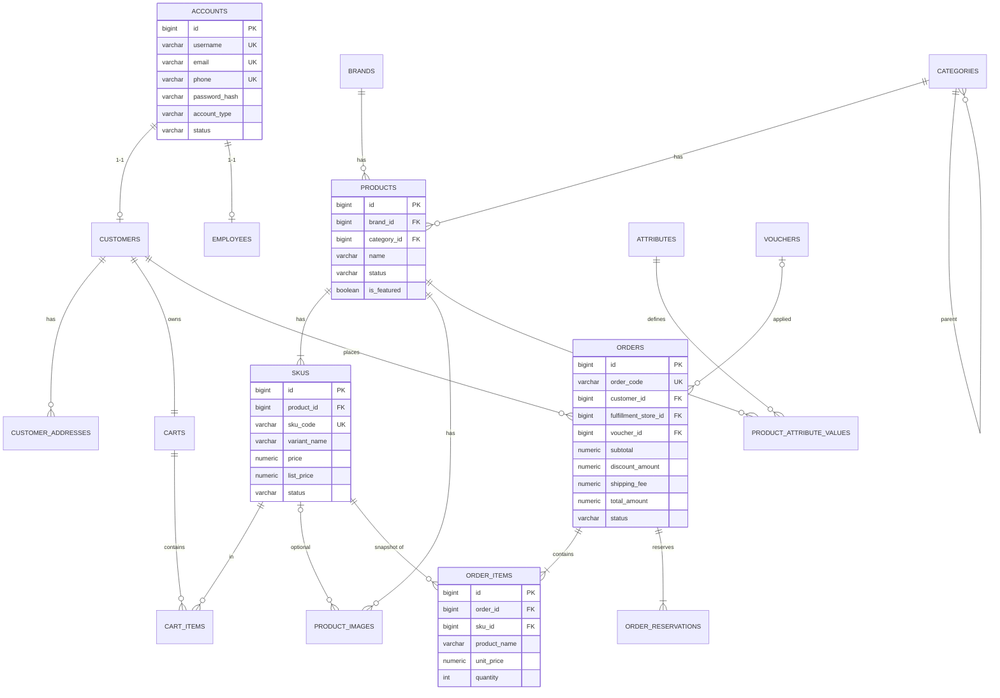
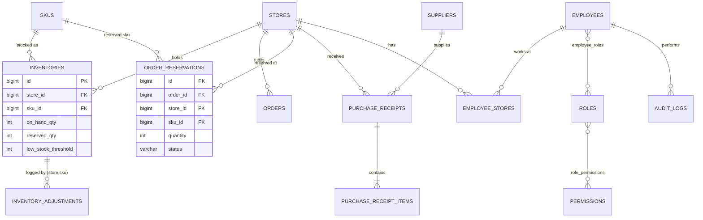

# LUNEA — Cosmetics E-commerce Website
## Architecture Document: Business Flow, System Design & 10-Day Development Plan

| | |
|---|---|
| **Môn học** | Công nghệ phần mềm |
| **Nguồn yêu cầu** | `Nhom01_ThietKeGiaoDien.docx` (khảo sát, yêu cầu, 91 use case, 37 bảng dữ liệu, 8 màn hình giao diện) |
| **Stack** | Java 25 · Spring Boot 4.1.1 · Maven · Spring Data JPA/Hibernate · Spring Security · Bean Validation · Lombok · ModelMapper · PostgreSQL (Docker) · Thymeleaf + HTML/CSS/JS · Cloudinary |
| **Phạm vi** | Monolith, 2 developer, ~10 ngày; **chỉ kiến trúc và kế hoạch, chưa có mã nguồn** |

### Cách đọc tài liệu

**Nhãn truy vết nguồn gốc** (để trả lời giảng viên "yêu cầu này từ đâu ra"):

| Nhãn | Ý nghĩa |
|---|---|
| `[DOC]` | Lấy từ tài liệu Nhóm 01 (kèm mã quy định như KH-QĐ13, QLTK-QĐ8 khi có) |
| `[INF]` | INFERRED: tài liệu chưa nói nhưng cần để code chạy được |
| `[REC]` | RECOMMENDATION: quyết định kỹ thuật |

**Mức cài đặt:** **M / MUST** = làm trong MVP · **S / SHOULD** = làm nếu kịp (Day 8) · **N / NICE** = chỉ khi thừa thời gian · **D / DESIGN-ONLY** = có bảng và mô tả trong báo cáo, không cài đặt.

**Mã tham chiếu:** `G1…G17` (điểm tài liệu chưa đủ, mục 2) · `D1…D5` (quyết định ảnh hưởng database) · `BR-xx` (business rule, mục 7) · `ADR-xx` (quyết định kiến trúc, mục 10) · `A1, C1, K3, O2, P3, S3…` (endpoint, mục 42).

### Tóm tắt các quyết định lớn

| Chủ đề | Quyết định |
|---|---|
| Mô hình nghiệp vụ | Chuỗi cửa hàng: tồn kho theo `(chi nhánh, SKU)`, mỗi đơn do **một** chi nhánh xử lý, hệ thống **tự gán** lúc đặt hàng |
| Tồn kho | `Khả dụng = Thực tế − Đang giữ`; **giữ** khi đặt đơn bằng UPDATE nguyên tử, **trừ thật** khi `SHIPPING`, **giải phóng** khi hủy |
| Xác thực / phân quyền | Session + CSRF (không JWT); permission-based (13 mã) + phạm vi theo chi nhánh; chặn ở backend |
| Giao diện | Hybrid: `@Controller` trả trang, mọi dữ liệu qua `/api/**` bằng `fetch` |
| Thanh toán / vận chuyển | COD; không có bảng Payment/Shipping (enum + snapshot trong `orders`) |
| Dữ liệu | 38 bảng (tài liệu 37 + 1); 30 bảng có entity; còn lại DESIGN-ONLY |
| Lát cắt cài đặt | ~45/91 use case: MUST → SHOULD → DESIGN-ONLY |

---

## Mục lục

- [1. Project Overview](#1-project-overview)
- [2. Requirement Analysis](#2-requirement-analysis)
- [3. Functional Requirements (lát cắt cài đặt)](#3-functional-requirements-lát-cắt-cài-đặt)
- [4. Non-functional Requirements](#4-non-functional-requirements)
- [5. Actors & Roles](#5-actors-roles)
- [6. Use Case Overview](#6-use-case-overview)
- [7. Business Rules](#7-business-rules)
- [8. Main User Flows](#8-main-user-flows)
- [9. System Architecture](#9-system-architecture)
- [10. Architecture Decision Records](#10-architecture-decision-records)
- [11. Package Architecture](#11-package-architecture)
- [12. Module Architecture](#12-module-architecture)
- [13. Domain Model](#13-domain-model)
- [14. Entity List (đồng thời là bảng ánh xạ tên tài liệu ↔ tên code)](#14-entity-list-đồng-thời-là-bảng-ánh-xạ-tên-tài-liệu-tên-code)
- [15. Entity Relationships](#15-entity-relationships)
- [16. JPA Relationship Strategy](#16-jpa-relationship-strategy)
- [17. ERD](#17-erd)
- [18. Database Schema (PostgreSQL)](#18-database-schema-postgresql)
- [19. Enum Design](#19-enum-design)
- [20. DTO Architecture](#20-dto-architecture)
- [21. Mapper Architecture](#21-mapper-architecture)
- [22. Repository Architecture](#22-repository-architecture)
- [23. Service Architecture](#23-service-architecture)
- [24. Controller Architecture](#24-controller-architecture)
- [25. REST API Architecture](#25-rest-api-architecture)
- [26. Authentication Architecture](#26-authentication-architecture)
- [27. Authorization Architecture](#27-authorization-architecture)
- [28. Validation Architecture](#28-validation-architecture)
- [29. Exception Architecture](#29-exception-architecture)
- [30. Product Architecture](#30-product-architecture)
- [31. Cart Architecture](#31-cart-architecture)
- [32. Checkout Architecture](#32-checkout-architecture)
- [33. Order Architecture](#33-order-architecture)
- [34. Payment Architecture](#34-payment-architecture)
- [35. Shipping Architecture](#35-shipping-architecture)
- [36. Coupon (Voucher) Architecture](#36-coupon-voucher-architecture)
- [37. Cloudinary Architecture](#37-cloudinary-architecture)
- [38. Admin Architecture](#38-admin-architecture)
- [39. Staff Architecture](#39-staff-architecture)
- [40. Frontend Architecture](#40-frontend-architecture)
- [41. Page ↔ API Mapping](#41-page-api-mapping)
- [42. API Endpoint Table](#42-api-endpoint-table)
- [43. Database Transaction Boundaries](#43-database-transaction-boundaries)
- [44. Search / Filter / Sort / Pagination](#44-search-filter-sort-pagination)
- [45. Security Risks](#45-security-risks)
- [46. Technical Risks](#46-technical-risks)
- [47. Testing Strategy](#47-testing-strategy)
- [48. Docker Architecture](#48-docker-architecture)
- [49. Configuration Architecture](#49-configuration-architecture)
- [50. Project File Tree](#50-project-file-tree)
- [51. Implementation Dependency Graph](#51-implementation-dependency-graph)
- [52. 10-Day Development Roadmap](#52-10-day-development-roadmap)
- [53. Task Distribution for 2 Developers](#53-task-distribution-for-2-developers)
- [54. MUST HAVE / SHOULD HAVE / NICE TO HAVE](#54-must-have-should-have-nice-to-have)
- [55. Demo Scenario](#55-demo-scenario)
- [56. Lecturer Questions & Answers](#56-lecturer-questions-answers)
- [57. Common Mistakes](#57-common-mistakes)
- [58. Final Architecture Summary](#58-final-architecture-summary)
- [59. Implementation Checklist](#59-implementation-checklist)
- [WHAT I SHOULD CODE FIRST](#what-i-should-code-first)

---

## 1. Project Overview

| Hạng mục | Nội dung |
|---|---|
| Hệ thống | LUNEA, website bán mỹ phẩm **theo mô hình chuỗi cửa hàng** `[DOC]` |
| Điểm khác biệt | Sản phẩm/giá quản lý tập trung; **tồn kho và xử lý đơn theo từng chi nhánh** `[DOC]` |
| Actor | Khách + 10 nhóm actor nội bộ (mục 5) |
| Phạm vi tài liệu gốc | 91 use case, 37 bảng, 8 màn hình giao diện khách hàng |
| Stack | Java 25, Spring Boot 4.1.1, Maven, JPA/Hibernate, Spring Security, PostgreSQL (Docker), Thymeleaf + JS, ModelMapper, Cloudinary |
| Ràng buộc | ~10 ngày, 2 người, phải chạy thật để demo |
| Chiến lược | Giữ **nguyên mô hình dữ liệu của tài liệu** để khớp báo cáo, nhưng **cài đặt theo lát cắt** (mục 3) |

---

## 2. Requirement Analysis

### 2.1 Điểm tài liệu chưa đủ và cách xử lý

| # | Vấn đề trong tài liệu | Quyết định | Tag |
|---|---|---|---|
| G1 | **Ai chọn chi nhánh cho đơn online?** UI checkout không có ô chọn; UC "phân công chi nhánh" thuộc nhân viên xử lý đơn | **Hệ thống tự gán** lúc đặt hàng: chọn chi nhánh ACTIVE đủ tồn khả dụng cho **toàn bộ** đơn, ưu tiên cùng tỉnh/thành với địa chỉ nhận. **Giữ tồn ngay lúc đó**. Nhân viên có thể đổi chi nhánh khi đơn còn `PENDING` | `[REC]` (khớp QLTK-QĐ6, QLDH-QĐ3) |
| G2 | Thời điểm **trừ tồn thực tế** không được nói | Trừ khi đơn chuyển sang `SHIPPING` (hàng rời cửa hàng): `on_hand_qty -= qty`, `reserved_qty -= qty`, giữ tồn chuyển `COMMITTED`. Hủy chỉ được phép trước `SHIPPING` nên luôn là "giải phóng" | `[REC]` |
| G3 | **Lọc theo Loại da / Nhu cầu** (UI có) nhưng `GiaTriThuocTinhSKU` là thuộc tính theo SKU | Thêm **1 bảng** `product_attribute_values` cho thuộc tính cấp sản phẩm, dùng lại bảng `attributes` (nhóm `SKIN_TYPE`, `NEED`) | `[INF]` (D1) |
| G4 | `DonHang` **thiếu**: mã đơn hiển thị, tên người nhận, phương thức giao hàng, ghi chú (UI có ô ghi chú, tài liệu yêu cầu "tự sinh mã") | Thêm cột: `order_code` (unique, ví dụ `LUN-260930-7K3QX9`), `receiver_name`, `delivery_method`, `note` | `[INF]` (D2) |
| G5 | **Không có bảng Payment**, thanh toán chỉ là cột `PhuongThucThanhToan` | Làm đúng như tài liệu: cột `payment_method` (enum, hiện chỉ `COD`) trong `orders`. COD coi là đã thu khi đơn `COMPLETED`. Chỉ tạo bảng Payment khi thêm thanh toán online | `[REC]` |
| G6 | Giao hàng: tài liệu nói "giao tận nơi hoặc nhận tại cửa hàng" | MVP chỉ `HOME_DELIVERY`. `STORE_PICKUP` chỉ có trong enum, chưa cài đặt | `[REC]` |
| G7 | Phí ship không có công thức | Phí cố định + miễn phí từ ngưỡng, cấu hình trong `application.yml` | `[REC]` |
| G8 | Địa chỉ UI chỉ có **Tỉnh/thành + Phường/xã** nhưng bảng có `QuanHuyen` | Để `district` nullable, không dùng (khớp UI) | `[INF]` |
| G9 | `TaiKhoan.TenDangNhap` bắt buộc nhưng UI đăng nhập bằng email/SĐT | Form đăng ký có **cả email và SĐT** nên bắt buộc cả hai; `username` = email. Đăng nhập nhận email **hoặc** SĐT | `[INF]` |
| G10 | **Không có bảng Chương trình khuyến mãi** (UC76) dù có bảng Voucher | MVP chỉ dùng **Voucher**. Chương trình khuyến mãi = thiết kế, chưa cài | `[REC]` |
| G11 | Công thức 1.3.7 có "điểm quy đổi" nhưng KH-QĐ9 thì không | Không quy đổi điểm trong MVP. Giữ cột `loyalty_points` | `[REC]` |
| G12 | Nav có **Khuyến mãi, Cửa hàng, Blog**, không có màn hình mô tả | Cửa hàng = trang danh sách chi nhánh (rẻ, thể hiện mô hình chuỗi). Khuyến mãi = liệt kê voucher đang chạy. Blog = **NOT NEEDED** (không có bảng) | `[INF]` |
| G13 | **Không có giao diện** cho nhân viên/quản trị | Tự làm layout back-office tối giản (Bootstrap, bảng + form) | `[INF]` |
| G14 | Bảng khóa chính kép (`TonKho`, `ChiTietGioHang`, `ChiTietYeuThich`…) khó dùng với JPA (`@EmbeddedId`) | Dùng **surrogate `id` + UNIQUE** trên cặp khóa. ERD logic vẫn tương đương | `[REC]` (D3) |
| G15 | Tên bảng/cột trong tài liệu là tiếng Việt | Code và DB dùng **tiếng Anh** (`inventories`, `orders`…); mục 14 có bảng ánh xạ tên tài liệu ↔ tên code | `[REC]` (D4) |
| G16 | "Còn hàng" trên card: tồn của chi nhánh nào? | Card/detail hiển thị **tổng khả dụng của các chi nhánh ACTIVE**. Chi tiết theo chi nhánh (KH-QĐ2) là SHOULD. **Checkout kiểm tra tồn khả dụng theo từng chi nhánh** (đơn phải đủ tại 1 chi nhánh); nếu không chi nhánh nào đủ thì báo lỗi rõ ràng | `[REC]` |
| G17 | Nhãn "Nhu cầu" lệch nhau trong UI: trang chủ ghi "Chăm sóc da nhạy cảm", trang danh sách ghi "Chăm sóc da" | Chọn `SENSITIVE_CARE` (nhãn "Chăm sóc da nhạy cảm"); nên thống nhất lại trong báo cáo | `[INF]` |

### 2.2 Quyết định ảnh hưởng database

| ID | Quyết định |
|---|---|
| D1 | Thêm bảng `product_attribute_values` (G3) |
| D2 | Bổ sung 4 cột cho `orders`: `order_code`, `receiver_name`, `delivery_method`, `note` (G4) |
| D3 | Khóa chính surrogate + UNIQUE cho bảng khóa kép (G14) |
| D4 | Tên bảng/cột tiếng Anh (G15) |
| D5 | Không tạo bảng `payments`, không tạo entity `Shipping` (G5, G6) |

---

## 3. Functional Requirements (lát cắt cài đặt)

**M** = MVP (Ngày 1–8) · **S** = Should (nếu kịp) · **D** = Design-only (có bảng + mô tả trong báo cáo, không code)

| Module (mã tài liệu) | Chức năng / UC | Mức |
|---|---|:-:|
| **Auth** (UC01–03, UC09) | Đăng ký, đăng nhập (email/SĐT), đăng xuất | M |
| | Ghi nhớ đăng nhập (checkbox có trong UI) | S |
| | Khôi phục mật khẩu (cần email/OTP) | D |
| **Duyệt sản phẩm** (KH, UC04–08) | Home, danh sách, chi tiết + chọn SKU, tìm kiếm, lọc (thương hiệu/giá/loại da/nhu cầu), sắp xếp, phân trang | M |
| | Tình trạng còn hàng theo chi nhánh trong chi tiết | S |
| **Tài khoản** (UC10–11) | Hồ sơ, địa chỉ nhận hàng | M |
| | Yêu thích (icon ♡ có trong UI) | S |
| | Beauty Profile, gợi ý sản phẩm (UC12–13) | D |
| **Giỏ hàng** (UC15–18) | Thêm, sửa số lượng, xóa, xem | M |
| **Đặt hàng** (UC19–21) | Voucher, tính tổng, đặt COD, tự gán chi nhánh + giữ tồn, trang thành công | M |
| **Đơn của khách** (UC22–25) | Lịch sử, chi tiết, trạng thái, hủy (trước `SHIPPING`) | M |
| | Trả hàng (UC26), đánh giá (UC27–28) | D |
| **QLSP** (UC29–37) | CRUD sản phẩm, SKU, ảnh (Cloudinary), thương hiệu, danh mục | M |
| | Thuộc tính mỹ phẩm, kiểm duyệt đánh giá | S / D |
| **QLDH** (UC65–75) | Danh sách + tìm đơn, chi tiết, xác nhận, cập nhật trạng thái, hủy + giải phóng tồn | M |
| | Đổi chi nhánh xử lý khi `PENDING`, in đơn | S |
| | Xử lý đơn trả (UC74) | D |
| **QLTK** (UC49–57) | Xem tồn theo chi nhánh, điều chỉnh tồn (có log) | M |
| | Danh sách tồn thấp | S |
| | Kiểm kê, điều chuyển, xuất báo cáo | D |
| **QLNH** (UC43–48) | NCC + phiếu nhập → **xác nhận thì tăng tồn** | S |
| **QLKM** (UC76–81) | Áp voucher phía khách (M). CRUD voucher (S: nếu không kịp thì seed sẵn) | M / S |
| | Chương trình khuyến mãi, báo cáo KM | D |
| **QLCH** (UC38–42) | Danh sách cửa hàng, xem chi tiết (dữ liệu seed) | M |
| | CRUD cửa hàng | S |
| **QLKH** (UC58–64) | Xem khách, khóa/mở khóa tài khoản | S |
| | Xử lý trả hàng, lịch sử hỗ trợ | D |
| **QLNV** (UC82–87) | Tài khoản nhân viên demo (seed) | M |
| | CRUD nhân viên, gán vai trò/chi nhánh | S |
| | Nhật ký thao tác (bảng + ghi log cho vài thao tác chính) | S |
| **BCTK** (UC88–91) | Dashboard cơ bản (doanh thu từ đơn `COMPLETED`, đơn theo trạng thái, top bán chạy) | S |
| | Các báo cáo còn lại | D |
| **Hệ thống** | Sao lưu/phục hồi (`pg_dump` trong README) | D |
| | Google Maps, gửi thông báo/OTP, cổng thanh toán | D |

---

## 4. Non-functional Requirements

| NFR `[DOC]` | Cách đạt |
|---|---|
| Không để tồn khả dụng âm (#13) | `CHECK (reserved_qty >= 0 AND reserved_qty <= on_hand_qty)` + câu lệnh UPDATE có điều kiện (mục 7, 22) |
| Giá mới không đổi đơn cũ (#14) | Snapshot ở `order_items` |
| Giao dịch kho nhất quán (#15) | Mọi thay đổi tồn nằm trong `InventoryService` + `@Transactional` |
| Không xóa vật lý dữ liệu đã phát sinh (#16) | Soft-delete bằng `status` |
| Khách không xem dữ liệu khách khác (#12) | Luôn lấy `customerId` từ Authentication, không nhận từ client; trả 404 nếu không phải chủ |
| Bảo vệ mật khẩu (#9) | BCrypt |
| Phân quyền theo vai trò + chi nhánh (#11) | Mục 27 |
| Responsive (#4) | Bootstrap grid; UI gốc là dark theme, làm bằng CSS variables |
| Phản hồi ≤ 3s (#6, #7) | Pageable + index cột lọc; tránh N+1 |
| Ảnh tối ưu (#8) | Cloudinary transformation (`w_600,q_auto`) trong URL |
| Dễ mở rộng cửa hàng/SKU/thanh toán/khuyến mãi (#18–21) | Chi nhánh là dữ liệu chứ không hard-code; `payment_method` là enum; voucher có `type` enum |
| Dễ bảo trì, hạn chế lặp mã (#22–23) | Phân lớp Controller → Service → Repository; `Specification` dùng chung cho tìm kiếm/lọc/phân trang |
| Portability | `docker compose up -d` + `mvn spring-boot:run` `[REC]` |

---

## 5. Actors & Roles

### 5.1 Ánh xạ actor tài liệu → role cài đặt

| Actor `[DOC]` | Role code `[REC]` | Cài đặt |
|---|---|:-:|
| KH – Khách hàng | `CUSTOMER` (`account_type=CUSTOMER`, không có dòng `role`) | M |
| QLSP | `PRODUCT_MANAGER` | M |
| QLDH | `ORDER_STAFF` | M |
| QLTK | `WAREHOUSE_STAFF` | M |
| QLCH + QLNV + BCTK | `ADMIN` (toàn quyền; quản lý cửa hàng, nhân viên, báo cáo) | M |
| QLKM | `MARKETING_STAFF` | S |
| QLNH | `PURCHASING_STAFF` | S |
| QLKH | `CS_STAFF` | S/D |

### 5.2 Mô hình phân quyền

Dùng đúng mô hình tài liệu: `Employee → EmployeeRole → Role → RolePermission → Permission`, thêm `EmployeeStore` cho phạm vi chi nhánh. `[DOC]`

- Role và Permission được **seed sẵn**. MVP không có màn hình sửa quyền (UC86 là S). `[REC]`
- Lúc login, nạp permission code làm `GrantedAuthority` (ví dụ `ORDER_PROCESS`). Endpoint dùng `@PreAuthorize("hasAuthority('...')")`. `[REC]`
- **Phạm vi chi nhánh**: Service kiểm tra dữ liệu thuộc chi nhánh của nhân viên (trừ người có `ALL_STORES`). Không đặt trong controller. `[DOC: QLNV-QĐ4]`

### 5.3 Ma trận quyền (MVP, mức chức năng)

| Chức năng | Guest | CUSTOMER | PRODUCT_MGR | ORDER_STAFF | WAREHOUSE | ADMIN |
|---|:-:|:-:|:-:|:-:|:-:|:-:|
| Duyệt / tìm / lọc sản phẩm | ✓ | ✓ | ✓ | ✓ | ✓ | ✓ |
| Giỏ hàng, đặt hàng, đơn của mình | ✗ | ✓ | ✗ | ✗ | ✗ | ✗ |
| CRUD sản phẩm / SKU / ảnh / thương hiệu / danh mục | ✗ | ✗ | ✓ | ✗ | ✗ | ✓ |
| Xem & xử lý đơn (theo chi nhánh) | ✗ | ✗ | ✗ | ✓ | ✗ | ✓ (mọi chi nhánh) |
| Xem / điều chỉnh tồn (theo chi nhánh) | ✗ | ✗ | ✗ | xem | ✓ | ✓ |
| Quản lý cửa hàng, nhân viên, báo cáo | ✗ | ✗ | ✗ | ✗ | ✗ | ✓ |

Nhân viên **không mua hàng** bằng tài khoản nhân viên; muốn mua thì dùng tài khoản khách riêng. `[REC]`

---

## 6. Use Case Overview

91 use case trong tài liệu (UC01–UC91) gom thành 15 module. Cột "Mã" là dải use case trong tài liệu.

| Module | Mã UC | Actor | Mức |
|---|---|---|:-:|
| Xác thực | UC01–03, 09 | mọi actor có tài khoản | M (UC03: D) |
| Duyệt sản phẩm | UC04–08 | Khách, Guest | M |
| Tài khoản khách | UC10–14 | KH | M (12–14: D/S) |
| Giỏ hàng | UC15–18 | KH | M |
| Voucher & đặt hàng | UC19–21 | KH | M |
| Đơn của khách | UC22–28 | KH | M (26–28: D) |
| Sản phẩm/SKU/ảnh | UC29–37 | QLSP | M |
| Cửa hàng | UC38–42 | QLCH | M/S |
| Nhập hàng | UC43–48 | QLNH | S |
| Kho | UC49–57 | QLTK | M/S/D |
| CSKH | UC58–64 | QLKH | S/D |
| Xử lý đơn | UC65–75 | QLDH | M/S/D |
| Khuyến mãi | UC76–81 | QLKM | S/D |
| Nhân viên & quyền | UC82–87 | QLNV | M/S |
| Báo cáo | UC88–91 | BCTK | S/D |

Số use case **cài đặt thật** khoảng 45/91. Phần còn lại có thiết kế (bảng + mô tả), vẫn nằm trong báo cáo.

---

## 7. Business Rules

**Auth / Tài khoản**

| ID | Rule | Nguồn |
|---|---|---|
| BR-01 | Email và SĐT không trùng; đăng ký phải hợp lệ | KH-QĐ3 |
| BR-02 | Đăng ký cần: họ tên, email, SĐT, mật khẩu ≥ 8 ký tự (chữ + số), xác nhận mật khẩu, tick điều khoản | UI, `[INF]` |
| BR-03 | Tài khoản `INACTIVE` không đăng nhập được; khóa không làm mất dữ liệu | QLKH-QĐ2 |
| BR-04 | Đăng ký luôn tạo `CUSTOMER`; tài khoản nhân viên do Admin tạo | QLNV-QĐ1 |

**Sản phẩm / Giỏ**

| ID | Rule | Nguồn |
|---|---|---|
| BR-10 | Khách chỉ thấy sản phẩm `ACTIVE` (và SKU `ACTIVE`) | KH-QĐ1 |
| BR-11 | Sản phẩm/SKU/thương hiệu/danh mục đã phát sinh giao dịch chỉ chuyển `INACTIVE`, không xóa | QLSP-QĐ3, QĐ4 |
| BR-12 | Công khai sản phẩm phải có ít nhất 1 ảnh đại diện | QLSP-QĐ6 |
| BR-13 | Mã SKU unique | QLSP-QĐ5 |
| BR-14 | Mỗi khách 1 giỏ; thêm cùng SKU thì cộng dồn số lượng; số lượng > 0 | KH-QĐ7 |
| BR-15 | **Thêm vào giỏ không giữ tồn**; kiểm tra `số lượng ≤ tổng tồn khả dụng` để báo sớm | KH-QĐ7, `[REC]` |
| BR-16 | Giỏ **không lưu giá**; luôn tính theo `price` hiện tại của SKU | `[REC]` |

**Voucher / Tổng tiền**

| ID | Rule | Nguồn |
|---|---|---|
| BR-20 | Voucher hợp lệ khi: `ACTIVE`, trong hạn, còn lượt (`used < limit`), đạt đơn tối thiểu | KH-QĐ8, QLKM-QĐ4 |
| BR-21 | Loại: `PERCENT` (có `max_discount`), `FIXED`, `FREESHIP` | bảng Voucher |
| BR-22 | Giảm giá không làm tiền hàng < 0 | QLKM-QĐ5 |
| BR-23 | `Tổng tiền hàng = Σ(đơn giá × SL)`; `Tổng thanh toán = Tiền hàng − Ưu đãi + Phí ship` | KH-QĐ9 |
| BR-24 | Phí ship cố định, miễn phí từ ngưỡng (config, ví dụ 30.000đ / miễn phí từ 500.000đ) | `[REC]` |

**Đặt hàng / Kho**

| ID | Rule | Nguồn |
|---|---|---|
| BR-30 | Chỉ COD; chọn phương thức khác thì từ chối | KH-QĐ10 |
| BR-31 | Đơn phải do **một** chi nhánh xử lý, chi nhánh đó đủ tồn khả dụng cho **toàn bộ** SKU | QLDH-QĐ3 |
| BR-32 | `Tồn khả dụng = Tồn thực tế − Đang giữ`, không âm | QLTK-QĐ8 |
| BR-33 | Giữ tồn khi tạo đơn xong và xác định được chi nhánh: `reserved += qty` bằng UPDATE có điều kiện `(on_hand - reserved) >= qty`, kiểm tra số dòng bị ảnh hưởng | QLTK-QĐ6, `[REC]` |
| BR-34 | Snapshot trong `order_items`: tên SP, tên biến thể, đơn giá, SL, thành tiền; snapshot trong `orders`: tên/SĐT/địa chỉ nhận | QLDH-QĐ1 |
| BR-35 | Tạo đơn (order + items + reservations + tăng `voucher.used_count` + xóa giỏ) trong **1 transaction**; lỗi thì rollback tất cả | `[REC]` |
| BR-36 | Khách chỉ xem/hủy đơn của mình; đơn người khác trả 404 | KH-QĐ11 |
| BR-37 | Khách tự hủy được khi đơn còn **trước `SHIPPING`** (`PENDING`, `CONFIRMED`, `PREPARING`); hủy thì giải phóng giữ tồn (`RELEASED`) | KH-QĐ13 |
| BR-38 | Chuyển sang `SHIPPING`: trừ tồn thực tế + chốt giữ (`COMMITTED`) | G2 |
| BR-39 | Xác nhận đơn chỉ khi thông tin nhận hợp lệ và còn đủ tồn | QLDH-QĐ2 |
| BR-40 | Doanh thu chỉ tính từ đơn `COMPLETED` | BCTK-QĐ1 |
| BR-41 | Điều chỉnh tồn bắt buộc lý do, lưu số lượng trước/sau, người thực hiện, thời gian | QLTK-QĐ3 |
| BR-42 | Phiếu nhập chỉ tăng tồn khi xác nhận; chỉ `DRAFT` mới sửa được | QLNH-QĐ4, QĐ5 |

**Vòng đời đơn** `[DOC: KH-QĐ12, QLDH-QĐ4]`

```text
PENDING → CONFIRMED → PREPARING → SHIPPING → COMPLETED
 (Chờ xác nhận)  (Đã xác nhận)  (Đang chuẩn bị)  (Đang giao)  (Hoàn thành)
   │           │            │
   └───────────┴────────────┴──→ CANCELLED (Đã hủy)
```

| Hành động | CUSTOMER | Nhân viên (`ORDER_PROCESS`) | ADMIN |
|---|:-:|:-:|:-:|
| Tiến đúng 1 bước | ✗ | ✓ (chi nhánh của mình) | ✓ |
| Hủy khi `PENDING` / `CONFIRMED` / `PREPARING` | ✓ (đơn của mình) | ✓ | ✓ |
| Hủy khi `SHIPPING` / `COMPLETED` | ✗ | ✗ | ✗ |
| Nhảy cóc hoặc lùi | ✗ | ✗ | ✗ |

Tài liệu nhắc thêm "yêu cầu hoàn/trả" và "đã hoàn trả". Đây là luồng trả hàng, thuộc nhóm **D**.

---

## 8. Main User Flows

**Luồng chính** `[DOC]`

```text
HOME → DANH SÁCH SP → CHI TIẾT SP → GIỎ HÀNG → GIAO HÀNG & THANH TOÁN → ĐẶT HÀNG THÀNH CÔNG
 ├── ĐĂNG NHẬP / ĐĂNG KÝ    ├── TÌM KIẾM    ├── THƯƠNG HIỆU
 └── TÀI KHOẢN ── ĐƠN HÀNG
```

**Flow A: Thêm vào giỏ** (`POST /api/cart/items`)

| Bước | Layer | Việc |
|---|---|---|
| 1 | UI/JS | Chọn SKU (dung tích), click "Thêm vào giỏ", gửi `{skuId, quantity}` + CSRF header |
| 2 | Security | Chưa đăng nhập → 401 → JS chuyển tới `/login?redirect=...` |
| 3 | Controller | `@Valid`: `skuId` not null, `quantity` 1–99 |
| 4 | Service `@Transactional` | **Khóa dòng giỏ** của khách → tìm SKU (404) → SKU và Product `ACTIVE` (409 `SKU_UNAVAILABLE`) |
| 5 | Business | Nếu đã có dòng: `newQty = cũ + mới`; kiểm tra `newQty ≤ tổng tồn khả dụng` (không thì 409 `INSUFFICIENT_STOCK`) |
| 6 | Repository | Lưu `cart_item` |
| 7 | Response | `CartResponse` (dòng, giá hiện tại, tạm tính) |
| 8 | UI | Cập nhật badge số lượng trên icon giỏ + thông báo |

**Flow B: Đặt hàng COD** (xem bước chi tiết ở mục 32)

| Bước | Layer | Việc |
|---|---|---|
| 1 | UI | Trang checkout gọi `GET /api/cart` + `GET /api/account/addresses`; `POST /api/checkout/preview` để xem giảm giá/phí ship/tổng |
| 2 | UI | Submit `PlaceOrderRequest` (người nhận, địa chỉ, `deliveryMethod`, `paymentMethod=COD`, `voucherCode?`, `note?`, `expectedTotal`); disable nút sau click |
| 3 | Controller | `@Valid`; khách lấy từ `Authentication` (không tin `customerId` từ client) |
| 4 | Service `@Transactional` | Khóa giỏ → kiểm tra SKU `ACTIVE` → validate voucher, tính tổng, so `expectedTotal` (khác thì 409 `PRICE_CHANGED`) |
| 5 | InventoryService | Chọn chi nhánh đủ hàng cho toàn đơn → giữ tồn từng SKU theo `skuId` tăng dần; lỗi thì **rollback toàn bộ** |
| 6 | Repository | Ghi `orders` (`PENDING`, `order_code`, snapshot) + `order_items` (snapshot) + `order_reservations` (`HELD`); tăng `voucher.used_count`; xóa giỏ |
| 7 | Response | `201` + `OrderDetailResponse` |
| 8 | UI | Chuyển tới `/order-success?code=LUN-...` (trang gọi `GET /api/orders/{code}`, chỉ chủ đơn xem được) |

Chống đặt trùng: giỏ bị khóa và xóa trong cùng transaction nên request thứ hai gặp "giỏ rỗng" → 400. Nút bị disable là lớp phòng thủ thứ hai.

**Flow C: Nhân viên xử lý đơn** (`PATCH /api/admin/orders/{id}/status`)

| Bước | Việc |
|---|---|
| 1 | ORDER_STAFF mở danh sách đơn (chỉ thấy đơn thuộc chi nhánh mình được gán; Admin thấy tất cả) |
| 2 | Bấm "Xác nhận" → Service khóa dòng đơn, kiểm tra quyền + phạm vi chi nhánh + **transition hợp lệ** (bảng mục 7) + còn đủ giữ tồn |
| 3 | `CONFIRMED` → `PREPARING` → `SHIPPING` (trừ tồn thực tế, chốt giữ) → `COMPLETED` |
| 4 | Hủy (`POST /api/admin/orders/{id}/cancel`): giải phóng `reserved`, reservation → `RELEASED`, giảm `voucher.used_count` nếu có |
| 5 | Ghi `audit_logs` cho thay đổi trạng thái `[S]` |

Các flow còn lại (Register, Login, Search/Filter, Update/Remove cart, CRUD sản phẩm, điều chỉnh tồn, xác nhận phiếu nhập…) nằm ở mục 26, 30–39, 42 và 44.

---

## 9. System Architecture

```text
Browser
  │
  ├─ GET /, /products, /cart, /checkout, /admin/...      ┐
  │     @Controller  → chỉ trả template Thymeleaf        │  1 SecurityFilterChain
  │                                                      │  session + CSRF + permission
  └─ fetch('/api/**', '/api/admin/**')                   │
        @RestController  → DTO in/out                    ┘
              │
        Service  (@Transactional, business rules)
              │  ├─ InventoryService  (nơi DUY NHẤT đổi on_hand/reserved)
              │  └─ OrderService, CartService, ProductService...
        Repository (Spring Data JPA + Specification)
              │
        Hibernate ── PostgreSQL (Docker)

Service ──→ Cloudinary (chỉ upload/xóa ảnh sản phẩm)
@RestControllerAdvice → ErrorResponse thống nhất
```

| Thành phần | Quyết định |
|---|---|
| Monolith một ứng dụng | ✅ |
| Session + CSRF (Spring Security) | ✅ |
| Docker chỉ cho PostgreSQL | ✅ |
| Cloudinary | ✅ (seed sẵn URL ảnh để demo không phụ thuộc mạng) |
| JWT, Redis, Kafka, Elasticsearch, K8s | ❌ `OPTIONAL — DO NOT IMPLEMENT IN 10-DAY MVP` |
| Google Maps, cổng thanh toán, gửi email/OTP | ❌ D (chỉ lưu `latitude/longitude` cửa hàng) |

---

## 10. Architecture Decision Records

| ID | Quyết định | Phương án loại | Lý do | Tag |
|---|---|---|---|---|
| ADR-01 | Monolith phân lớp | Microservices | 10 ngày, 2 người, dễ debug | `[REC]` |
| ADR-02 | **Hybrid:** `@Controller` chỉ trả trang; **dữ liệu và thao tác** đi qua `/api/**` bằng `fetch` (ngoại lệ duy nhất: login/logout dùng form POST chuẩn của Spring Security) | SSR form POST; SPA | Một đường dữ liệu, test được bằng Postman, khớp bảng Page↔API | `[REC]` |
| ADR-03 | **Session** (JSESSIONID) + CSRF token (meta tag → header `X-CSRF-TOKEN`) | JWT | Cùng origin với Thymeleaf; logout làm phiên hết hiệu lực ngay (đúng "quản lý phiên" của tài liệu); ít lỗi | `[REC]` |
| ADR-04 | Permission-based authorization, seed sẵn role/permission | Role đơn giản trong 1 cột | Khớp 5 bảng phân quyền của tài liệu; đáp ứng phân quyền theo chi nhánh | `[DOC]`+`[REC]` |
| ADR-05 | Giá + SKU đúng như tài liệu: `Product 1—n SKU`; giá ở `SKU` | Giá ở Product, `minPrice` denormalized | Bám tài liệu. Lọc/sắp xếp giá dùng subquery `MIN(price)` (mục 44) | `[DOC]` |
| ADR-06 | Tồn kho `Inventory(store, sku)` + `reserved_qty`; **giữ tồn khi tạo đơn**, trừ tồn khi `SHIPPING` | Trừ thẳng khi đặt | Đúng công thức khả dụng của tài liệu, hỗ trợ hủy đơn | `[DOC]`+`[REC]` |
| ADR-07 | Giữ tồn bằng `UPDATE ... WHERE (on_hand - reserved) >= :qty` | Lock pessimistic / optimistic cho tồn | Chống bán quá tồn, code ngắn, dễ giải thích | `[REC]` |
| ADR-08 | Tự gán chi nhánh lúc đặt đơn | Nhân viên gán thủ công | Giữ tồn ngay, tránh bán quá tồn (vấn đề #1 trong mục 1.3.10 của tài liệu) | `[REC]` |
| ADR-09 | `payment_method` là cột enum trong `orders`; không có bảng Payment | Bảng `payments` + interface Gateway | Đúng tài liệu; thêm VNPay/MoMo sau bằng cách thêm giá trị enum + bảng | `[DOC]`+`[REC]` |
| ADR-10 | Snapshot địa chỉ/giá vào đơn, không FK tới địa chỉ | FK tới Address | Sửa địa chỉ không ảnh hưởng đơn cũ | `[DOC]` |
| ADR-11 | Enum lưu `STRING` | ORDINAL | Dễ đọc trong DBeaver, đổi thứ tự enum không hỏng dữ liệu | `[REC]` |
| ADR-12 | `ddl-auto=update` khi dev + seed dữ liệu bằng Java | Flyway | Tiết kiệm thời gian; Flyway = NICE | `[REC]` |
| ADR-13 | Tìm kiếm/lọc/phân trang bằng `Specification` + `Pageable` | Query method dài; Elasticsearch | Nhiều bộ lọc tùy chọn kết hợp được | `[REC]` |
| ADR-14 | Ảnh trên Cloudinary; DB lưu `url` (+ `public_id` để xóa) | Lưu binary | Nhẹ DB; khớp bảng `HinhAnhSanPham` | `[DOC]` |
| ADR-15 | Bảng khóa kép dùng surrogate id + UNIQUE | `@EmbeddedId` | Ít lỗi JPA hơn | `[REC]` |
| ADR-16 | Service là class thường, không có `interface` + `impl` | Interface cho mọi service | Một cài đặt/service; bớt một nửa số file | `[REC]` |
| ADR-17 | Trả DTO trực tiếp khi thành công, lỗi dùng `ErrorResponse` | Wrapper `{success,message,data}` | HTTP status đã nói lên kết quả; ít lớp bọc | `[REC]` |

**Lưu ý stack:** Spring Boot 4.x dùng Spring Security 7, Hibernate 7 và Jackson 3. Khi thêm thư viện ngoài (ModelMapper, Cloudinary SDK…) mà gặp lỗi tương thích thì kiểm tra phiên bản ở đó trước (mục 46).

## 11. Package Architecture

```text
com.lunea
├── LuneaApplication.java
├── config/          SecurityConfig, ModelMapperConfig, CloudinaryConfig, AppProperties, DataSeeder
├── security/        AppUserDetails, AppUserDetailsService, JsonAuthEntryPoint (401), JsonAccessDeniedHandler (403), StoreScope
├── web/             @Controller: chỉ trả template Thymeleaf (PageController, AdminPageController)
├── api/             @RestController: /api/** (customer) và /api/admin/** (back-office)
├── dto/
│   ├── request/     dữ liệu vào + validation annotation
│   └── response/    dữ liệu ra
├── entity/
│   ├── BaseEntity.java
│   ├── account/     Account, Customer, CustomerAddress, Employee, Role, Permission, EmployeeStore, AuditLog
│   ├── catalog/     Brand, Category, Product, Sku, Attribute, ProductAttributeValue, SkuAttributeValue, ProductImage, Wishlist, WishlistItem
│   ├── inventory/   Store, Inventory, InventoryAdjustment, Supplier, PurchaseReceipt, PurchaseReceiptItem
│   └── sales/       Cart, CartItem, Voucher, Order, OrderItem, OrderReservation
├── enums/
├── repository/      Spring Data JPA interfaces
├── specification/   ProductSpecification, OrderSpecification (tìm kiếm/lọc)
├── service/         class @Service cụ thể (không có interface)
├── mapper/          ProductMapper, OrderMapper, CartMapper: chỉ phần ModelMapper không tự map được
├── exception/       BusinessException, ResourceNotFoundException, InsufficientStockException, ErrorCode, GlobalExceptionHandler
└── util/            OrderCodeGenerator, PhoneUtils, RoleCode, PermissionCode
```

| Package | Trách nhiệm | Không được làm |
|---|---|---|
| `web` | Trả tên template + tham số trang (id, mã đơn) | Gọi Service, chứa logic |
| `api` | Nhận request DTO, `@Valid`, gọi **một** Service, trả response DTO | Gọi Repository, viết business rule |
| `service` | Business rule, `@Transactional`, kiểm tra quyền theo phạm vi dữ liệu, map Entity → DTO | Import `HttpServletRequest` hay class của controller |
| `repository` | Truy vấn dữ liệu | Chứa business rule |
| `entity` | State + ánh xạ JPA | Import DTO, gọi Service |
| `specification` | Xây điều kiện lọc động | Truy cập DB trực tiếp |
| `enums` | Trạng thái, loại; enum `OrderStatus` có hàm `canTransitionTo` (state machine thuần) | Gọi DB |

**Quyết định về package** `[REC]`:
- **Service là class thường, không có `interface` + `impl`.** Project chỉ có một cài đặt cho mỗi service, nên interface chỉ làm gấp đôi số file. Thêm interface sau này chỉ mất 5 phút khi thật sự cần.
- **`InventoryService` là nơi duy nhất được ghi `on_hand_qty` / `reserved_qty`.** `OrderService` và `OrderStaffService` đều gọi qua nó. Nhờ vậy quy tắc "tồn không âm" chỉ nằm ở một chỗ.
- **Mapping Entity → DTO xảy ra trong Service**, khi transaction còn mở. Controller không bao giờ nhìn thấy Entity, nên không có `LazyInitializationException` ở tầng web.
- Cấu hình bắt buộc: `spring.jpa.open-in-view=false`.

---

## 12. Module Architecture

| Module | Service chính | Entity | Phụ thuộc | Gợi ý owner |
|---|---|---|---|:-:|
| **auth-account** | `AuthService`, `AccountService` (hồ sơ, địa chỉ), `AppUserDetailsService` | Account, Customer, CustomerAddress, Employee, Role, Permission, EmployeeStore | — | B |
| **catalog** | `ProductService` (đọc), `ProductAdminService` (ghi), `BrandService`, `CategoryService`, `ProductImageService` (Cloudinary) | Product, Sku, Brand, Category, Attribute, ProductAttributeValue, ProductImage | — | A |
| **store-inventory** | `InventoryService`, `StoreService` | Store, Inventory, InventoryAdjustment | catalog | A |
| **cart** | `CartService` | Cart, CartItem | catalog, inventory (chỉ đọc) | B |
| **order** | `OrderService` (khách), `OrderStaffService`, `VoucherService`, `CheckoutCalculator` (gồm phí ship) | Order, OrderItem, OrderReservation, Voucher | cart, catalog, **inventory (ghi)** | B |
| **back-office** | Trang admin/staff (Thymeleaf + `/api/admin/**`), `AuditLogService` [S] | AuditLog | mọi module | A + B |

```text
catalog ◄────────── cart ◄────────── order
   ▲                                   │
   │                                   ▼
store-inventory ◄───────────────────────┘   (order gọi InventoryService.reserve/release/commit)
```

Quy tắc chống vòng lặp phụ thuộc: `InventoryService` **không** import `OrderService`. Nó chỉ nhận tham số (storeId, skuId, qty) và không biết "đơn hàng" là gì. Phân công chính thức cho 2 người ở mục 53.

---

## 13. Domain Model

Aggregate = nhóm entity luôn thay đổi cùng nhau. Đây cũng là căn cứ quyết định cascade ở mục 16.

| Aggregate (root) | Thành viên | Bất biến (invariant) cần giữ |
|---|---|---|
| **Account** | Customer hoặc Employee (1–1) | Email/SĐT không trùng; ít nhất một trong hai |
| **Product** | Sku, ProductImage, ProductAttributeValue | Sản phẩm công khai phải có ảnh chính; mã SKU unique; SKU đã có giao dịch chỉ `INACTIVE` |
| **Inventory** (store × sku) | InventoryAdjustment (log) | `0 ≤ reserved ≤ on_hand`; mọi điều chỉnh có lý do |
| **Cart** | CartItem | Mỗi khách một giỏ; mỗi SKU một dòng; `quantity > 0` |
| **Order** | OrderItem, OrderReservation | Snapshot bất biến; `total = subtotal − discount + shipping`; đúng một chi nhánh xử lý |
| **Voucher** | — | `used_count ≤ usage_limit`; hợp lệ theo thời gian/điều kiện |

**Cân nhắc nhưng không tạo entity** `[REC]`:

| Đối tượng | Lý do bỏ |
|---|---|
| `Payment` | Tài liệu chỉ có cột `PhuongThucThanhToan`; COD coi là đã thu khi `COMPLETED` |
| `Shipping` / `Shipment` | Chỉ cần snapshot trong `orders` (không có hãng vận chuyển thật) |
| `Blog`, `PromotionProgram`, `Notification` | Tài liệu không có bảng tương ứng |
| `Role` dạng enum trên user | Thay bằng mô hình 5 bảng phân quyền của tài liệu |

---

## 14. Entity List (đồng thời là bảng ánh xạ tên tài liệu ↔ tên code)

Mức: **REQUIRED** = cài đặt trong MVP · **OPTIONAL** = cài đặt nếu kịp · **DESIGN-ONLY** = có bảng trong tài liệu/ERD, không tạo entity.

| # | Tài liệu | Bảng | Entity | Mức |
|--:|---|---|---|:-:|
| 1 | TaiKhoan | `accounts` | Account | REQUIRED |
| 2 | KhachHang | `customers` | Customer | REQUIRED |
| 3 | DiaChiKhachHang | `customer_addresses` | CustomerAddress | REQUIRED |
| 4 | BeautyProfile | `beauty_profiles` | — | DESIGN-ONLY |
| 5 | ThuongHieu | `brands` | Brand | REQUIRED |
| 6 | DanhMuc | `categories` | Category | REQUIRED |
| 7 | SanPham | `products` | Product | REQUIRED |
| 8 | SKU | `skus` | Sku | REQUIRED |
| 9 | ThuocTinh | `attributes` | Attribute | REQUIRED |
| 10 | GiaTriThuocTinhSKU | `sku_attribute_values` | SkuAttributeValue | OPTIONAL |
| 11 | HinhAnhSanPham | `product_images` | ProductImage | REQUIRED |
| 12 | CuaHang | `stores` | Store | REQUIRED |
| 13 | TonKho | `inventories` | Inventory | REQUIRED |
| 14 | GioHang | `carts` | Cart | REQUIRED |
| 15 | ChiTietGioHang | `cart_items` | CartItem | REQUIRED |
| 16 | Voucher | `vouchers` | Voucher | REQUIRED |
| 17 | DonHang | `orders` | Order | REQUIRED |
| 18 | ChiTietDonHang | `order_items` | OrderItem | REQUIRED |
| 19 | GiuTonDonHang | `order_reservations` | OrderReservation | REQUIRED |
| 20 | YeuThich | `wishlists` | Wishlist | OPTIONAL |
| 21 | ChiTietYeuThich | `wishlist_items` | WishlistItem | OPTIONAL |
| 22 | DanhGia | `reviews` | — | DESIGN-ONLY |
| 23 | YeuCauTraHang | `return_requests` | — | DESIGN-ONLY |
| 24 | ChiTietTraHang | `return_request_items` | — | DESIGN-ONLY |
| 25 | NhaCungCap | `suppliers` | Supplier | OPTIONAL |
| 26 | PhieuNhap | `purchase_receipts` | PurchaseReceipt | OPTIONAL |
| 27 | ChiTietPhieuNhap | `purchase_receipt_items` | PurchaseReceiptItem | OPTIONAL |
| 28 | DieuChinhTon | `inventory_adjustments` | InventoryAdjustment | REQUIRED |
| 29 | DieuChuyenKho | `stock_transfers` | — | DESIGN-ONLY |
| 30 | ChiTietDieuChuyen | `stock_transfer_items` | — | DESIGN-ONLY |
| 31 | NhanVien | `employees` | Employee | REQUIRED |
| 32 | VaiTro | `roles` | Role | REQUIRED |
| 33 | Quyen | `permissions` | Permission | REQUIRED |
| 34 | NhanVienVaiTro | `employee_roles` | *(join table, không entity)* | REQUIRED |
| 35 | VaiTroQuyen | `role_permissions` | *(join table, không entity)* | REQUIRED |
| 36 | NhanVienCuaHang | `employee_stores` | EmployeeStore | REQUIRED |
| 37 | NhatKyThaoTac | `audit_logs` | AuditLog | OPTIONAL |
| 38 | *(mới, D1)* | `product_attribute_values` | ProductAttributeValue | REQUIRED `[INF]` |

Tổng: 38 bảng = 25 REQUIRED + 7 OPTIONAL + 6 DESIGN-ONLY. Số class entity thật sự cần viết: **23 (REQUIRED) + 7 (OPTIONAL)**. 6 bảng DESIGN-ONLY nằm trong `docs/schema-full.sql` để đưa vào báo cáo, không chạy lúc khởi động.

**Quy ước chung** `[REC]`:
- Tên số ít cho class (`Order`), số nhiều cho bảng (`orders`, vì `order` là từ khóa SQL).
- `BaseEntity` (`@MappedSuperclass`): `id`, `createdAt`, `updatedAt` (`@CreationTimestamp`/`@UpdateTimestamp`).
- Các cột ngày của tài liệu (`NgayTao`, `NgayDat`, `NgayLap`, `NgayThamGia`, `NgayThem`, `NgayGiu`, `ThoiGian`, `NgayCapNhat`) được **gộp vào `created_at` / `updated_at`**. Các mốc riêng có ý nghĩa nghiệp vụ (`confirmed_at`, `released_at`…) giữ nguyên.
- Tiền: `BigDecimal` + `NUMERIC(18,2)`. Thời gian: `LocalDateTime` + `TIMESTAMP`, chạy với múi giờ `Asia/Ho_Chi_Minh`.

---

## 15. Entity Relationships

Mọi FK đều `ON DELETE RESTRICT` (mặc định của PostgreSQL). Không dùng `ON DELETE CASCADE` ở DB.

| Quan hệ | Cardinality | FK nằm ở | Null? |
|---|---|---|:-:|
| Account – Customer | 1–1 | `customers.account_id` (UNIQUE) | NN |
| Account – Employee | 1–1 | `employees.account_id` (UNIQUE) | NN |
| Customer – CustomerAddress | 1–n | `customer_addresses.customer_id` | NN |
| Customer – Cart | 1–1 | `carts.customer_id` (UNIQUE) | NN |
| Cart – CartItem | 1–n | `cart_items.cart_id` | NN |
| Sku – CartItem | 1–n | `cart_items.sku_id` | NN |
| Brand – Product | 1–n | `products.brand_id` | NN |
| Category – Product | 1–n | `products.category_id` | NN |
| Category – Category (cha) | 1–n (tự tham chiếu) | `categories.parent_id` | NULL |
| Product – Sku | 1–n | `skus.product_id` | NN |
| Product – ProductImage | 1–n | `product_images.product_id` | NN |
| Sku – ProductImage | 1–n (ảnh riêng theo SKU) | `product_images.sku_id` | NULL |
| Product – Attribute | n–n qua `product_attribute_values` | 2 FK + `value` | NN |
| Sku – Attribute | n–n qua `sku_attribute_values` | 2 FK + `value` | NN |
| Store – Inventory – Sku | n–n qua `inventories` | `store_id`, `sku_id` | NN |
| Inventory (store, sku) – InventoryAdjustment | 1–n (logic) | `store_id`, `sku_id`, `adjusted_by` | NN |
| Customer – Order | 1–n | `orders.customer_id` | NN |
| Store – Order (chi nhánh xử lý) | 1–n | `orders.fulfillment_store_id` | NN `[REC]` |
| Voucher – Order | 1–n | `orders.voucher_id` | NULL |
| Order – OrderItem | 1–n | `order_items.order_id` | NN |
| Sku – OrderItem | 1–n | `order_items.sku_id` | NN |
| Order – OrderReservation | 1–n | `order_reservations.order_id` (+ `store_id`, `sku_id`) | NN |
| Employee – Role | n–n | `employee_roles` | NN |
| Role – Permission | n–n | `role_permissions` | NN |
| Employee – Store | n–n | `employee_stores` (+ `is_primary`) | NN |
| Customer – Wishlist / Wishlist – Product | 1–1 / n–n | `wishlists.customer_id`; `wishlist_items` | NN |
| Supplier / Store / Employee – PurchaseReceipt | 1–n | `supplier_id`, `receiving_store_id`, `created_by` | NN |
| Employee – AuditLog | 1–n | `audit_logs.employee_id` | NN |

---

## 16. JPA Relationship Strategy

### 16.1 Quy tắc chung `[REC]`

1. **`@ManyToOne(fetch = LAZY)` mặc định cho mọi FK, không cascade.**
2. **Không map collection nếu không cần điều hướng từ cha xuống con trong cùng transaction.** Tìm SKU của sản phẩm dùng `skuRepository.findByProductId(...)`, không dùng `product.getSkus()`. Nhờ vậy gần như không có bidirectional, không có vòng tham chiếu.
3. **Chỉ có 2 `@OneToMany` trong cả project:** `Cart.items` và `Order.items`.
4. **`@ManyToMany` chỉ dùng cho bảng nối thuần (không có cột phụ):** `Employee.roles`, `Role.permissions`. Có cột phụ (`quantity`, `is_primary`, `added_at`) thì tạo entity.
5. Collection dùng `Set`, không dùng `List`. Tránh lỗi `MultipleBagFetchException`.

### 16.2 Chi tiết các quan hệ không mặc định

| Quan hệ | Owning side | mappedBy | JoinColumn | Cascade | Fetch | orphanRemoval | Vì sao |
|---|---|---|---|---|---|---|---|
| `Customer.account` (`@OneToOne`) | Customer | — | `account_id` NN, UNIQUE | không | LAZY | — | Chỉ map phía có FK. `@OneToOne` LAZY ở phía inverse không hoạt động nên bỏ hẳn phía `Account` |
| `Employee.account` (`@OneToOne`) | Employee | — | `account_id` NN, UNIQUE | không | LAZY | — | Như trên |
| `Cart.items` (`@OneToMany`) | CartItem (`cart`) | `cart` | `cart_items.cart_id` | **ALL** | LAZY | **true** | Dòng giỏ thuộc hoàn toàn về giỏ: xóa dòng = bỏ khỏi collection, "xóa sạch giỏ" = `items.clear()`. Đây là nơi duy nhất `REMOVE` chấp nhận được, vì `CartItem` không được ai khác tham chiếu |
| `Order.items` (`@OneToMany`) | OrderItem (`order`) | `order` | `order_items.order_id` | **PERSIST** (không MERGE/REMOVE) | LAZY | false | Dòng đơn được tạo cùng đơn, không bao giờ bị xóa |
| `Employee.roles` (`@ManyToMany`) | Employee | — | `@JoinTable employee_roles(employee_id, role_id)` | không | LAZY | — | Bảng nối thuần |
| `Role.permissions` (`@ManyToMany`) | Role | — | `@JoinTable role_permissions(role_id, permission_id)` | không | LAZY | — | Bảng nối thuần; nạp bằng `@EntityGraph` trong `AppUserDetailsService` |
| `OrderItem.sku`, `OrderReservation.sku/store/order` | phía con | — | FK NN | không | LAZY | — | Chỉ tham chiếu, không cascade |
| `Order.voucher` | Order | — | `voucher_id` NULL | không | LAZY | — | |
| `Category.parent` | Category | — | `parent_id` NULL | không | LAZY | — | Không map `children`; truy vấn theo `parentId` |

### 16.3 Cảnh báo bắt buộc

| Rủi ro | Cách tránh trong project này |
|---|---|
| `CascadeType.REMOVE` / `ALL` | Xóa Product cascade sang Sku → mất lịch sử đơn hàng. Ta chỉ dùng `ALL` ở `Cart.items`; mọi thứ khác là `RESTRICT` + soft-delete bằng `status` |
| `LazyInitializationException` | `open-in-view=false` + map sang DTO **trong Service** (transaction đang mở) |
| N+1 query | Danh sách sản phẩm: một query lấy trang + `default_batch_fetch_size=50` để gom nạp brand/ảnh. Danh sách đơn: `@EntityGraph(attributePaths = {"items"})` hoặc query riêng theo `orderId IN (...)` |
| Vòng tham chiếu / JSON đệ quy | Không trả Entity ra API; gần như không có bidirectional |
| Lombok `@Data` trên entity | **Cấm.** Dùng `@Getter @Setter`; `@ToString` loại trừ quan hệ; `equals/hashCode` chỉ theo `id` hoặc bỏ |
| Hai `List` fetch join cùng lúc | Dùng `Set`, hoặc tách thành 2 query |

---

## 17. ERD

Mermaid `erDiagram` (dán vào mermaid.live hoặc xem trực tiếp trên GitHub). Tách 2 sơ đồ giống tài liệu.

**ERD 1: khách hàng, sản phẩm, giỏ, đơn**



**ERD 2: cửa hàng, tồn kho, nhập hàng, phân quyền**



Wishlist (`wishlists`, `wishlist_items`) và 6 bảng DESIGN-ONLY có trong `docs/schema-full.sql`, không vẽ lại ở đây để tránh rối.

---

## 18. Database Schema (PostgreSQL)

**Ký hiệu:** `NN` = NOT NULL · `UQ` = UNIQUE · `FK→` = khóa ngoại · `DEF` = default · `CHK` = CHECK.
**Cột mặc định của mọi bảng có `BaseEntity`:** `id BIGINT PK GENERATED BY DEFAULT AS IDENTITY`, `created_at TIMESTAMP NN DEF now()`, `updated_at TIMESTAMP NN DEF now()`. Phần dưới không lặp lại các cột này.
Trạng thái lưu `VARCHAR(20/30)` (enum String), xem mục 19.

**Tài khoản & nhân sự**

```text
accounts               username VARCHAR(100) NN UQ, password_hash VARCHAR(255) NN,
                       email VARCHAR(150) UQ, phone VARCHAR(20) UQ,
                       account_type VARCHAR(20) NN, status VARCHAR(20) NN DEF 'ACTIVE'
                       CHK (email IS NOT NULL OR phone IS NOT NULL)
customers              account_id NN UQ FK→accounts, full_name VARCHAR(150) NN,
                       birth_date DATE, gender VARCHAR(20), loyalty_points INT NN DEF 0 CHK ≥0
customer_addresses     customer_id NN FK→customers, receiver_name VARCHAR(150) NN, phone VARCHAR(20) NN,
                       address_detail VARCHAR(255) NN, ward VARCHAR(100) NN, district VARCHAR(100) [không dùng],
                       province VARCHAR(100) NN, is_default BOOLEAN NN DEF false
                       IDX (customer_id) · UQ một phần: (customer_id) WHERE is_default
employees              account_id NN UQ FK→accounts, full_name VARCHAR(150) NN,
                       work_email VARCHAR(150), phone VARCHAR(20), status VARCHAR(20) NN DEF 'ACTIVE'
roles                  name VARCHAR(100) NN UQ, description VARCHAR(255)
permissions            code VARCHAR(100) NN UQ, name VARCHAR(150) NN, description VARCHAR(255)
employee_roles         employee_id FK→employees, role_id FK→roles           PK(employee_id, role_id)   [không có id/timestamp]
role_permissions       role_id FK→roles, permission_id FK→permissions       PK(role_id, permission_id) [không có id/timestamp]
employee_stores        employee_id NN FK→employees, store_id NN FK→stores, is_primary BOOLEAN NN DEF false
                       UQ (employee_id, store_id)
audit_logs [S]         employee_id NN FK→employees, action VARCHAR(100) NN, target_type VARCHAR(100),
                       target_id VARCHAR(100), content TEXT, ip_address VARCHAR(45)
                       IDX (employee_id), (target_type, target_id), (created_at)
beauty_profiles [D]    customer_id NN UQ FK→customers, skin_type/skin_concerns/needs/preferences VARCHAR(255), price_range VARCHAR(100)
```

**Danh mục & sản phẩm**

```text
brands                 name VARCHAR(150) NN UQ, description TEXT, status VARCHAR(20) NN DEF 'ACTIVE'
categories             name VARCHAR(150) NN, parent_id FK→categories NULL, description VARCHAR(500),
                       status VARCHAR(20) NN DEF 'ACTIVE'                       IDX (parent_id)
products               brand_id NN FK→brands, category_id NN FK→categories, name VARCHAR(200) NN,
                       description TEXT, origin VARCHAR(100), main_ingredients TEXT, benefits TEXT,
                       is_featured BOOLEAN NN DEF false [INF],
                       status VARCHAR(20) NN DEF 'ACTIVE'
                       IDX (status, category_id), (brand_id)
skus                   product_id NN FK→products, sku_code VARCHAR(50) NN UQ, variant_name VARCHAR(150),
                       price NUMERIC(18,2) NN CHK ≥0, list_price NUMERIC(18,2) CHK ≥0,
                       barcode VARCHAR(100) UQ, status VARCHAR(20) NN DEF 'ACTIVE'
                       CHK (list_price IS NULL OR list_price >= price)
                       IDX (product_id, status), (price)
attributes             name VARCHAR(120) NN, attribute_group VARCHAR(30) NN     UQ (attribute_group, name)
product_attribute_values [INF]
                       product_id NN FK→products, attribute_id NN FK→attributes, value VARCHAR(100) NN
                       UQ (product_id, attribute_id, value)   IDX (attribute_id, value, product_id)
sku_attribute_values [S]
                       sku_id NN FK→skus, attribute_id NN FK→attributes, value VARCHAR(255) NN
                       UQ (sku_id, attribute_id)
product_images         product_id NN FK→products, sku_id FK→skus NULL, url VARCHAR(500) NN,
                       public_id VARCHAR(200) [INF, để xóa trên Cloudinary],
                       is_primary BOOLEAN NN DEF false, sort_order INT NN DEF 0 CHK ≥0
                       IDX (product_id) · UQ một phần: (product_id) WHERE is_primary
wishlists [S]          customer_id NN UQ FK→customers
wishlist_items [S]     wishlist_id NN FK→wishlists, product_id NN FK→products     UQ (wishlist_id, product_id)
reviews [D]            customer_id, product_id, order_item_id NN UQ, rating SMALLINT CHK 1..5, content TEXT,
                       moderation_status VARCHAR(20) NN DEF 'PENDING'
```

**Cửa hàng & tồn kho**

```text
stores                 name VARCHAR(150) NN, address VARCHAR(255) NN, province VARCHAR(100) NN [INF],
                       phone VARCHAR(20), open_time TIME, close_time TIME,
                       latitude NUMERIC(10,7), longitude NUMERIC(10,7), status VARCHAR(20) NN DEF 'ACTIVE'
inventories            store_id NN FK→stores, sku_id NN FK→skus,
                       on_hand_qty INT NN DEF 0, reserved_qty INT NN DEF 0, low_stock_threshold INT NN DEF 5
                       UQ (store_id, sku_id)   IDX (sku_id)
                       CHK (on_hand_qty >= 0 AND reserved_qty >= 0 AND reserved_qty <= on_hand_qty)
inventory_adjustments  store_id NN FK→stores, sku_id NN FK→skus, quantity_before INT NN CHK ≥0,
                       quantity_after INT NN CHK ≥0, reason VARCHAR(255) NN, adjusted_by NN FK→employees
                       IDX (store_id, sku_id)
suppliers [S]          name VARCHAR(200) NN, address VARCHAR(255), phone VARCHAR(20), email VARCHAR(150),
                       status VARCHAR(20) NN DEF 'ACTIVE'
purchase_receipts [S]  supplier_id NN FK, receiving_store_id NN FK→stores, created_by NN FK→employees,
                       status VARCHAR(20) NN DEF 'DRAFT', confirmed_at TIMESTAMP, total_amount NUMERIC(18,2) NN DEF 0 CHK ≥0
purchase_receipt_items [S]
                       receipt_id NN FK, sku_id NN FK, quantity INT NN CHK >0, unit_cost NUMERIC(18,2) NN CHK ≥0,
                       line_total NUMERIC(18,2) NN CHK ≥0     UQ (receipt_id, sku_id)
stock_transfers [D]    from_store_id, to_store_id, status, created_by, exported_at, received_at   CHK (from_store_id <> to_store_id)
stock_transfer_items [D]  transfer_id, sku_id, quantity CHK >0
```

**Giỏ hàng, voucher, đơn hàng**

```text
carts                  customer_id NN UQ FK→customers
cart_items             cart_id NN FK→carts, sku_id NN FK→skus, quantity INT NN CHK >0     UQ (cart_id, sku_id)
vouchers               code VARCHAR(50) NN UQ [lưu chữ HOA], type VARCHAR(20) NN, value NUMERIC(18,2) NN CHK ≥0,
                       max_discount NUMERIC(18,2) CHK ≥0, min_order_amount NUMERIC(18,2) NN DEF 0 CHK ≥0,
                       start_at TIMESTAMP NN, end_at TIMESTAMP NN, usage_limit INT [NULL = không giới hạn] CHK ≥0,
                       used_count INT NN DEF 0 CHK ≥0, status VARCHAR(20) NN DEF 'ACTIVE'
                       CHK (end_at > start_at) · CHK (usage_limit IS NULL OR used_count <= usage_limit)
                       CHK (type <> 'PERCENT' OR value <= 100)
orders                 order_code VARCHAR(30) NN UQ [INF], customer_id NN FK→customers,
                       fulfillment_store_id NN FK→stores, voucher_id FK→vouchers NULL,
                       receiver_name VARCHAR(150) NN [INF], receiver_phone VARCHAR(20) NN,
                       shipping_address VARCHAR(500) NN, delivery_method VARCHAR(20) NN DEF 'HOME_DELIVERY' [INF],
                       subtotal NUMERIC(18,2) NN CHK ≥0, discount_amount NUMERIC(18,2) NN DEF 0 CHK ≥0,
                       shipping_fee NUMERIC(18,2) NN DEF 0 CHK ≥0, total_amount NUMERIC(18,2) NN CHK ≥0,
                       payment_method VARCHAR(20) NN DEF 'COD', status VARCHAR(30) NN DEF 'PENDING', note VARCHAR(500) [INF]
                       CHK (total_amount = subtotal - discount_amount + shipping_fee)
                       CHK (discount_amount <= subtotal + shipping_fee)
                       IDX (customer_id, created_at DESC), (fulfillment_store_id, status), (status)
order_items            order_id NN FK→orders, sku_id NN FK→skus, product_name VARCHAR(200) NN,
                       variant_name VARCHAR(150), unit_price NUMERIC(18,2) NN CHK ≥0, quantity INT NN CHK >0,
                       line_total NUMERIC(18,2) NN CHK ≥0     CHK (line_total = unit_price * quantity)
                       IDX (order_id), (sku_id)
order_reservations     order_id NN FK→orders, store_id NN FK→stores, sku_id NN FK→skus, quantity INT NN CHK >0,
                       status VARCHAR(20) NN, released_at TIMESTAMP
                       IDX (order_id), (store_id, sku_id, status)
                       UQ một phần: (order_id, sku_id) WHERE status IN ('HELD','COMMITTED')
return_requests [D]    order_id, customer_id, reason VARCHAR(255) NN, description TEXT, status VARCHAR(30), handled_by FK→employees NULL
return_request_items [D]  return_request_id, order_item_id, quantity CHK >0, detail_reason VARCHAR(255)   UQ (return_request_id, order_item_id)
```

**Cách áp CHECK và index một phần** `[REC]`: Hibernate `ddl-auto=update` không tạo được partial index và không tạo CHECK phức tạp. Ta đặt chúng trong `src/main/resources/db/constraints.sql`, viết **chạy lại được nhiều lần** bằng các lệnh đơn giản: `ALTER TABLE … DROP CONSTRAINT IF EXISTS chk_x;` rồi `ALTER TABLE … ADD CONSTRAINT chk_x CHECK (…);`, và `CREATE UNIQUE INDEX IF NOT EXISTS …`. Không dùng khối `DO $$ … $$` vì Spring tách câu lệnh theo dấu `;` nên sẽ cắt sai. File chạy sau khi Hibernate tạo bảng (cấu hình ở mục 49).

**Dữ liệu seed sẵn** (nhất quán với UI/tài liệu): 6 thương hiệu trong UI (La Roche-Posay, Laneige, The Ordinary, Estée Lauder, Innisfree, SK-II), 5 danh mục cấp 1 (Chăm sóc da, Trang điểm, Dưỡng thể, Chăm sóc tóc, Set quà tặng), ≥ 3 chi nhánh với tồn kho khác nhau (ví dụ 20/8/0 như tài liệu), 2 attribute (Loại da, Nhu cầu), role + permission, tài khoản demo cho từng role, vài voucher.

---

## 19. Enum Design

Tất cả lưu `@Enumerated(EnumType.STRING)` `[REC]`. Lý do: DBeaver đọc được; thêm hoặc đổi thứ tự giá trị không làm hỏng dữ liệu cũ (ORDINAL thì có).

| Enum | Giá trị | Dùng ở | Ghi chú |
|---|---|---|---|
| `AccountType` | `CUSTOMER`, `EMPLOYEE` | `accounts.account_type` | `[DOC]` |
| `ActiveStatus` | `ACTIVE`, `INACTIVE` | accounts, employees, brands, categories, products, skus, stores, suppliers, vouchers | **Một enum dùng chung** cho mọi bảng có `TrangThai ACTIVE/INACTIVE` trong tài liệu. Khóa tài khoản = `INACTIVE` |
| `OrderStatus` | `PENDING`, `CONFIRMED`, `PREPARING`, `SHIPPING`, `COMPLETED`, `CANCELLED` | `orders.status` | Có `canTransitionTo(next)` (state machine thuần, xem mục 7 và 33) |
| `PaymentMethod` | `COD` | `orders.payment_method` | Chỉ một giá trị nhưng giữ lại vì NFR #20 của tài liệu yêu cầu dễ thêm cổng thanh toán |
| `DeliveryMethod` | `HOME_DELIVERY`, `STORE_PICKUP` | `orders.delivery_method` | `STORE_PICKUP` có trong enum, chưa cài đặt |
| `VoucherType` | `PERCENT`, `FIXED`, `FREESHIP` | `vouchers.type` | `[DOC]` |
| `ReservationStatus` | `HELD`, `RELEASED`, `COMMITTED` | `order_reservations.status` | `[DOC]` |
| `AttributeGroup` | `SKIN_TYPE`, `NEED`, `VARIANT` | `attributes.attribute_group` | `[INF]` |
| `SkinType` | `DRY`, `OILY_COMBINATION`, `SENSITIVE` | giá trị của `product_attribute_values` khi attribute thuộc nhóm `SKIN_TYPE` | Theo bộ lọc UI (Da khô / Da dầu-hỗn hợp / Da nhạy cảm). Nhãn tiếng Việt nằm ở `messages.properties`, không ở DB |
| `SkincareNeed` | `HYDRATION`, `CLEANSING`, `SENSITIVE_CARE` | như trên, nhóm `NEED` | Xem G17 về nhãn |
| `PriceRange` | `UNDER_500K`, `FROM_500K_TO_1M`, `OVER_1M` | tham số lọc, không lưu DB | Theo khoảng giá trong UI |
| `ReceiptStatus` [S] | `DRAFT`, `CONFIRMED` | `purchase_receipts.status` | |
| `TransferStatus`, `ReturnStatus`, `ReviewStatus` [D] | `PENDING_EXPORT/IN_TRANSIT/RECEIVED`; theo quy trình trả hàng; `VISIBLE/HIDDEN/PENDING` | bảng DESIGN-ONLY | Chưa tạo class |

**Role và permission không làm enum.** Dữ liệu nằm trong bảng `roles`/`permissions` (đúng tài liệu) nên admin sau này thêm role không cần sửa code. Để không hard-code chuỗi rải rác, tạo 2 class hằng `RoleCode` và `PermissionCode` (`public static final String ORDER_PROCESS = "ORDER_PROCESS";`). Dùng class hằng thay vì enum vì `@PreAuthorize("hasAuthority('...')")` cần chuỗi hằng lúc biên dịch.

**Quy ước tên:** tên **entity** số ít (`OrderReservation`, `CartItem`), tên **bảng** số nhiều (`order_reservations`, `cart_items`).

## 20. DTO Architecture

**Vì sao cần DTO, và vì sao không trả Entity trực tiếp:**
- Entity mang quan hệ LAZY, `password_hash` và các cột nội bộ. Trả trực tiếp sẽ gây `LazyInitializationException`, rò dữ liệu và lỗi JSON đệ quy.
- API là hợp đồng với JS/Postman. DTO cho phép đổi schema DB mà không vỡ API.
- Request DTO chặn "mass assignment": client không thể gửi `status`, `price`, `customerId` để ghi đè.

**Request và Response:** Request DTO = dữ liệu vào + annotation validation. Response DTO = dữ liệu ra, chỉ chứa thứ giao diện cần. **Summary** dùng cho danh sách (ít trường, rẻ, tránh nạp cả cây), **Detail** dùng cho một trang chi tiết.

**Quy ước** `[REC]`:
- DTO là **class Lombok** (`@Getter @Setter @NoArgsConstructor`), không dùng `record`. Lý do: ModelMapper phải khởi tạo được đích; hỗ trợ `record` phụ thuộc phiên bản ModelMapper.
- Đặt tên `XxxRequest`, `XxxResponse`, `XxxSummaryResponse`, `XxxDetailResponse`.
- Danh sách phân trang luôn trả `PageResponse<T>` (tự định nghĩa: `content, page, size, totalElements, totalPages`), **không trả `Page` của Spring** vì cấu trúc JSON của nó không được đảm bảo ổn định.

| Module | Request DTO | Response DTO |
|---|---|---|
| Auth / Account | `RegisterRequest`, `UpdateProfileRequest`, `AddressRequest`, `ChangePasswordRequest` [S] | `ProfileResponse`, `AddressResponse` |
| Catalog (khách) | `ProductFilterRequest` (keyword, categoryId, brandIds, priceRanges, skinTypes, needs, featured, sort, page, size) | `ProductSummaryResponse`, `ProductDetailResponse`, `SkuResponse`, `ImageResponse`, `BrandResponse`, `CategoryResponse`, `StoreResponse`, `FilterOptionsResponse`, `PageResponse<T>` |
| Cart | `AddCartItemRequest`, `UpdateCartItemRequest` | `CartResponse`, `CartItemResponse`, `CartSummaryResponse` (chỉ `itemCount`) |
| Checkout / Order | `CheckoutPreviewRequest` (voucherCode), `PlaceOrderRequest`, `CancelOrderRequest` (reason, tùy chọn) | `CheckoutPreviewResponse`, `OrderSummaryResponse`, `OrderDetailResponse`, `OrderItemResponse` |
| Back-office catalog | `ProductCreateRequest`, `ProductUpdateRequest`, `SkuRequest`, `StatusRequest`, `BrandRequest`, `CategoryRequest`, `ImageUploadRequest` (multipart) | `AdminProductSummaryResponse`, `AdminProductDetailResponse` |
| Back-office kho/đơn | `AdjustInventoryRequest`, `OrderFilterRequest`, `UpdateOrderStatusRequest` | `InventoryResponse` |
| [S] | `VoucherRequest`, `EmployeeRequest`, `PurchaseReceiptRequest` | `VoucherResponse`, `EmployeeResponse`, `DashboardResponse`… |
| Chung | — | `ErrorResponse`, `FieldErrorItem` |

**Trường quan trọng:**

| DTO | Nội dung |
|---|---|
| `ProductSummaryResponse` | `id, name, brandName, thumbnailUrl, defaultSkuId, variantLabel, price, listPrice, featured, inStock` (khớp card trong UI: nhãn "Nổi bật"/"Tạm hết hàng", "30 ml", "892.000 ₫") |
| `SkuResponse` | `id, skuCode, variantName, price, listPrice, availableQty` (tổng khả dụng, chặn ở 99) |
| `CartItemResponse` | `itemId, skuId, productId, productName, brandName, variantName, imageUrl, unitPrice, quantity, lineTotal, available (boolean), stockWarning` |
| `OrderDetailResponse` | `orderCode, status, statusLabel, canCancel, createdAt, receiverName, receiverPhone, shippingAddress, deliveryMethod, paymentMethod, paymentNote, note, subtotal, discountAmount, shippingFee, totalAmount, voucherCode, storeName, items[]` |
| `PlaceOrderRequest` | `receiverName, phone, province, ward, addressDetail, deliveryMethod, paymentMethod, voucherCode?, note?, saveAddress?, expectedTotal` |

`PlaceOrderRequest` luôn chứa các trường địa chỉ **inline** thay vì chỉ `addressId`. JS điền sẵn từ địa chỉ đã lưu. Một luồng duy nhất, không phải xử lý hai nhánh. `expectedTotal` giải thích ở mục 32.

---

## 21. Mapper Architecture

**Cấu hình ModelMapper** `[REC]`:

```java
@Bean
ModelMapper modelMapper() {
    ModelMapper m = new ModelMapper();
    m.getConfiguration()
        .setMatchingStrategy(MatchingStrategies.STRICT)
        .setSkipNullEnabled(false)
        .setFieldMatchingEnabled(false);   // KHÔNG bật private field access (lý do bên dưới)
    return m;
}
```

| Lựa chọn | Quyết định | Giải thích |
|---|---|---|
| Strategy `STRICT` | ✅ | Chỉ map khi tên khớp đầy đủ. `STANDARD` và `LOOSE` đoán theo từng mảnh tên nên dễ map nhầm (ví dụ `product.name` và `sku.name` cùng khớp `name`), lỗi im lặng và khó tìm |
| `skipNull` | **false** | Update dùng ngữ nghĩa PUT (thay toàn bộ). Nếu bật `skipNull`, client không thể xóa một trường tùy chọn (ví dụ mô tả) |
| Field matching + `PRIVATE` | **Không bật** | Với proxy Hibernate LAZY, các field private của proxy là `null` (dữ liệu thật nằm ở đối tượng đích bên trong). Chỉ getter mới đi qua proxy. Bật field access sẽ làm DTO ra `null` một cách khó hiểu |

**Khi nào KHÔNG để ModelMapper tự map** (dùng `*Mapper` @Component viết tay hoặc `TypeMap` tường minh):

| Trường hợp | Lý do | Cách làm |
|---|---|---|
| Request → Entity có quan hệ (`brandId → product.brand`) | ModelMapper sẽ tạo `Brand` mới chỉ có `id`, dẫn tới entity transient | `typeMap.addMappings(m -> { m.skip(Product::setBrand); m.skip(Product::setCategory); m.skip(Product::setId); })`, rồi Service gán `brandRepository.getReferenceById(id)` |
| Trường tính toán (`price`/`inStock` của card, `canCancel`, `statusLabel`, `paymentNote`) | Không có ở entity | `ProductMapper`, `OrderMapper` (@Component) |
| Dữ liệu gom từ nhiều nguồn (thumbnail, giá thấp nhất, tồn) | Chống N+1 | Service lấy dữ liệu theo batch rồi `ProductMapper` ghép |
| Enum → nhãn tiếng Việt | Không phải map cấu trúc | `messages.properties` |
| Trường nhạy cảm (`passwordHash`) | Không được lọt vào DTO | DTO không có trường đó, ModelMapper không thể map |

**Quy ước:** ModelMapper cho DTO phẳng (Brand, Category, Address, Store, Voucher…). `ProductMapper`, `OrderMapper`, `CartMapper` cho DTO có tính toán.

⚠️ **Kiểm tra ngay Ngày 1:** chạy thử map một DTO trên Java 25 + Spring Boot 4.1.1. ModelMapper dùng ByteBuddy; nếu báo lỗi phiên bản class file thì nâng ModelMapper/ByteBuddy. Phát hiện sớm thì chỉ tốn 15 phút.

---

## 22. Repository Architecture

Chỉ tạo repository khi có service dùng. **Không tạo** cho bảng nối (`employee_roles`, `role_permissions`), `Permission` (nạp qua `Role`) và các bảng DESIGN-ONLY.

| Repository | Truy vấn đáng chú ý | Ghi chú |
|---|---|---|
| `AccountRepository` | `findByEmailIgnoreCaseOrPhoneOrUsername`, `existsByEmailIgnoreCase`, `existsByPhone` | Dùng cho login và đăng ký |
| `CustomerRepository`, `CustomerAddressRepository` | `findByAccountId`, `findByCustomerId...` | |
| `EmployeeRepository` | `@EntityGraph(attributePaths={"account","roles","roles.permissions"}) findByAccountId` | Nạp quyền lúc login, một query |
| `EmployeeStoreRepository` | `findStoreIdsByEmployeeId` | Phạm vi chi nhánh, đọc mới mỗi lần |
| `BrandRepository`, `CategoryRepository` | `findByStatus`, `findByParentId` | |
| `ProductRepository` (+ `JpaSpecificationExecutor`) | Tìm kiếm/lọc bằng `ProductSpecification` | Chi tiết ở mục 44 |
| `SkuRepository` | `findByProductIdAndStatus`, **`findDefaultSkuByProductIds(ids)`** (SKU rẻ nhất mỗi sản phẩm) | Batch cho danh sách |
| `ProductImageRepository` | `findPrimaryByProductIds(ids)`, `clearPrimary(productId)`, `setPrimary(imageId)` | Batch; hai `@Modifying` |
| `AttributeRepository`, `ProductAttributeValueRepository` | `deleteByProductId`, `findByProductId` | Thay toàn bộ khi update |
| `StoreRepository` | `findByStatus` | |
| `InventoryRepository` | `sumAvailableBySkuIds(ids)` (chỉ chi nhánh ACTIVE); `findByStoreStatusAndSkuIdIn`; `findByStoreIdAndSkuIdForUpdate` (`@Lock`, dùng khi điều chỉnh tồn); **`reserve`**, **`release`**, **`commit`** (đều `@Modifying`) | Xem ví dụ bên dưới |
| `InventoryAdjustmentRepository` | `findByStoreIdAndSkuId` | |
| `CartRepository` | `findByCustomerId`; **`findByCustomerIdForUpdate`** (`@Lock(PESSIMISTIC_WRITE)`) | Khóa dòng giỏ của chính khách |
| `VoucherRepository` | `findByCodeIgnoreCase`; **`incrementUsed(id)`**, **`decrementUsed(id)`** (`@Modifying`) | Điều kiện nằm trong câu UPDATE |
| `OrderRepository` (+ `JpaSpecificationExecutor`) | `findByCustomerId(Pageable)`, `findByOrderCodeAndCustomerId`, **`findByIdForUpdate`** (`@Lock`), Specification cho staff | Không dùng JPQL `:p is null or ...` cho enum (Hibernate 6+ với PostgreSQL hay báo lỗi kiểu tham số) |
| `OrderReservationRepository` | `findByOrderIdAndStatus` | |
| `AuditLogRepository` [S], `WishlistRepository` [S], `SupplierRepository`/`PurchaseReceiptRepository` [S] | | |

Ví dụ truy vấn cốt lõi (chống bán quá tồn, mục 32):

```java
@Modifying(clearAutomatically = true, flushAutomatically = true)
@Query("""
   update Inventory i set i.reservedQty = i.reservedQty + :qty
   where i.store.id = :storeId and i.sku.id = :skuId
     and (i.onHandQty - i.reservedQty) >= :qty""")
int reserve(@Param("storeId") Long storeId, @Param("skuId") Long skuId, @Param("qty") int qty);
// trả 0 = không đủ hàng → Service ném InsufficientStockException
```

Quy tắc: repository **không chứa business rule**. `@Modifying` luôn có `clearAutomatically` + `flushAutomatically` để persistence context không giữ dữ liệu cũ.

---

## 23. Service Architecture

Quy tắc chung `[REC]`: class thường, class-level `@Transactional(readOnly = true)`, method ghi có `@Transactional`. Service gọi service khác trong cùng transaction (REQUIRED), nên lỗi ở bước sau sẽ rollback toàn bộ. Service nhận `customerId` / `AppUserDetails` từ controller, **không** đọc `SecurityContext`.

| Service | Phương thức chính | Phụ thuộc |
|---|---|---|
| `AuthService` | `register` | Account/Customer repo, PasswordEncoder |
| `AccountService` | `getProfile`, `updateProfile`, CRUD địa chỉ, `changePassword` [S] | |
| `ProductService` (đọc) | `search(filter)`, `getDetail(id)` | Product/Sku/Image/Inventory repo, `ProductMapper` |
| `ProductAdminService` | `create`, `update`, `setStatus`, `addSku`, `updateSku`, `getAdminDetail` | + `ProductImageService` |
| `ProductImageService` | `upload`, `setPrimary`, `delete` | Cloudinary |
| `BrandService`, `CategoryService` | đọc (khách) + CRUD (back-office); `resolveCategoryIds(id)` (gồm con) | |
| `StoreService` | `listActive`; CRUD [S] | |
| `CartService` | `get`, `count`, `addItem`, `updateQty`, `removeItem` | Sku repo, `InventoryService.totalAvailable` |
| `VoucherService` | `validate(code, subtotal, shippingFee)`, `consume`, `giveBack`; CRUD [S] | |
| `CheckoutCalculator` (@Component, không truy cập DB) | `calculate(lines, voucherResult, deliveryMethod)` gồm cả **phí ship** | `AppProperties` |
| `OrderService` (khách) | `placeOrder`, `previewCheckout`, `listMine`, `getMine(code)`, `cancelMine(code)` | Cart, Voucher, Inventory, Calculator |
| `OrderStaffService` | `search`, `get`, `advance`, `cancel`, `reassignStore` [S] | Inventory, Voucher, `StoreScope` |
| `InventoryService` | `chooseStore`, `reserve`, `release`, `commit`, `adjust`, `search`, `totalAvailable` | **Nơi duy nhất ghi tồn** |
| `StoreScope` (@Component) | `allowedStoreIds(principal)`, `assertCanAccess(storeId)` | EmployeeStoreRepo |
| `AuditLogService` [S], `EmployeeService` [S], `DashboardService` [S], `PurchaseService` [S] | | |

Phí ship chỉ là một công thức nhỏ nên nằm trong `CheckoutCalculator`, không tạo service riêng.

---

## 24. Controller Architecture

**Quyết định:** dùng cả hai, tách rõ nhiệm vụ (ADR-02).

| | `@Controller` (`web/`) | `@RestController` (`api/`) |
|---|---|---|
| Trả về | Tên template Thymeleaf | JSON (DTO) |
| Làm gì | Chọn trang, đưa tham số trang (id, mã đơn) | Nhận request, `@Valid`, gọi Service, trả DTO |
| Không làm | Gọi Service, chứa logic | Gọi Repository, chứa business rule |
| Ngoại lệ duy nhất | `/login` xử lý bằng form POST chuẩn của Spring Security, không qua API | |

**Trang (`@Controller`):**

| Nhóm | URL | Truy cập |
|---|---|---|
| Công khai | `/`, `/products` (query: `q`, `categoryId`, `brandId`…), `/products/{id}`, `/brands`, `/stores`, `/login`, `/register` | Guest |
| Khách hàng | `/cart`, `/checkout`, `/order-success?code=`, `/account`, `/account/addresses`, `/account/orders`, `/account/orders/{code}` | `ROLE_CUSTOMER` |
| Back-office | `/admin` (landing), `/admin/products[/new|/{id}]`, `/admin/brands`, `/admin/categories`, `/admin/inventory`, `/admin/orders[/{id}]`, và [S] `/admin/stores`, `/admin/employees`, `/admin/vouchers`, `/admin/purchase-receipts`, `/admin/customers`, `/admin/audit` | `ROLE_EMPLOYEE` + permission từng trang |

Thương hiệu: trang "Thương hiệu" (`/brands`) liệt kê brand, mỗi brand dẫn tới `/products?brandId=` `[INF]`.

**REST controller:**

| Class | Base path | Truy cập |
|---|---|---|
| `AuthApiController` | `/api/auth` (`register`) | Public |
| `ProductApiController`, `CatalogApiController` | `/api/products`, `/api/categories`, `/api/brands`, `/api/stores` | Public |
| `CartApiController` | `/api/cart` | Customer |
| `CheckoutApiController` | `/api/checkout/preview` | Customer |
| `OrderApiController` | `/api/orders` | Customer |
| `AccountApiController` | `/api/account` (profile, addresses) | Đã đăng nhập |
| `Admin*ApiController` (products, brands, categories, inventory, orders, [S] còn lại) | `/api/admin/**` | Employee + permission |

Quy tắc controller: không `try/catch` (đã có `GlobalExceptionHandler`); chỉ dùng `ResponseEntity` khi cần status khác 200 (201, 204).

---

## 25. REST API Architecture

**Response thành công: trả thẳng DTO, không bọc `{success, message, data}`** (ADR-17). Lý do: HTTP status đã cho biết thành công hay thất bại; JS chỉ cần `response.ok`; Postman thấy đúng kiểu dữ liệu; ít lớp bọc để giải thích. Thông báo hiển thị (toast) là chuỗi tĩnh ở giao diện.

**Response lỗi thống nhất** (`ErrorResponse`):

```json
{
  "timestamp": "2026-09-30T10:15:30",
  "status": 409,
  "code": "INSUFFICIENT_STOCK",
  "message": "Sản phẩm Hyalu B5 Serum (30 ml) không đủ hàng.",
  "path": "/api/cart/items",
  "fieldErrors": [ { "field": "quantity", "message": "phải ≥ 1" } ]
}
```

`fieldErrors` chỉ có khi lỗi validation (400).

| Status | Dùng khi |
|---|---|
| 200 | GET, PUT, PATCH thành công; cũng dùng khi cần trả dữ liệu mới (ví dụ xóa dòng giỏ trả `CartResponse` để UI cập nhật tổng) |
| 201 | POST tạo mới (đăng ký, thêm giỏ, đặt hàng, tạo sản phẩm…) |
| 204 | DELETE thành công không cần trả dữ liệu |
| 400 | Validation lỗi, JSON sai, giỏ rỗng, voucher không hợp lệ, phương thức thanh toán chưa hỗ trợ |
| 401 | Chưa đăng nhập (JSON cho `/api/**`) |
| 403 | Đã đăng nhập nhưng thiếu quyền |
| 404 | Không tồn tại **hoặc không thuộc về bạn** (khách xem đơn người khác, nhân viên xem đơn ngoài chi nhánh) |
| 409 | Xung đột với trạng thái hiện tại: hết hàng, chuyển trạng thái sai, trùng email/SĐT, giá đổi |
| 502 / 503 | Upload Cloudinary thất bại / chưa cấu hình |
| 500 | Lỗi không lường trước (thông báo chung, log stack trace phía server) |

**Quy ước API:**
- JSON `camelCase`; tiền là số; ngày ISO-8601.
- Phân trang: `page` (bắt đầu từ 0) + `size` (mặc định 12, tối đa 48).
- Sắp xếp sản phẩm: `sort=featured|newest|priceAsc|priceDesc` (không dùng `sort=field,dir` của Spring vì sắp xếp giá cần subquery).
- **CSRF:** mọi `POST/PUT/PATCH/DELETE` gửi header `X-CSRF-TOKEN` (token lấy từ thẻ `<meta>` do Thymeleaf render). File `api.js` dùng chung bọc `fetch`: gắn CSRF, `401` → chuyển `/login?redirect=…`, `403` → toast, lỗi khác → đọc `ErrorResponse` hiện toast.
- **Test bằng Postman:** đăng nhập `POST /login` (form) để có cookie `JSESSIONID`. Với CSRF, dùng property `app.security.csrf-enabled=false` **chỉ khi chạy local để test**; bắt buộc bật khi demo/nộp bài.

---

## 26. Authentication Architecture

**Session + CSRF, không JWT** (ADR-03). Sơ đồ:

```text
/login (form: identifier, password, rememberMe, _csrf)
  → POST /login  (UsernamePasswordAuthenticationFilter)
  → AppUserDetailsService.loadUserByUsername(identifier)
       tìm Account theo email (lowercase) | phone (chuẩn hóa) | username
       status INACTIVE → DisabledException
       EMPLOYEE → nạp permission qua roles
  → DaoAuthenticationProvider + BCryptPasswordEncoder
  → thành công: tạo session mới (chống session fixation, mặc định của Spring)
        CUSTOMER → về trang trước đó (?redirect) hoặc "/"
        EMPLOYEE → "/admin"
  → thất bại: /login?error  (thông báo chung, không nói sai email hay sai mật khẩu)
  → logout: POST /logout (có CSRF): hủy session, xóa cookie → "/"
```

| Nội dung | Quyết định |
|---|---|
| `AppUserDetails` | `accountId, customerId?, employeeId?, displayName, authorities, enabled`. Khách có `ROLE_CUSTOMER`; nhân viên có `ROLE_EMPLOYEE` + mỗi permission code |
| Mật khẩu | `BCryptPasswordEncoder` |
| Đăng ký | `RegisterRequest` → chuẩn hóa (email chữ thường, SĐT bỏ khoảng trắng, `+84` → `0`) → kiểm tra trùng email và SĐT → tạo `Account(type=CUSTOMER, username=email)` + `Customer`. Sau đó chuyển sang `/login`, không tự đăng nhập |
| Phiên | `server.servlet.session.timeout=30m`; cookie `HttpOnly`, `SameSite=Lax` |
| Ghi nhớ đăng nhập [S] | `rememberMe()` hash-based, 14 ngày, khóa lấy từ env `REMEMBER_ME_KEY` |
| 401/403 | `/api/**` trả JSON (AuthenticationEntryPoint + AccessDeniedHandler); trang thì chuyển `/login` hoặc trang lỗi 403 |
| Quên mật khẩu, khóa sau N lần sai, OTP | DESIGN-ONLY |

Form đăng ký trong UI có cả email và SĐT nên cả hai bắt buộc (username = email). DB vẫn để `email`/`phone` nullable để sau này tạo tài khoản nhân viên linh hoạt.

**Lưu ý Spring Boot 4 / Security 7:** dùng lambda DSL (`http.authorizeHttpRequests(a -> …)`); một số cú pháp cũ như `.and()` không còn. Bật `@EnableMethodSecurity` để dùng `@PreAuthorize`.

---

## 27. Authorization Architecture

**Ba lớp kiểm tra, tất cả ở backend** (Rule 8, 9):

| Lớp | Ở đâu | Kiểm tra gì |
|---|---|---|
| 1. URL | `SecurityFilterChain` | Thô: `/cart`, `/checkout`, `/api/cart/**`, `/api/orders/**` → `ROLE_CUSTOMER`; `/admin/**`, `/api/admin/**` → `ROLE_EMPLOYEE`; còn lại public |
| 2. Permission | `@PreAuthorize("hasAuthority('ORDER_PROCESS')")` trên **method của `Admin*ApiController`** | Nhân viên có đúng quyền cho chức năng này không |
| 3. Phạm vi dữ liệu | **Trong Service** | Khách chỉ đụng dữ liệu của mình; nhân viên chỉ đụng chi nhánh của mình |

Ẩn/hiện menu bằng `sec:authorize` chỉ là giao diện. Người dùng gọi API thẳng vẫn bị chặn ở lớp 2 và 3.

**Danh mục permission (13 mã, seed sẵn)** `[REC]` gom theo màn hình quản trị, không chia nhỏ hơn để tiết kiệm thời gian:

| Permission | Ý nghĩa |
|---|---|
| `CATALOG_MANAGE` | Sản phẩm, SKU, ảnh, thương hiệu, danh mục |
| `ORDER_VIEW`, `ORDER_PROCESS` | Xem đơn; xác nhận/đổi trạng thái/hủy/đổi chi nhánh |
| `INVENTORY_VIEW`, `INVENTORY_ADJUST` | Xem tồn; điều chỉnh tồn |
| `PURCHASE_MANAGE` [S] | Nhà cung cấp, phiếu nhập |
| `VOUCHER_MANAGE` [S] | Voucher |
| `STORE_MANAGE` [S] | Cửa hàng |
| `EMPLOYEE_MANAGE` [S] | Nhân viên, gán role, gán chi nhánh |
| `CUSTOMER_MANAGE` [S] | Xem/khóa khách hàng |
| `REPORT_VIEW`, `AUDIT_VIEW` [S] | Dashboard; nhật ký |
| `ALL_STORES` | **Cờ phạm vi**: thấy mọi chi nhánh (chỉ ADMIN có) |

**Ma trận Role × Permission (seed):**

| Permission | ADMIN | PRODUCT_MGR | ORDER_STAFF | WAREHOUSE | MARKETING | PURCHASING | CS |
|---|:-:|:-:|:-:|:-:|:-:|:-:|:-:|
| `CATALOG_MANAGE` | ✓ | ✓ | | | | | |
| `ORDER_VIEW` | ✓ | | ✓ | | | | ✓ |
| `ORDER_PROCESS` | ✓ | | ✓ | | | | |
| `INVENTORY_VIEW` | ✓ | ✓ | ✓ | ✓ | | ✓ | |
| `INVENTORY_ADJUST` | ✓ | | | ✓ | | | |
| `PURCHASE_MANAGE` | ✓ | | | | | ✓ | |
| `VOUCHER_MANAGE` | ✓ | | | | ✓ | | |
| `STORE_MANAGE`, `EMPLOYEE_MANAGE`, `REPORT_VIEW`, `AUDIT_VIEW`, `ALL_STORES` | ✓ | | | | | | |
| `CUSTOMER_MANAGE` | ✓ | | | | | | ✓ |

**Phạm vi chi nhánh** (`StoreScope`): nếu principal có `ALL_STORES` thì không giới hạn; ngược lại lấy `employee_stores` **mới từ DB mỗi lần** (đổi gán chi nhánh có hiệu lực ngay). Truy vấn đơn/tồn của nhân viên luôn thêm điều kiện `store_id IN (...)`. Truy cập một bản ghi ngoài phạm vi trả **404**. Lưu ý: permission được nạp lúc đăng nhập, nên đổi role của nhân viên có hiệu lực ở lần đăng nhập sau.

**Chống nâng quyền:** chỉ `EMPLOYEE_MANAGE` được gán role; không cho tự khóa hoặc tự gỡ quyền của chính mình [S].

---

## 28. Validation Architecture

**Hai tầng khác nhau:**

| | DTO validation | Business validation |
|---|---|---|
| Kiểm tra | Hình thức: bắt buộc, độ dài, định dạng, khoảng giá trị | Quy tắc nghiệp vụ, cần trạng thái/DB |
| Ở đâu | Annotation trên Request DTO + `@Valid` ở controller | Trong Service, ném `BusinessException(ErrorCode)` |
| Lỗi | 400 + `fieldErrors` | 400/404/409 + `code` |
| Ví dụ | Email sai định dạng | Email đã tồn tại, hết hàng, voucher hết hạn |

DB constraint (UNIQUE, CHECK) là **lớp phòng thủ cuối**. Nếu lọt tới DB, `DataIntegrityViolationException` được ánh xạ thành 409 `DATA_CONFLICT`.

| DTO | Annotation |
|---|---|
| `RegisterRequest` | `fullName` `@NotBlank @Size(max=150)`; `email` `@NotBlank @Email @Size(max=150)`; `phone` `@Pattern(^(0\|\+84)\d{9}$)`; `password` `@Size(min=8,max=72)` + `@Pattern` (có chữ và số; 72 là giới hạn byte của BCrypt); `confirmPassword` `@NotBlank`; `acceptTerms` `@AssertTrue` |
| `AddressRequest` / phần địa chỉ của `PlaceOrderRequest` | `receiverName` `@NotBlank @Size(max=150)`; `phone` `@Pattern`; `province`, `ward` `@NotBlank @Size(max=100)`; `addressDetail` `@NotBlank @Size(max=255)` |
| `AddCartItemRequest` | `skuId` `@NotNull @Positive`; `quantity` `@NotNull @Min(1) @Max(99)` |
| `UpdateCartItemRequest` | `quantity` `@NotNull @Min(1) @Max(99)` |
| `PlaceOrderRequest` | `deliveryMethod`, `paymentMethod` `@NotNull`; `voucherCode` `@Size(max=50)`; `note` `@Size(max=500)`; `expectedTotal` `@NotNull @PositiveOrZero` |
| `ProductCreateRequest` | `brandId`, `categoryId` `@NotNull`; `name` `@NotBlank @Size(max=200)`; `skus` `@NotEmpty @Valid`; `skinTypes`/`needs` là `List<enum>` (giá trị lạ → 400 do Jackson) |
| `SkuRequest` | `skuCode` `@Pattern([A-Z0-9-]{3,50})`; `price` `@NotNull @DecimalMin("0")`; `listPrice` `@DecimalMin("0")` |
| `AdjustInventoryRequest` | `storeId`, `skuId` `@NotNull`; `newQuantity` `@NotNull @Min(0)`; `reason` `@NotBlank @Size(max=255)` |
| `VoucherRequest` [S] | `code` `@Pattern([A-Z0-9_-]{3,50})`; `type` `@NotNull`; `value` `@DecimalMin("0")`; `startAt`, `endAt` `@NotNull` |
| `ProductFilterRequest` | `page` `@Min(0)`; `size` `@Min(1) @Max(48)`; `priceRange` là `List<PriceRange>` (giá trị lạ → 400) |

**Business validation (trong Service):** `confirmPassword == password`; email/SĐT chưa tồn tại; SKU/sản phẩm `ACTIVE`; `listPrice ≥ price`; số lượng ≤ tồn khả dụng; voucher hợp lệ; chuyển trạng thái đơn hợp lệ; sản phẩm chỉ chuyển `ACTIVE` khi có ảnh chính; tồn mới ≥ số đang giữ.

Với `@RequestParam`/`@PathVariable`, đặt `@Validated` ở controller; `ConstraintViolationException` được handler ánh xạ thành 400.

---

## 29. Exception Architecture

**Chỉ 3 class tự tạo** (không tạo class vô nghĩa) `[REC]`:

| Class | Dùng khi |
|---|---|
| `BusinessException(ErrorCode, message)` | Mọi vi phạm nghiệp vụ; **`ErrorCode` quyết định HTTP status** |
| `ResourceNotFoundException` (con của `BusinessException`) | Không tìm thấy, hoặc không thuộc về người gọi |
| `InsufficientStockException` (con của `BusinessException`) | Cần mang payload `List<StockShortage>` (skuId, cần, còn) để giao diện tô đúng dòng thiếu hàng |

Không cần `UnauthorizedException`/`ForbiddenException`: Spring Security tự xử lý 401/403. Không cần `ValidationException`: Spring đã có `MethodArgumentNotValidException`, `ConstraintViolationException`, `HttpMessageNotReadableException`.

**`ErrorCode` (enum, mỗi mã gắn HTTP status):**

| Status | Code |
|---|---|
| 400 | `VALIDATION_ERROR`, `EMPTY_CART`, `VOUCHER_INVALID`, `PAYMENT_METHOD_NOT_SUPPORTED`, `DELIVERY_METHOD_NOT_SUPPORTED`, `CONFIRM_PASSWORD_MISMATCH` |
| 401/403 | `UNAUTHENTICATED`, `ACCESS_DENIED` |
| 404 | `RESOURCE_NOT_FOUND` (kèm `PRODUCT_NOT_FOUND`, `ORDER_NOT_FOUND`, `SKU_NOT_FOUND`…) |
| 409 | `DUPLICATE_EMAIL`, `DUPLICATE_PHONE`, `DUPLICATE_SKU_CODE`, `INSUFFICIENT_STOCK`, `NO_STORE_CAN_FULFILL`, `SKU_UNAVAILABLE`, `PRICE_CHANGED`, `INVALID_STATUS_TRANSITION`, `ORDER_NOT_CANCELLABLE`, `QUANTITY_BELOW_RESERVED`, `PRODUCT_NEEDS_IMAGE`, `DATA_CONFLICT` |
| 502 / 503 | `IMAGE_UPLOAD_FAILED` / `IMAGE_STORAGE_NOT_CONFIGURED` |
| 500 | `INTERNAL_ERROR` |

**`GlobalExceptionHandler`** (`@RestControllerAdvice(basePackages = "com.lunea.api")`):

| Exception | Kết quả |
|---|---|
| `BusinessException` (và con) | Status theo `ErrorCode` |
| `MethodArgumentNotValidException`, `ConstraintViolationException`, `HttpMessageNotReadableException` | 400 `VALIDATION_ERROR` + `fieldErrors` |
| `AccessDeniedException` | 403 `ACCESS_DENIED` |
| `DataIntegrityViolationException` | 409 `DATA_CONFLICT` |
| `Exception` | 500 `INTERNAL_ERROR`, thông điệp chung; log stack trace |

Trang lỗi cho `@Controller`: template `error/403`, `error/404`, `error/500` (cơ chế `/error` của Spring Boot). Cấu hình `server.error.include-message=never` và `include-stacktrace=never`.

---

## 30. Product Architecture

| Chủ đề | Thiết kế |
|---|---|
| Mô hình | `Product` (thông tin chung, thương hiệu, danh mục) → `Sku` (biến thể, **giá**, mã SKU). Ảnh ở cấp Product (1 ảnh chính + thư viện), có thể gắn riêng cho SKU. Loại da/nhu cầu ở `product_attribute_values` |
| Khách chỉ thấy | Product `ACTIVE`, brand và category `ACTIVE`, có ít nhất 1 SKU `ACTIVE` (BR-10) |
| Card danh sách | Hiển thị **SKU mặc định = SKU `ACTIVE` rẻ nhất** (giá + nhãn dung tích, đúng như UI "30 ml / 892.000 ₫"). Không dùng "từ …" |
| Nhãn | "Nổi bật" nếu `is_featured`; "Tạm hết hàng" nếu tổng tồn khả dụng của mọi chi nhánh ACTIVE = 0 |
| Trang chi tiết | Chọn SKU (dung tích) → đổi giá; gạch giá cũ nếu `list_price > price`; `availableQty` giới hạn ô số lượng |
| Danh mục | Tối đa 2 cấp (cha/con). Lọc theo danh mục **bao gồm danh mục con** (`CategoryService.resolveCategoryIds`) |
| Danh sách nhiều bảng | Một query lấy trang Product + **3 query batch** (SKU mặc định theo `IN (ids)`, ảnh chính theo `IN (ids)`, tổng tồn theo `IN (ids)`). Không N+1. Chi tiết truy vấn ở mục 44 |

**Vòng đời (Admin):**

```text
Tạo (mặc định INACTIVE, kèm ≥1 SKU, một transaction)
  → Tải ảnh (ảnh đầu tiên tự thành ảnh chính)
  → "Kích hoạt": ProductAdminService.setStatus kiểm tra có ảnh chính (BR-12), không thì 409 PRODUCT_NEEDS_IMAGE
  → Ngừng bán: INACTIVE (không có xóa cứng, BR-11)
```

Quy tắc SKU: `sku_code` **không sửa được** sau khi tạo. Sửa giá được ở bất kỳ lúc nào (đơn cũ đã có snapshot; giỏ hàng luôn hiển thị giá mới). Thêm SKU mới cho sản phẩm có sẵn được. Dòng `inventories` tạo lười (lần điều chỉnh/nhập đầu tiên hoặc seed); SKU chưa có dòng nào coi như tồn 0. Cập nhật loại da/nhu cầu theo kiểu **thay toàn bộ** (xóa cũ, thêm mới).

---

## 31. Cart Architecture

| Chủ đề | Quyết định |
|---|---|
| Ai có giỏ | Chỉ `CUSTOMER` đã đăng nhập. **Không có guest cart** |
| Lưu | Bảng `carts` (1 giỏ/khách, tạo lười khi thêm lần đầu) + `cart_items` |
| Giá | **Không lưu**; luôn dùng `sku.price` hiện tại (BR-16) |
| Hết hạn giỏ | Không có (dọn giỏ cũ là NICE) |
| Số lượng | `1 ≤ qty ≤ min(99, tổng tồn khả dụng các chi nhánh ACTIVE)` |
| Giữ tồn | **Không** (thêm vào giỏ không giữ hàng, KH-QĐ7). Chỉ giữ ở bước đặt hàng |
| Cập nhật số lượng | Đặt **giá trị tuyệt đối** (không cộng dồn) |
| Badge | `itemCount` = tổng số lượng các dòng |
| Cờ cảnh báo | `available=false` nếu SKU/sản phẩm bị `INACTIVE`; `stockWarning` nếu `qty > tồn khả dụng` |
| Guest bấm "Thêm vào giỏ" | 401 → chuyển `/login?redirect=<trang sản phẩm>`; đăng nhập xong khách tự bấm lại |

**Chống lỗi khi thao tác đồng thời:** trong `addItem`/`updateQty`, **khóa dòng `carts` của chính khách** (`@Lock(PESSIMISTIC_WRITE)`). Nhấn đúp hoặc mở hai tab không tạo dòng trùng hay ghi đè mất dữ liệu. Chỉ khóa giỏ của người đó nên không ảnh hưởng người khác. UNIQUE `(cart_id, sku_id)` là lớp bảo vệ cuối.

**Quyền sở hữu:** thao tác trên `itemId` luôn kiểm tra dòng đó thuộc giỏ của khách hiện tại, không thì 404.

## 32. Checkout Architecture

**Công thức (`CheckoutCalculator`, thuần tính toán)** `[DOC KH-QĐ9 + REC]`:

```text
subtotal    = Σ(sku.price × quantity)
shippingFee = subtotal ≥ app.shipping.free-threshold ? 0 : app.shipping.standard-fee   (mặc định 30.000 / 500.000, ở application.yml)
discount    = PERCENT: min(subtotal × value / 100, maxDiscount?) | FIXED: min(value, subtotal) | FREESHIP: shippingFee
total       = subtotal − discount + shippingFee            (làm tròn HALF_UP về đồng)
```

**Preview** (`POST /api/checkout/preview` với `{voucherCode?}`): server tính lại từ giỏ hiện tại, trả `subtotal, discount, shippingFee, total, voucherMessage`. Không tiêu thụ voucher.

**Bảo vệ giá thay đổi** `[REC]`: `PlaceOrderRequest` gửi `expectedTotal` (số khách đang thấy). Nếu tổng server tính lại **khác** thì trả `409 PRICE_CHANGED` kèm tổng mới; giao diện làm mới và hỏi khách xác nhận lại.

**Chọn chi nhánh (`InventoryService.chooseStore`)**:

| Bước | Việc |
|---|---|
| 1 | Gộp giỏ thành `skuId → qty` |
| 2 | Một query lấy tồn của các SKU đó tại mọi chi nhánh `ACTIVE` |
| 3 | Chi nhánh **ứng viên** = chi nhánh mà **mọi** SKU đều có `khả dụng ≥ qty` (QLDH-QĐ3) |
| 4 | Không có ứng viên → `409 NO_STORE_CAN_FULFILL`, kèm SKU nào thiếu ở đâu |
| 5 | Xếp hạng: **cùng tỉnh/thành với địa chỉ nhận** trước, sau đó `store.id` nhỏ hơn (xác định, dễ giải thích) |

**Đặt hàng** (`POST /api/orders`, **một** `@Transactional`):

| Bước | Việc | Lỗi |
|---|---|---|
| 1 | `customerId` từ principal | |
| 2 | Kiểm tra `deliveryMethod = HOME_DELIVERY`, `paymentMethod = COD` | 400 |
| 3 | **Khóa giỏ** (`findByCustomerIdForUpdate`), lấy items | `EMPTY_CART` |
| 4 | Nạp SKU + Product; mỗi SKU/Product phải `ACTIVE` | `SKU_UNAVAILABLE` |
| 5 | Validate voucher, tính tổng; so `expectedTotal` | `VOUCHER_INVALID`, `PRICE_CHANGED` |
| 6 | Chọn chi nhánh | `NO_STORE_CAN_FULFILL` |
| 7 | Giữ tồn: gọi `reserve` từng SKU **theo thứ tự `skuId` tăng dần** | `INSUFFICIENT_STOCK` → rollback |
| 8 | Tạo `Order` (`PENDING`, `order_code`, snapshot người nhận/địa chỉ/tiền) + `OrderItem` (snapshot tên, biến thể, giá) — cascade PERSIST | |
| 9 | Ghi `OrderReservation(HELD)` cho từng SKU | |
| 10 | `voucher.incrementUsed` (UPDATE có điều kiện) | `VOUCHER_INVALID` nếu hết lượt |
| 11 | Xóa giỏ (`cart.items.clear()`) và lưu địa chỉ nếu `saveAddress` | |
| 12 | Trả `201 OrderDetailResponse` | |

Lý do thiết kế:
- **Thứ tự `skuId` tăng dần** ở bước 7: hai đơn cùng đặt A và B nhưng khóa theo thứ tự ngược nhau sẽ gây deadlock. Cùng một thứ tự thì tránh được. `[REC]`
- **Khóa giỏ ở bước 3** cũng là cơ chế **chống đặt trùng**: request thứ hai đợi, rồi thấy giỏ rỗng → `EMPTY_CART`.
- Race condition hai khách cùng mua món cuối: câu UPDATE có điều kiện (mục 22) đảm bảo chỉ một người thành công; người kia nhận 409 và giao diện cho thử lại.
- **Mã đơn:** `OrderCodeGenerator` sinh `LUN-yyMMdd-XXXXXX` (6 ký tự chữ hoa/số ngẫu nhiên), kiểm tra tồn tại và thử lại tối đa 3 lần.
- **Chuỗi địa chỉ snapshot:** `"{addressDetail}, {ward}, {province}"`.

---

## 33. Order Architecture

**Snapshot (BR-34):**

| Bảng | Trường bảo vệ lịch sử |
|---|---|
| `orders` | `receiver_name, receiver_phone, shipping_address, delivery_method, subtotal, discount_amount, shipping_fee, total_amount, payment_method`, `voucher_id` (mã voucher truy được), `fulfillment_store_id` |
| `order_items` | `product_name, variant_name, unit_price, quantity, line_total`, `sku_id` (để truy vết) |

Ảnh sản phẩm trong danh sách đơn lấy từ sản phẩm hiện tại (không snapshot), chấp nhận đánh đổi này.

**State machine** (`OrderStatus.canTransitionTo`) và tác động phụ:

| Chuyển | Điều kiện | Tồn kho | Voucher |
|---|---|---|---|
| `PENDING → CONFIRMED` | Reservation `HELD` còn đủ; thông tin nhận hợp lệ (QLDH-QĐ2) | không đổi | |
| `CONFIRMED → PREPARING` | | không đổi | |
| `PREPARING → SHIPPING` | | **`commit`**: `on_hand −= q`, `reserved −= q`; reservation → `COMMITTED` | |
| `SHIPPING → COMPLETED` | | | COD coi là đã thu tiền |
| `PENDING / CONFIRMED / PREPARING → CANCELLED` | Chỉ trước `SHIPPING` | **`release`**: `reserved −= q`; reservation → `RELEASED`, ghi `released_at` | `decrementUsed` |
| Mọi chuyển khác | | | `409 INVALID_STATUS_TRANSITION` |

KH-QĐ13 cho phép khách tự hủy **trước khi đơn sang `SHIPPING`**, tức ở `PENDING`, `CONFIRMED` và `PREPARING`:

| Hành động | CUSTOMER | Nhân viên (`ORDER_PROCESS`) | ADMIN |
|---|:-:|:-:|:-:|
| Tiến đúng 1 bước | ✗ | ✓ (chi nhánh của mình) | ✓ |
| Hủy khi `PENDING` / `CONFIRMED` / `PREPARING` | ✓ (đơn của mình) | ✓ | ✓ |
| Hủy khi `SHIPPING` / `COMPLETED` | ✗ | ✗ | ✗ |

**Chống xử lý trùng:** `advance` và `cancel` đọc đơn bằng `findByIdForUpdate` (khóa dòng). Hai nhân viên cùng bấm "Giao hàng" thì lần thứ hai thấy trạng thái đã đổi và nhận `409`. Nhờ vậy tồn không bị `commit` hai lần. Không cần thêm cột `version`.

**Đổi chi nhánh xử lý** [S]: chỉ khi `PENDING`; trong một transaction `release` reservation cũ, chọn/`reserve` ở chi nhánh mới (phải đủ hàng cho cả đơn), cập nhật `fulfillment_store_id`.

**Phía khách:** danh sách và chi tiết theo `customerId` (KH-QĐ11); tra cứu bằng `order_code`; `canCancel` do server tính. Nhãn: Chờ xác nhận / Đã xác nhận / Đang chuẩn bị / Đang giao / Hoàn thành / Đã hủy. Không có bảng lịch sử trạng thái; [S] `audit_logs` ghi mỗi lần đổi trạng thái.

---

## 34. Payment Architecture

| Nội dung | Thiết kế |
|---|---|
| Hiện tại | Chỉ COD. Cột `orders.payment_method` (enum `PaymentMethod`). **Không có bảng `payments`** (ADR-09) |
| Trạng thái thanh toán | **Không lưu**, tính ra khi trả response (`paymentNote`): `COMPLETED` → "Đã thanh toán (COD)"; `CANCELLED` → "Đã hủy"; còn lại → "Thanh toán khi nhận hàng" |
| Validation | `paymentMethod ≠ COD` → `400 PAYMENT_METHOD_NOT_SUPPORTED` |
| Thu tiền | Bằng tổng `total_amount` khi giao hàng |

**Đường mở rộng** (chỉ thêm khi thật sự làm cổng thanh toán, chưa làm bây giờ): thêm giá trị enum (`VNPAY`, `MOMO`…) → tạo bảng `payments(order_id, method, status, transaction_ref, paid_at)` → tách `PaymentService` với mỗi phương thức một cài đặt. Trả lời được câu "sao không thiết kế sẵn interface?": chưa có hơn một cài đặt thì interface chỉ là code thừa (Rule 12).

---

## 35. Shipping Architecture

| Nội dung | Thiết kế |
|---|---|
| Entity | **Không có** `Shipment`. Mọi thông tin giao hàng nằm trong `orders` (snapshot) |
| Địa chỉ | Chỉ **Tỉnh/thành + Phường/xã + địa chỉ chi tiết** (đúng UI; cột `district` không dùng). Chọn từ file tĩnh `static/data/vn-locations.json` (giao diện dùng cho ô chọn phụ thuộc); server chỉ kiểm tra không rỗng |
| Phương thức giao | `HOME_DELIVERY` (làm) / `STORE_PICKUP` (có trong enum, gọi thì `400 DELIVERY_METHOD_NOT_SUPPORTED`) |
| Phí | Trong `CheckoutCalculator` (mục 32), cấu hình ở `application.yml` |
| Theo dõi | Chỉ theo trạng thái `SHIPPING`/`COMPLETED`; không có mã vận đơn |
| Ghép tỉnh với chi nhánh | So `province` của địa chỉ với `stores.province` bằng `equalsIgnoreCase`. Cả hai lấy từ **cùng bộ tên** trong `vn-locations.json`, nên seed cửa hàng phải dùng đúng tên đó |
| Hãng vận chuyển, Google Maps | DESIGN-ONLY |

---

## 36. Coupon (Voucher) Architecture

| Nội dung | Thiết kế |
|---|---|
| Loại `[DOC]` | `PERCENT` (có `max_discount`), `FIXED`, `FREESHIP` |
| Mã | Lưu và so sánh **chữ hoa** (`findByCodeIgnoreCase`) |
| Xem trước | `POST /api/checkout/preview` (không tiêu thụ) |
| Tiêu thụ | Lúc đặt đơn: `incrementUsed` = `UPDATE … SET used_count = used_count + 1 WHERE id=? AND (usage_limit IS NULL OR used_count < usage_limit)`. 0 dòng → `VOUCHER_INVALID` (hết lượt) |
| Hoàn lượt | Hủy đơn → `decrementUsed` `[REC]` |
| Mỗi đơn | Tối đa **1 voucher**; không cộng dồn |
| Phạm vi | Toàn đơn (không theo sản phẩm/khách, vì tài liệu không có cột phạm vi) |

**Thứ tự kiểm tra và thông báo (`VoucherService.validate`)**:

| Thứ tự | Điều kiện | Thông báo |
|---|---|---|
| 1 | Tồn tại | "Mã giảm giá không tồn tại" |
| 2 | `status = ACTIVE` | "Mã đã ngừng áp dụng" |
| 3 | Trong `[start_at, end_at]` | "Mã chưa đến hoặc đã quá hạn" |
| 4 | `used_count < usage_limit` | "Mã đã hết lượt sử dụng" |
| 5 | `subtotal ≥ min_order_amount` | "Đơn tối thiểu … để dùng mã này" |

`FREESHIP` khi đơn đã miễn phí ship: hợp lệ, giảm 0, kèm ghi chú "Đơn đã được miễn phí vận chuyển". Trang "Khuyến mãi" [S] liệt kê voucher đang chạy. Chương trình khuyến mãi (`PromotionProgram`) là DESIGN-ONLY (G10).

---

## 37. Cloudinary Architecture

```text
Admin UI (form multipart)
  → POST /api/admin/products/{id}/images  (file, skuId?, primary?)  [CATALOG_MANAGE]
  → ProductImageService.upload
       kiểm tra: jpeg/png/webp, ≤ 5 MB (spring.servlet.multipart.max-file-size)
       Cloudinary SDK upload → folder lunea/products/{productId}
       nhận secure_url + public_id
       lưu ProductImage(url, public_id, is_primary, sort_order)
```

| Tình huống | Xử lý |
|---|---|
| Ảnh đầu tiên của sản phẩm | Tự thành ảnh chính |
| Đổi ảnh chính | Trong một transaction: `clearPrimary(productId)` rồi `setPrimary(imageId)` (partial unique index chỉ cho phép một ảnh chính) |
| Upload lỗi | Không lưu gì; trả `502 IMAGE_UPLOAD_FAILED` |
| Upload xong nhưng lưu DB lỗi | Xóa ảnh vừa tải lên theo `public_id` (best-effort) |
| Xóa ảnh | Xóa dòng DB trước, rồi `destroy` trên Cloudinary (lỗi chỉ log, ảnh mồ côi chấp nhận được). **Không cho xóa ảnh cuối cùng của sản phẩm `ACTIVE`** → `409 PRODUCT_NEEDS_IMAGE`. Xóa ảnh chính thì tự chuyển ảnh kế tiếp thành chính |
| Hiển thị | Helper chèn `w_600,q_auto,f_auto` sau `/upload/` **chỉ khi** URL chứa `res.cloudinary.com` (NFR #8) |
| Cấu hình | `CLOUDINARY_CLOUD_NAME`, `CLOUDINARY_API_KEY`, `CLOUDINARY_API_SECRET` từ `.env`. Thiếu thì upload trả `503`, ảnh seed vẫn hiển thị |
| Không làm | Upload thẳng từ trình duyệt lên Cloudinary (giữ secret ở backend); lưu binary vào PostgreSQL |

---

## 38. Admin Architecture

Một giao diện **back-office** dùng chung cho Admin và mọi nhân viên: layout Thymeleaf `admin/_layout.html` (sidebar). Menu hiển thị theo permission bằng `sec:authorize`. Backend vẫn kiểm tra lại (mục 27).

| Module | List | Chi tiết | Tạo | Sửa | Ngừng/Khóa | Tìm kiếm | Lọc | Permission | Mức |
|---|:-:|:-:|:-:|:-:|:-:|:-:|:-:|---|:-:|
| Sản phẩm (+SKU, ảnh, thuộc tính) | ✓ | ✓ | ✓ | ✓ | ✓ | tên/mã SKU | thương hiệu, danh mục, trạng thái | `CATALOG_MANAGE` | M |
| Thương hiệu | ✓ | | ✓ | ✓ | ✓ | | trạng thái | `CATALOG_MANAGE` | M |
| Danh mục | ✓ | | ✓ | ✓ | ✓ | | | `CATALOG_MANAGE` | M |
| Tồn kho | ✓ | | | Điều chỉnh (modal + lý do) | | SKU/tên | chi nhánh, tồn thấp [S] | `INVENTORY_VIEW` / `_ADJUST` | M |
| Đơn hàng | ✓ | ✓ | | Đổi trạng thái, hủy | | mã đơn, SĐT | trạng thái, chi nhánh | `ORDER_VIEW` / `_PROCESS` | M |
| Cửa hàng | ✓ | ✓ | ✓ | ✓ | ✓ | | | `STORE_MANAGE` | S |
| Nhân viên (+role, chi nhánh) | ✓ | ✓ | ✓ | ✓ | ✓ | | role, chi nhánh | `EMPLOYEE_MANAGE` | S |
| Voucher | ✓ | ✓ | ✓ | ✓ | ✓ | mã | trạng thái | `VOUCHER_MANAGE` | S |
| Nhà cung cấp, phiếu nhập | ✓ | ✓ | ✓ | (DRAFT) | | | | `PURCHASE_MANAGE` | S |
| Khách hàng | ✓ | ✓ | | | Khóa/mở | tên/SĐT | | `CUSTOMER_MANAGE` | S |
| Dashboard | KPI: doanh thu (từ đơn `COMPLETED`), đơn theo trạng thái, đơn chờ xử lý, số SKU tồn thấp, top 5 bán chạy | | | | | | | `REPORT_VIEW` | S |
| Nhật ký thao tác | ✓ | | | | | | | `AUDIT_VIEW` | S |

Để kịp 10 ngày: **không có xóa cứng** ở bất kỳ module nào; dùng chung một helper JS cho "bảng + phân trang + modal form"; giao diện là Bootstrap mặc định (không theo dark theme của trang khách); biểu đồ để NICE.

---

## 39. Staff Architecture

Nhân viên **không phải một role riêng**. Họ là `Employee` với role và chi nhánh phù hợp, dùng chung `/admin` như Admin nhưng bị giới hạn ở lớp 2 và 3 (mục 27).

| Role | Việc làm | Giới hạn |
|---|---|---|
| `ORDER_STAFF` | Xem, xác nhận, chuẩn bị, giao, hoàn thành, hủy đơn **của chi nhánh mình**; xem tồn | Không đụng catalog, không điều chỉnh tồn, không thấy đơn chi nhánh khác |
| `WAREHOUSE_STAFF` | Xem và **điều chỉnh tồn** ở chi nhánh mình (bắt buộc lý do, ghi log trước/sau) | `newQuantity ≥ reserved_qty`, không thì `409 QUANTITY_BELOW_RESERVED`; chi nhánh ngoài phạm vi trả 404 |
| `PRODUCT_MANAGER` | CRUD sản phẩm/SKU/ảnh/brand/category | Catalog là dữ liệu toàn chuỗi nên không giới hạn theo chi nhánh |
| `MARKETING_STAFF`, `PURCHASING_STAFF`, `CS_STAFF` [S] | Voucher; nhà cung cấp + phiếu nhập; xem/khóa khách | |
| `ADMIN` | Toàn bộ, `ALL_STORES` | |

Quy tắc chung:
- Nhân viên **không mua hàng** bằng tài khoản nhân viên; giỏ và đặt hàng chỉ dành cho `ROLE_CUSTOMER`.
- Tài khoản demo seed: `admin`, `order_hcm` (chi nhánh 1), `order_hn` (chi nhánh 2), `warehouse_hcm`, `product01`. Cặp `order_hcm`/`order_hn` cho phép **demo phân quyền theo chi nhánh**: đơn của chi nhánh 1 không hiện với `order_hn`.
- [S] Ghi `audit_logs` khi đổi trạng thái đơn, điều chỉnh tồn, đổi giá/trạng thái sản phẩm, khóa tài khoản.

## 40. Frontend Architecture

**Mô hình** (ADR-02): Thymeleaf dựng **khung trang, layout, CSRF meta, trạng thái đăng nhập** (`sec:authorize`). **Dữ liệu và thao tác** do JavaScript gọi `/api/**` rồi vẽ ra. Không dùng framework JS, không cần build tool.

```text
src/main/resources/
├── templates/
│   ├── fragments/    head.html (meta csrf, css), header.html, footer.html, toast.html, pagination.html
│   ├── customer/     home.html, product-list.html, product-detail.html, brands.html, stores.html,
│   │                 cart.html, checkout.html, order-success.html,
│   │                 account/ (profile.html, addresses.html, orders.html, order-detail.html)
│   ├── auth/         login.html, register.html
│   ├── admin/        _layout.html (sidebar), dashboard.html, products.html, product-form.html,
│   │                 brands.html, categories.html, inventory.html, orders.html, order-detail.html, [S] ...
│   └── error/        403.html, 404.html, 500.html
└── static/
    ├── css/          tokens.css (biến màu/chữ của theme tối), site.css (trang khách), admin.css
    ├── js/           api.js, format.js, header.js, home.js, product-list.js, product-detail.js,
    │                 cart.js, checkout.js, account.js, auth.js, admin/*.js (admin-table.js dùng chung)
    ├── vendor/       bootstrap (css + js bundle) copy sẵn, không dùng CDN
    ├── data/         vn-locations.json (tỉnh/thành, phường/xã)
    └── images/       logo, placeholder
```

| Quyết định | Nội dung |
|---|---|
| Layout | Dùng **fragment có tham số** (`th:replace`), không cần thêm thư viện Layout Dialect |
| Theme | Trang khách: Bootstrap 5.3 với `data-bs-theme="dark"` + biến CSS trong `tokens.css` theo UI (nền tối, màu nhấn vàng, tiêu đề dùng font serif). Trang admin: theme sáng mặc định |
| Không dùng CDN | Copy Bootstrap vào `static/vendor` để demo không phụ thuộc mạng |
| JS | ES module thuần (`<script type="module">`), mỗi trang một file + `api.js` dùng chung |
| URL là trạng thái | Bộ lọc/sort/trang nằm trên query string (`/products?brandId=1&sort=priceAsc&page=0`), cập nhật bằng `history.replaceState`. Reload và nút Back vẫn đúng |
| Chống XSS | Dữ liệu từ API đưa vào DOM bằng `textContent` hoặc hàm `escapeHtml`, **không** nối thẳng vào `innerHTML` |
| Giao diện khi tải | Hiển thị khung chờ (skeleton) rồi thay bằng dữ liệu thật |

**Thành phần** `[DOC UI]`:

| Thành phần | Chi tiết |
|---|---|
| Header / Navbar | Logo, menu Sản phẩm · Thương hiệu · Khuyến mãi · Cửa hàng · Blog (liên kết tĩnh, không có chức năng), ô tìm kiếm, icon yêu thích [S], icon tài khoản (đăng nhập/đã đăng nhập theo `sec:authorize`), icon giỏ + badge (gọi K2, chỉ khi đã đăng nhập) |
| Footer | Mua sắm, Chăm sóc khách hàng, Tài khoản, điều khoản (liên kết tĩnh) |
| Product card | Hàm JS `renderProductCard(summary)`: ảnh, nhãn "Nổi bật"/"Tạm hết hàng", thương hiệu, tên, dung tích, giá, nút "Xem sản phẩm", ♡ [S] |
| Danh sách | Breadcrumb, sidebar bộ lọc (Thương hiệu, Khoảng giá, Loại da, Nhu cầu, "Xóa bộ lọc"), số kết quả, ô "Sắp xếp", lưới 4 cột, phân trang |
| Chi tiết | Ảnh + thư viện, chọn SKU, giá/giá cũ, tình trạng còn hàng, chọn số lượng, "Thêm vào giỏ", mô tả/thành phần/công dụng |
| Giỏ hàng | Danh sách dòng (đổi số lượng, xóa), tạm tính, nút sang checkout |
| Checkout | Form người nhận, ô chọn tỉnh → phường/xã (từ `vn-locations.json`), phương thức giao, thanh toán (chỉ COD), ô voucher, ghi chú, panel tóm tắt đơn |
| Order success | Mã đơn, tóm tắt, liên kết "Đơn hàng của tôi" |
| Admin layout | Sidebar lọc theo permission, bảng + phân trang + modal form (helper `admin-table.js`) |
| Trang lỗi | 403 / 404 / 500 |

---

## 41. Page ↔ API Mapping

Mã endpoint (A1, C1, K3…) được định nghĩa ở mục 42.

| Trang | Hành động | Endpoint | Truy cập |
|---|---|---|---|
| Home `/` | Tải sản phẩm nổi bật (`featured=true&size=4`), danh mục | C1, C4 | Public |
| Mọi trang (header) | Cập nhật badge giỏ | K2 | Customer (khách chưa đăng nhập: không gọi) |
| Product list `/products` | Tải, lọc, sắp xếp, phân trang; nạp tùy chọn bộ lọc, thương hiệu, danh mục | C1, C3, C4, C5 | Public |
| Search (ô tìm ở header) | Chuyển tới `/products?q=...`, dùng chính trang danh sách | C1 | Public |
| Brands `/brands` | Liệt kê thương hiệu | C5 | Public |
| Product detail `/products/{id}` | Tải chi tiết; thêm vào giỏ | C2; K3 | Public; Customer |
| Login `/login` | Gửi form (`POST /login`, Spring Security); đăng xuất `POST /logout` | — (không phải REST) | Public / đã đăng nhập |
| Register `/register` | Gửi form đăng ký | A1 | Public |
| Cart `/cart` | Tải giỏ; đổi số lượng; xóa dòng | K1; K4; K5 | Customer |
| Checkout `/checkout` | Tải giỏ + địa chỉ đã lưu; áp voucher/tính tiền; đặt hàng | K1, U4; O1; O2 | Customer |
| Order success | Tải đơn theo mã | O4 | Customer (chủ đơn) |
| Account profile | Xem/sửa hồ sơ | U1, U2 | Customer |
| Addresses | CRUD địa chỉ, đặt mặc định | U4–U8 | Customer |
| My orders | Danh sách; chi tiết; hủy đơn | O3; O4; O5 | Customer |
| Stores `/stores` | Danh sách chi nhánh | C7 | Public |
| Admin products | Danh sách/chi tiết/tạo/sửa/đổi trạng thái; SKU; ảnh | P1–P11 | `CATALOG_MANAGE` |
| Admin brands / categories | CRUD + trạng thái | B1–B4 / G1–G4 | `CATALOG_MANAGE` |
| Admin inventory | Xem tồn; điều chỉnh | I1; I2 | `INVENTORY_VIEW` / `_ADJUST` |
| Admin orders | Danh sách/chi tiết; đổi trạng thái; hủy | S1, S2; S3; S4 | `ORDER_VIEW` / `_PROCESS` |
| [S] các trang còn lại | Xem bảng [S] ở mục 42 | | |

---

## 42. API Endpoint Table

Quy tắc chung (xem mục 25, 27, 28): validation chi tiết ở mục 28; mọi API ghi cần CSRF; lỗi theo `ErrorResponse`; khách truy cập dữ liệu người khác trả 404.

**Public + Auth**

| ID | Method và URL | Request → Response | Truy cập | OK | Lỗi chính |
|---|---|---|---|:-:|---|
| A1 | `POST /api/auth/register` | `RegisterRequest` → `ProfileResponse` | Public | 201 | 400, 409 `DUPLICATE_EMAIL`/`DUPLICATE_PHONE` |
| C1 | `GET /api/products` | `ProductFilterRequest` (query) → `PageResponse<ProductSummaryResponse>` | Public | 200 | 400 |
| C2 | `GET /api/products/{id}` | → `ProductDetailResponse` | Public | 200 | 404 (kể cả sản phẩm `INACTIVE`) |
| C3 | `GET /api/products/filter-options` | → `FilterOptionsResponse` (loại da, nhu cầu, khoảng giá kèm nhãn) | Public | 200 | |
| C4 | `GET /api/categories` | → `List<CategoryResponse>` (có `parentId`) | Public | 200 | |
| C5 | `GET /api/brands` | → `List<BrandResponse>` | Public | 200 | |
| C7 | `GET /api/stores` | → `List<StoreResponse>` | Public | 200 | |

**Khách hàng** (`ROLE_CUSTOMER`)

| ID | Method và URL | Request → Response | OK | Lỗi chính |
|---|---|---|:-:|---|
| U1 | `GET /api/account/profile` | → `ProfileResponse` | 200 | |
| U2 | `PUT /api/account/profile` | `UpdateProfileRequest` → `ProfileResponse` | 200 | 400 |
| U4 | `GET /api/account/addresses` | → `List<AddressResponse>` | 200 | |
| U5 | `POST /api/account/addresses` | `AddressRequest` → `AddressResponse` | 201 | 400 |
| U6 | `PUT /api/account/addresses/{id}` | `AddressRequest` → `AddressResponse` | 200 | 400, 404 |
| U7 | `DELETE /api/account/addresses/{id}` | — | 204 | 404 |
| U8 | `PATCH /api/account/addresses/{id}/default` | — → `AddressResponse` | 200 | 404 |
| K1 | `GET /api/cart` | → `CartResponse` | 200 | |
| K2 | `GET /api/cart/summary` | → `CartSummaryResponse` | 200 | |
| K3 | `POST /api/cart/items` | `AddCartItemRequest` → `CartResponse` | 201 | 400, 404 `SKU_NOT_FOUND`, 409 `INSUFFICIENT_STOCK`/`SKU_UNAVAILABLE` |
| K4 | `PATCH /api/cart/items/{itemId}` | `UpdateCartItemRequest` → `CartResponse` | 200 | 400, 404, 409 `INSUFFICIENT_STOCK` |
| K5 | `DELETE /api/cart/items/{itemId}` | → `CartResponse` (giỏ mới) | 200 | 404 |
| O1 | `POST /api/checkout/preview` | `CheckoutPreviewRequest` → `CheckoutPreviewResponse` | 200 | 400 `EMPTY_CART`/`VOUCHER_INVALID` |
| O2 | `POST /api/orders` | `PlaceOrderRequest` → `OrderDetailResponse` | 201 | 400 (`VALIDATION_ERROR`, `EMPTY_CART`, `VOUCHER_INVALID`, `PAYMENT_METHOD_NOT_SUPPORTED`, `DELIVERY_METHOD_NOT_SUPPORTED`); 409 (`INSUFFICIENT_STOCK`, `NO_STORE_CAN_FULFILL`, `SKU_UNAVAILABLE`, `PRICE_CHANGED`) |
| O3 | `GET /api/orders?status&page&size` | → `PageResponse<OrderSummaryResponse>` | 200 | |
| O4 | `GET /api/orders/{code}` | → `OrderDetailResponse` | 200 | 404 |
| O5 | `POST /api/orders/{code}/cancel` | `CancelOrderRequest` → `OrderDetailResponse` | 200 | 404, 409 `ORDER_NOT_CANCELLABLE` |

**Back-office** (`ROLE_EMPLOYEE` + permission; phạm vi chi nhánh áp dụng ở I* và S*)

| ID | Method và URL | Request → Response | Permission | OK | Lỗi chính |
|---|---|---|---|:-:|---|
| P1 | `GET /api/admin/products?keyword&brandId&categoryId&status&page&size` | → `PageResponse<AdminProductSummaryResponse>` | `CATALOG_MANAGE` | 200 | |
| P2 | `GET /api/admin/products/{id}` | → `AdminProductDetailResponse` | `CATALOG_MANAGE` | 200 | 404 |
| P3 | `POST /api/admin/products` | `ProductCreateRequest` → `AdminProductDetailResponse` (tạo ở `INACTIVE`) | `CATALOG_MANAGE` | 201 | 400, 404 (brand/category), 409 `DUPLICATE_SKU_CODE` |
| P4 | `PUT /api/admin/products/{id}` | `ProductUpdateRequest` → `AdminProductDetailResponse` | `CATALOG_MANAGE` | 200 | 400, 404 |
| P5 | `PATCH /api/admin/products/{id}/status` | `StatusRequest` → `AdminProductDetailResponse` | `CATALOG_MANAGE` | 200 | 404, 409 `PRODUCT_NEEDS_IMAGE` |
| P6 | `POST /api/admin/products/{id}/skus` | `SkuRequest` → `SkuResponse` | `CATALOG_MANAGE` | 201 | 400, 409 `DUPLICATE_SKU_CODE` |
| P7 | `PUT /api/admin/skus/{skuId}` | `SkuRequest` (không đổi `skuCode`) → `SkuResponse` | `CATALOG_MANAGE` | 200 | 400, 404 |
| P8 | `PATCH /api/admin/skus/{skuId}/status` | `StatusRequest` → `SkuResponse` | `CATALOG_MANAGE` | 200 | 404 |
| P9 | `POST /api/admin/products/{id}/images` (multipart) | `ImageUploadRequest` → `ImageResponse` | `CATALOG_MANAGE` | 201 | 400, 404, 502 `IMAGE_UPLOAD_FAILED`, 503 |
| P10 | `PATCH /api/admin/images/{imageId}/primary` | — → `ImageResponse` | `CATALOG_MANAGE` | 200 | 404 |
| P11 | `DELETE /api/admin/images/{imageId}` | — | `CATALOG_MANAGE` | 204 | 404, 409 `PRODUCT_NEEDS_IMAGE` |
| B1–B4 | `GET/POST /api/admin/brands`, `PUT /{id}`, `PATCH /{id}/status` | `BrandRequest` / `StatusRequest` → `BrandResponse` | `CATALOG_MANAGE` | 200/201 | 400, 404, 409 trùng tên |
| G1–G4 | Như B1–B4 cho `/api/admin/categories` | `CategoryRequest` → `CategoryResponse` | `CATALOG_MANAGE` | 200/201 | 400, 404 |
| I1 | `GET /api/admin/inventory?storeId&keyword&lowStockOnly&page&size` | → `PageResponse<InventoryResponse>` | `INVENTORY_VIEW` | 200 | 404 (chi nhánh ngoài phạm vi) |
| I2 | `POST /api/admin/inventory/adjustments` | `AdjustInventoryRequest` → `InventoryResponse` | `INVENTORY_ADJUST` | 201 | 400, 404, 409 `QUANTITY_BELOW_RESERVED` |
| S1 | `GET /api/admin/orders?status&storeId&keyword&page&size` | → `PageResponse<OrderSummaryResponse>` | `ORDER_VIEW` | 200 | |
| S2 | `GET /api/admin/orders/{id}` | → `OrderDetailResponse` (kèm khách, reservations) | `ORDER_VIEW` | 200 | 404 |
| S3 | `PATCH /api/admin/orders/{id}/status` | `UpdateOrderStatusRequest` → `OrderDetailResponse` (chỉ tiến lên; `CANCELLED` bị từ chối) | `ORDER_PROCESS` | 200 | 400, 404, 409 `INVALID_STATUS_TRANSITION` |
| S4 | `POST /api/admin/orders/{id}/cancel` | `CancelOrderRequest` → `OrderDetailResponse` | `ORDER_PROCESS` | 200 | 404, 409 `ORDER_NOT_CANCELLABLE` |

Hủy đơn **chỉ** có một đường ở mỗi phía (O5 và S4). `PATCH …/status` không nhận `CANCELLED`, để không có hai cách làm một việc.

**[S] (làm nếu kịp)**

| Nhóm | Endpoint | Permission |
|---|---|---|
| Yêu thích | `GET /api/wishlist`, `POST /api/wishlist/{productId}` (201), `DELETE /api/wishlist/{productId}` (204) | Customer |
| Voucher | `GET /api/vouchers/active` (public); `GET/POST/PUT /api/admin/vouchers`, `PATCH /{id}/status` | `VOUCHER_MANAGE` |
| Cửa hàng | `GET/POST/PUT /api/admin/stores`, `PATCH /{id}/status` | `STORE_MANAGE` |
| Nhân viên | `GET/POST/PUT /api/admin/employees`, `PATCH /{id}/status`, `PUT /{id}/roles`, `PUT /{id}/stores` | `EMPLOYEE_MANAGE` |
| Nhập hàng | `/api/admin/suppliers` (CRUD), `GET/POST/PUT /api/admin/purchase-receipts`, `POST /{id}/confirm` | `PURCHASE_MANAGE` |
| Khách hàng | `GET /api/admin/customers`, `PATCH /{id}/status` | `CUSTOMER_MANAGE` |
| Đổi chi nhánh | `POST /api/admin/orders/{id}/reassign-store` | `ORDER_PROCESS` |
| Báo cáo / Nhật ký | `GET /api/admin/dashboard`, `GET /api/admin/audit-logs`, `GET /api/admin/inventory/adjustments` | `REPORT_VIEW` / `AUDIT_VIEW` / `INVENTORY_VIEW` |
| Đổi mật khẩu | `PUT /api/account/password` (204) | Customer |

**Không phải REST (Spring Security):** `POST /login` (form: `identifier`, `password`, `remember-me`), `POST /logout`.

---

## 43. Database Transaction Boundaries

Transaction nằm ở **Service**, không ở controller. Mức cô lập mặc định `READ_COMMITTED` của PostgreSQL là đủ; không cần `SERIALIZABLE`.

| # | Use case | Khóa / cơ chế | Việc trong transaction | Rollback khi |
|--:|---|---|---|---|
| 1 | `register` | UNIQUE email/SĐT | Tạo Account + Customer | Trùng email/SĐT |
| 2 | Cart `addItem` / `updateQty` | **Khóa dòng `carts`** của khách (`FOR UPDATE`) | Nạp SKU, kiểm tra tồn, upsert dòng giỏ | Vượt tồn, SKU không khả dụng |
| 3 | **`placeOrder`** | Khóa dòng giỏ; UPDATE có điều kiện trên `inventories` và `vouchers` | Mục 32 bước 3–11: tạo Order + Items + Reservations, giữ tồn, tiêu thụ voucher, xóa giỏ | Bất kỳ ngoại lệ nào → rollback **toàn bộ** |
| 4 | Hủy đơn (khách/nhân viên) | Khóa dòng `orders` | Đổi `CANCELLED`, `release` tồn, reservation → `RELEASED`, trả lượt voucher | Đơn không còn hủy được |
| 5 | Đổi trạng thái đơn | Khóa dòng `orders` | Kiểm tra transition; ở `SHIPPING` thì `commit` tồn | Transition sai, `commit` lỗi |
| 6 | Điều chỉnh tồn | Khóa dòng `inventories` (`FOR UPDATE`) | Đọc `quantity_before`, kiểm tra `newQty ≥ reserved`, cập nhật, ghi `inventory_adjustments` | Dưới mức đang giữ |
| 7 | Đổi chi nhánh [S] | Khóa dòng `orders` | `release` chi nhánh cũ → chọn + `reserve` chi nhánh mới → cập nhật đơn | Chi nhánh mới không đủ hàng |
| 8 | Tạo sản phẩm | — | Product + SKUs + attribute values | Trùng `sku_code` |
| 9 | Tải ảnh lên | **Không** bọc lệnh gọi Cloudinary trong transaction DB | Upload (ngoài) → mở transaction lưu `product_images`; lỗi lưu thì xóa ảnh vừa tải | Lỗi lưu DB |
| 10 | Xác nhận phiếu nhập [S] | Khóa dòng phiếu | Với mỗi dòng: tăng `on_hand_qty` (tạo `inventories` nếu chưa có), phiếu → `CONFIRMED` | Phiếu không còn `DRAFT` |
| 11 | Mọi truy vấn đọc | `@Transactional(readOnly = true)` | | |

Quy tắc:
- **Thứ tự khóa thống nhất** để tránh deadlock: giỏ/đơn → các dòng `inventories` theo `skuId` tăng dần → voucher.
- Ngoại lệ **unchecked** mới tự rollback. `BusinessException` là `RuntimeException` nên đúng ý.
- Gọi một method `@Transactional` từ **trong cùng class** (self-invocation) sẽ bỏ qua proxy, tức là không có transaction. Muốn tách thì đặt ở bean khác.
- Giữ transaction ngắn. Không gọi dịch vụ bên ngoài (Cloudinary) bên trong.

---

## 44. Search / Filter / Sort / Pagination

**Tham số** (`GET /api/products`): `q`, `categoryId`, `brandId` (nhiều giá trị), `priceRange` (nhiều giá trị), `skinType` (nhiều giá trị), `need` (nhiều giá trị), `featured`, `sort`, `page` (từ 0), `size` (mặc định 12, tối đa 48).

UI dùng **hộp kiểm nhiều khoảng giá** nên khoảng giá là tham số `priceRange` lặp lại, biên do server định nghĩa bằng enum `PriceRange`:

| Giá trị | Điều kiện | Nhãn UI |
|---|---|---|
| `UNDER_500K` | giá < 500.000 | Dưới 500.000 ₫ |
| `FROM_500K_TO_1M` | 500.000 ≤ giá ≤ 1.000.000 | 500.000 – 1.000.000 ₫ |
| `OVER_1M` | giá > 1.000.000 | Trên 1.000.000 ₫ |

**Cách truy vấn hoạt động** (`ProductSpecification`, mọi điều kiện nối bằng AND):

```text
GET /api/products?q=serum&brandId=1&priceRange=UNDER_500K&skinType=DRY&sort=priceAsc&page=0
 → ProductSpecification → productRepository.findAll(spec, PageRequest.of(page, size))
     SELECT p … WHERE p.status='ACTIVE' AND brand.status='ACTIVE' AND category.status='ACTIVE'
       AND EXISTS (SKU ACTIVE của p)
       AND (lower(p.name) LIKE '%serum%' OR lower(brand.name) LIKE '%serum%')
       AND p.brand_id IN (1)
       AND (SELECT MIN(price) FROM skus WHERE product=p AND status='ACTIVE') < 500000
       AND EXISTS (SELECT 1 FROM product_attribute_values v WHERE v.product=p AND attribute nhóm SKIN_TYPE AND v.value IN ('DRY'))
     ORDER BY (SELECT MIN(price) …) ASC, p.id ASC
     LIMIT 12  +  COUNT(*) cùng điều kiện
 → lấy danh sách id → 3 query batch (SKU mặc định, ảnh chính, tổng tồn) → ProductMapper → PageResponse
```

| Điều kiện | Thiết kế |
|---|---|
| Hiển thị | Product, brand, category đều `ACTIVE` và có ít nhất 1 SKU `ACTIVE` |
| Từ khóa | So khớp tên sản phẩm hoặc tên thương hiệu (không phân biệt hoa thường). **Escape** ký tự `%` và `_` trong từ khóa. Cắt ở 100 ký tự. Tìm không dấu bằng `unaccent` là NICE |
| Danh mục | `category_id IN (id + các danh mục con)` |
| Khoảng giá | So **giá thấp nhất của SKU ACTIVE**, đúng với giá hiện trên card. Nhiều khoảng giá = OR |
| Loại da, nhu cầu | Mỗi nhóm một `EXISTS`; **trong nhóm là OR, giữa các nhóm là AND** |
| Sắp xếp | `featured` (mặc định): `is_featured DESC, created_at DESC, id DESC` · `newest`: `created_at DESC, id DESC` · `priceAsc`/`priceDesc`: theo subquery giá thấp nhất, rồi `id`. **Luôn có `id` cuối** để phân trang ổn định |
| Phân trang | `PageRequest` **không** truyền `Sort`; sắp xếp đặt trong Specification |
| Số query mỗi request | 1 (trang) + 1 (count) + 3 (batch) = 5, không có N+1 |

Hai chỗ dễ sai:
- `Specification` được dùng cho cả truy vấn **count**. Đoạn `query.orderBy(...)` phải bọc trong `if (query.getResultType() != Long.class)`, nếu không count sẽ lỗi.
- Nạp `brand` và `category` bằng `@EntityGraph` trên phương thức `findAll(Specification, Pageable)` của repository, không dùng `fetch` bên trong Specification.

Chỉ mục hỗ trợ (đã có ở mục 18): `products(status, category_id)`, `skus(product_id, status)`, `skus(price)`, `product_attribute_values(attribute_id, value, product_id)`.

**Tìm kiếm ở back-office** (đơn giản hơn): sản phẩm theo tên hoặc `sku_code`; đơn theo `OrderSpecification` (trạng thái, chi nhánh trong phạm vi, từ khóa khớp mã đơn/SĐT/tên người nhận).

## 45. Security Risks

| Rủi ro | Cách xử lý (vừa sức 10 ngày) |
|---|---|
| Lộ mật khẩu | BCrypt; không log mật khẩu; DTO không có trường hash |
| Chiếm phiên (session fixation) | Mặc định của Spring Security tạo session mới khi đăng nhập |
| CSRF | Token cho mọi request ghi; cookie `SameSite=Lax` |
| XSS | Thymeleaf `th:text` tự escape; JS dùng `textContent`/`escapeHtml`; thêm header `Content-Security-Policy` cơ bản (`default-src 'self'`, cho phép `img-src` Cloudinary) |
| IDOR (xem đơn/địa chỉ/giỏ người khác) | Luôn lọc theo `customerId` từ principal; không nhận `customerId` từ client; trả 404 |
| Nhân viên vượt phạm vi chi nhánh | `StoreScope` trong Service; truy vấn thêm `store_id IN (...)`; ngoài phạm vi trả 404 |
| Nâng quyền | Đăng ký luôn tạo `CUSTOMER`; DTO không có trường role; chỉ `EMPLOYEE_MANAGE` gán role; không tự sửa quyền của mình |
| Gọi API admin trực tiếp | `@PreAuthorize` ở controller + kiểm tra phạm vi ở Service; ẩn menu chỉ là giao diện |
| Mass assignment | Request DTO chỉ có trường được phép (không có `status`, `price` của đơn, `customerId`) |
| Giả mạo giá/số lượng | Server tính lại từ DB; `expectedTotal` chỉ để so sánh, không dùng để tính |
| SQL injection | JPA tham số hóa; Specification không nối chuỗi; escape wildcard của `LIKE` |
| Tải file độc hại | Chỉ nhận jpeg/png/webp, ≤ 5 MB, kiểm tra `Content-Type` và đuôi file; file lưu ở Cloudinary, không lưu trên server |
| Dò tài khoản / vét mật khẩu | Thông báo đăng nhập sai chung chung. Khóa sau N lần sai là DESIGN-ONLY |
| Lộ thông tin lỗi | `include-message=never`, `include-stacktrace=never`; 500 trả thông báo chung |
| Lộ secret | `.env` không commit; `.env.example` chỉ có giá trị giả (mục 49) |
| Clickjacking | Spring Security mặc định gửi `X-Frame-Options: DENY` |
| Quyền cũ còn hiệu lực | Permission nạp lúc đăng nhập; đổi role có hiệu lực ở lần đăng nhập sau (ghi rõ trong báo cáo) |

Không áp dụng: JWT bị đánh cắp/giả mạo (không dùng JWT).

---

## 46. Technical Risks

| Rủi ro | Khi nào xảy ra | Giải pháp | Nằm ở |
|---|---|---|---|
| **Tương thích Java 25 / Boot 4.1.1** | Lombok, ModelMapper (ByteBuddy), Cloudinary SDK, `thymeleaf-extras` báo lỗi phiên bản | **Ngày 1** chạy "smoke test": app lên, 1 entity, 1 map ModelMapper, 1 Lombok, 1 trang Thymeleaf có `sec:authorize`. Lỗi thì nâng phiên bản thư viện. Phương án cuối cùng nếu bị chặn: hạ xuống Java 21 và báo giảng viên | Day 1 |
| N+1 query | Danh sách sản phẩm/đơn | Batch query + `@EntityGraph` + `default_batch_fetch_size=50` | Mục 16, 44 |
| `LazyInitializationException` | Map DTO ngoài transaction | `open-in-view=false`; map trong Service | Mục 11 |
| JSON đệ quy | Trả entity ra API | Không bao giờ trả entity | Mục 20 |
| Xóa cascade mất dữ liệu | `CascadeType.REMOVE` bừa | Chỉ `Cart.items` có cascade ALL; còn lại `RESTRICT` + soft-delete | Mục 16 |
| **Bán quá tồn (race)** | Hai khách mua món cuối | UPDATE có điều kiện + CHECK DB | Mục 22, 32 |
| **Đặt đơn trùng** | Nhấn đúp, mạng chậm | Khóa giỏ + giỏ bị xóa trong cùng transaction + disable nút | Mục 32 |
| **Deadlock** | Hai đơn giữ nhiều SKU theo thứ tự khác nhau | Giữ tồn theo `skuId` tăng dần | Mục 43 |
| **Xử lý đơn hai lần** | Hai nhân viên cùng bấm "Giao hàng" | Khóa dòng `orders`; lần hai nhận 409 | Mục 33 |
| Số lượng không hợp lệ | Gửi `quantity = -1` | `@Min(1) @Max(99)` + kiểm tra tồn ở Service + CHECK DB | Mục 28 |
| **Giá đổi khi đang checkout** | Admin sửa giá lúc khách đặt | `expectedTotal` → 409 `PRICE_CHANGED` | Mục 32 |
| Upload ảnh lỗi | Mất mạng, sai thông tin Cloudinary | 502/503 rõ ràng; bù trừ bằng xóa ảnh; ảnh seed vẫn hiển thị | Mục 37 |
| Vi phạm ràng buộc DB | Lọt qua validation | `DataIntegrityViolationException` → 409 `DATA_CONFLICT` | Mục 29 |
| `ddl-auto=update` hạn chế | Đổi tên cột, partial index, CHECK phức tạp | CHECK + partial index đặt trong `db/constraints.sql`; đổi tên cột thì `docker compose down -v` làm lại (chưa dùng Flyway) | Mục 49 |
| Từ khóa trùng | Entity `Order`, bảng `orders` | Luôn `@Table(name="orders")`; viết `Order` trong JPQL cần alias rõ | Mục 14 |
| Lệch múi giờ | `created_at` sai giờ | Cùng đặt `Asia/Ho_Chi_Minh` cho JVM, Hibernate, container | Mục 48, 49 |
| Làm tròn tiền | Phần trăm giảm ra số lẻ | `BigDecimal`, `HALF_UP` về đồng | Mục 32 |
| Sửa đồng thời ở admin | Hai người sửa một sản phẩm | Chấp nhận "ghi sau thắng"; `@Version` là NICE | — |
| Demo phụ thuộc mạng | Cloudinary/CDN không tải được | Seed URL ảnh có sẵn; Bootstrap copy cục bộ | Mục 37, 40 |

---

## 47. Testing Strategy

**Công cụ:** JUnit 5, Mockito, MockMvc, `spring-security-test`; Testcontainers PostgreSQL cho vài test repository [S]. Mục tiêu khoảng **35–45 test** tập trung vào chỗ dễ sai, không đuổi coverage.

⚠️ Spring Boot 4 đổi package của các annotation test slice (`@WebMvcTest`, `@DataJpaTest`) và dùng `@MockitoBean` thay `@MockBean`. Nếu IDE báo import đỏ, tra lại tài liệu migration của Boot 4.

**Service (Mockito, nhanh, ưu tiên cao nhất):**

| Service | Ca cần có |
|---|---|
| `CheckoutCalculator` (thuần, dễ test nhất) | Miễn phí ship đúng ngưỡng; `PERCENT` có/không `max_discount`; `FIXED` lớn hơn tạm tính; `FREESHIP`; làm tròn |
| `VoucherService.validate` | 5 lý do từ chối (không tồn tại, ngừng, hết hạn, hết lượt, chưa đủ tối thiểu) + hợp lệ |
| `OrderStatus.canTransitionTo` | Bảng đủ các cặp (parametrized) |
| `AuthService` | Đăng ký thành công (mật khẩu đã hash, role khách); trùng email; trùng SĐT; xác nhận mật khẩu sai |
| `CartService` | Thêm mới; thêm trùng SKU thì cộng dồn; vượt tồn → 409; SKU `INACTIVE`; sửa số lượng; dòng của người khác → 404 |
| `InventoryService.chooseStore` | Không chi nhánh nào đủ; ưu tiên cùng tỉnh; hòa thì lấy id nhỏ hơn |
| `OrderService.placeOrder` | Thành công (snapshot đúng, reservation `HELD`, giỏ rỗng, voucher +1); giỏ rỗng; `PRICE_CHANGED`; `reserve` trả 0 → `InsufficientStockException` |
| `OrderStaffService` | Đơn ngoài phạm vi → 404; `SHIPPING` gọi `commit`; hủy gọi `release`; bấm lần hai → 409 |
| Điều chỉnh tồn | `newQty < reserved` → 409; ghi log trước/sau |

**Controller (MockMvc + security):**

| Ca | Mong đợi |
|---|---|
| `GET /api/cart` chưa đăng nhập | 401 JSON |
| Khách gọi `/api/admin/orders` | 403 |
| `ORDER_STAFF` gọi `POST /api/admin/products` | 403 |
| Body sai (thiếu `quantity`) | 400 + `fieldErrors` |
| Đơn không tồn tại | 404 `RESOURCE_NOT_FOUND` |
| Đặt hàng hợp lệ | 201 |
| POST thiếu CSRF (khi bật) | 403 |

**Repository (Testcontainers hoặc kiểm tra tay bằng Postman nếu hết thời gian):**
- `InventoryRepository.reserve`: tồn 5, giữ 3 thành công, giữ 3 lần nữa trả 0.
- `VoucherRepository.incrementUsed`: dừng ở `usage_limit`.
- `ProductSpecification`: kết hợp brand + khoảng giá + loại da cho đúng số sản phẩm.
- [S] Test song song: hai luồng cùng `reserve` món cuối, đúng một bên thành công.

Cấu trúc: `src/test/java/com/lunea/{service,api,repository}`. Thêm bộ **Postman collection** (`docs/postman/`) chạy tay các luồng chính; đây cũng là tài liệu cho phần demo.

---

## 48. Docker Architecture

Docker chỉ chạy **PostgreSQL**. Ứng dụng chạy trên máy bằng `mvn spring-boot:run` (Dockerfile cho app là NICE).

```yaml
services:
  db:
    image: postgres:17
    container_name: lunea-db
    restart: unless-stopped
    environment:
      POSTGRES_DB: ${DB_NAME}
      POSTGRES_USER: ${DB_USER}
      POSTGRES_PASSWORD: ${DB_PASSWORD}
      TZ: Asia/Ho_Chi_Minh
    ports:
      - "${DB_PORT:-5432}:5432"
    volumes:
      - lunea_pgdata:/var/lib/postgresql/data
    healthcheck:
      test: ["CMD-SHELL", "pg_isready -U ${DB_USER} -d ${DB_NAME}"]
      interval: 5s
      timeout: 3s
      retries: 10
volumes:
  lunea_pgdata:
```

| Hạng mục | Giá trị |
|---|---|
| Container | `lunea-db` |
| Port | `5432` trên máy ↔ `5432` trong container (đổi bằng `DB_PORT` nếu máy đã có PostgreSQL) |
| Database / user / password | Lấy từ `.env`: `DB_NAME`, `DB_USER`, `DB_PASSWORD`. Mẫu trong `.env.example` chỉ có giá trị giả (`lunea`, `lunea_app`, `change_me`) |
| Volume | `lunea_pgdata` (dữ liệu giữ lại khi tắt container) |
| Phiên bản | Ghim bản major `postgres:17` để volume không đổi định dạng khi image tự lên bản mới |

Lệnh: `docker compose up -d` (bật) · `docker compose down` (tắt, giữ dữ liệu) · `docker compose down -v` (xóa sạch dữ liệu, dùng khi muốn tạo lại schema). DBeaver kết nối `localhost:${DB_PORT}`. Sao lưu: `docker exec lunea-db pg_dump -U <user> <db> > backup.sql` (viết vào README, đáp ứng yêu cầu sao lưu của tài liệu ở mức tài liệu).

---

## 49. Configuration Architecture

```text
src/main/resources/
├── application.yml          cấu hình chung + giá trị mặc định không bí mật; spring.profiles.default=dev
├── application-dev.yml      ddl-auto=update, show-sql, log chi tiết, app.seed.enabled=true, csrf có thể tắt khi test local
├── application-prod.yml     show-sql=false, csrf bắt buộc bật, seed tắt, log gọn
└── db/constraints.sql       CHECK + partial index (chạy lại được nhiều lần)
(.env  → không commit)   (.env.example → commit, chỉ có giá trị giả)
```

Spring Boot **không tự đọc `.env`**. Dùng dòng sau trong `application.yml` để một file `.env` phục vụ cả Spring lẫn Docker Compose:

```yaml
spring:
  config:
    import: optional:file:.env[.properties]
```

| Nhóm | Khóa | Đặt ở | Bí mật? |
|---|---|---|:-:|
| Database | `DB_HOST`, `DB_PORT`, `DB_NAME`, `DB_USER`, `DB_PASSWORD` | `.env` | `DB_PASSWORD` có |
| Cloudinary | `CLOUDINARY_CLOUD_NAME`, `CLOUDINARY_API_KEY`, `CLOUDINARY_API_SECRET` | `.env` | Key + Secret có |
| Remember-me [S] | `REMEMBER_ME_KEY` | `.env` | Có |
| JWT | — (không dùng) | | |
| Nghiệp vụ | `app.shipping.standard-fee`, `app.shipping.free-threshold`, `app.security.csrf-enabled`, `app.seed.enabled` | `application*.yml` | Không |

Cấu hình Spring quan trọng:

| Khóa | Giá trị | Vì sao |
|---|---|---|
| `spring.jpa.open-in-view` | `false` | Tránh nạp lazy ngầm ở tầng web |
| `spring.jpa.hibernate.ddl-auto` | `update` (dev) | Không dùng Flyway (ADR-12) |
| `spring.jpa.properties.hibernate.default_batch_fetch_size` | `50` | Giảm N+1 |
| `spring.jpa.properties.hibernate.jdbc.time_zone` | `Asia/Ho_Chi_Minh` | Thống nhất múi giờ |
| `spring.jpa.defer-datasource-initialization` + `spring.sql.init.mode=always` + `spring.sql.init.data-locations=classpath:db/constraints.sql` | | Chạy `constraints.sql` **sau khi** Hibernate tạo bảng |
| `spring.servlet.multipart.max-file-size` | `5MB` | Giới hạn ảnh |
| `server.servlet.session.timeout` / cookie `http-only`, `same-site` | `30m` / `true`, `lax` | |
| `server.error.include-message`, `include-stacktrace` | `never` | Không lộ thông tin lỗi |

**Dữ liệu mẫu (seed):** làm bằng class Java `DataSeeder` (`CommandLineRunner`, chạy khi `app.seed.enabled=true` **và** bảng còn trống). Lý do: cần băm BCrypt cho tài khoản demo và tránh nhân đôi dữ liệu mỗi lần khởi động.

---

## 50. Project File Tree

Sinh `pom.xml` bằng **start.spring.io** (không gõ tay), vì Boot 4 đã đổi tên một số starter. Chọn: Spring Web, Thymeleaf, Spring Data JPA, PostgreSQL Driver, Spring Security, Validation, Lombok, DevTools. Thêm tay: `modelmapper`, `cloudinary-http5`, `thymeleaf-extras-springsecurity` (chọn bản tương thích Spring Security 7), `spring-security-test`, Testcontainers [S].

```text
lunea/
├── pom.xml
├── docker-compose.yml
├── .env.example                       (.env bị .gitignore)
├── .gitignore
├── README.md                          3 lệnh chạy, tài khoản demo, cách backup
├── docs/
│   ├── architecture/                  tài liệu kiến trúc này
│   ├── schema-full.sql                38 bảng (gồm 6 bảng DESIGN-ONLY) cho báo cáo
│   ├── erd.md                         ERD Mermaid
│   └── postman/lunea.postman_collection.json
└── src/
    ├── main/
    │   ├── java/com/lunea/
    │   │   ├── LuneaApplication.java
    │   │   ├── config/        SecurityConfig, ModelMapperConfig, CloudinaryConfig, AppProperties, DataSeeder
    │   │   ├── security/      AppUserDetails, AppUserDetailsService, JsonAuthEntryPoint,
    │   │   │                  JsonAccessDeniedHandler, StoreScope
    │   │   ├── web/           PageController, AdminPageController
    │   │   ├── api/           AuthApiController, ProductApiController, CatalogApiController,
    │   │   │                  AccountApiController, CartApiController, CheckoutApiController, OrderApiController,
    │   │   │                  admin/ (AdminProductApiController, AdminCatalogApiController,
    │   │   │                          AdminInventoryApiController, AdminOrderApiController, [S] ...)
    │   │   ├── dto/request/   RegisterRequest, AddCartItemRequest, PlaceOrderRequest, ProductCreateRequest, ...
    │   │   ├── dto/response/  ProductSummaryResponse, CartResponse, OrderDetailResponse, ErrorResponse,
    │   │   │                  PageResponse, ...
    │   │   ├── entity/        BaseEntity.java
    │   │   │   ├── account/   Account, Customer, CustomerAddress, Employee, Role, Permission, EmployeeStore, AuditLog
    │   │   │   ├── catalog/   Brand, Category, Product, Sku, Attribute, ProductAttributeValue,
    │   │   │   │              SkuAttributeValue, ProductImage, Wishlist, WishlistItem
    │   │   │   ├── inventory/ Store, Inventory, InventoryAdjustment, Supplier, PurchaseReceipt, PurchaseReceiptItem
    │   │   │   └── sales/     Cart, CartItem, Voucher, Order, OrderItem, OrderReservation
    │   │   ├── enums/         AccountType, ActiveStatus, OrderStatus, PaymentMethod, DeliveryMethod,
    │   │   │                  VoucherType, ReservationStatus, AttributeGroup, SkinType, SkincareNeed,
    │   │   │                  PriceRange, ReceiptStatus
    │   │   ├── repository/    một interface cho mỗi entity cần truy vấn (mục 22)
    │   │   ├── specification/ ProductSpecification, OrderSpecification
    │   │   ├── service/       AuthService, AccountService, ProductService, ProductAdminService,
    │   │   │                  ProductImageService, BrandService, CategoryService, StoreService,
    │   │   │                  CartService, VoucherService, CheckoutCalculator, OrderService,
    │   │   │                  OrderStaffService, InventoryService, [S] AuditLogService, EmployeeService, ...
    │   │   ├── mapper/        ProductMapper, OrderMapper, CartMapper
    │   │   ├── exception/     BusinessException, ResourceNotFoundException, InsufficientStockException,
    │   │   │                  ErrorCode, GlobalExceptionHandler
    │   │   └── util/          OrderCodeGenerator, PhoneUtils, RoleCode, PermissionCode
    │   └── resources/
    │       ├── application.yml, application-dev.yml, application-prod.yml
    │       ├── messages.properties            nhãn tiếng Việt (trạng thái đơn, loại da, nhu cầu)
    │       ├── db/constraints.sql
    │       ├── templates/ (mục 40)
    │       └── static/    (mục 40)
    └── test/java/com/lunea/{service, api, repository}
```

Trách nhiệm từng thư mục đã nêu ở mục 11 (Java) và mục 40 (giao diện); `docs/` chứa mọi thứ phục vụ báo cáo và demo; `db/constraints.sql` giữ những ràng buộc mà JPA không tạo được.

## 51. Implementation Dependency Graph

```text
[0] Smoke test: Java 25 + Boot 4.1.1 + Lombok + ModelMapper + Thymeleaf(sec) + PostgreSQL (Docker)
 ↓
[1] BaseEntity + enums + toàn bộ Entity (account → catalog → inventory → sales) + db/constraints.sql
 ↓
[2] Repository + DataSeeder (dữ liệu demo, tài khoản demo, role/permission)
 ↓
[3] Nền tảng dùng chung: ErrorCode / exception / GlobalExceptionHandler / ErrorResponse / PageResponse
    + SECURITY (AppUserDetailsService, SecurityConfig: session, CSRF, luật URL, 401/403 JSON) + api.js + layout
 ↓
 ├─[4a] Catalog đọc: ProductSpecification, ProductService, ProductMapper, C1–C7, trang Home/List/Detail      [Dev A]
 └─[4b] Auth + Account: AuthService, A1, login/register, U1–U8                                              [Dev B]
 ↓
 ├─[5a] InventoryService (totalAvailable, chooseStore, reserve/release/commit, adjust) + test                [Dev A]
 └─[5b] CartService + K1–K5 + trang giỏ + badge                                                              [Dev B]
 ↓
 ├─[6a] Admin catalog: ProductAdminService, ProductImageService, brand/category, P1–P11, G/B, trang admin    [Dev A]
 └─[6b] CheckoutCalculator + VoucherService + OrderService (O1–O5) + trang checkout/success/đơn của tôi      [Dev B]  (cần [5a])
 ↓
[7] OrderStaffService + S1–S4 + StoreScope + trang admin đơn/tồn (I1, I2)
 ↓
[8] [S] features → tích hợp, test, polish, dữ liệu demo, README, Postman, dry-run demo
```

| Bước | Phụ thuộc | Chặn | Chạy song song được với |
|---|---|---|---|
| [0] | — | tất cả | — |
| [1] | [0] | [2] | — |
| [2] | [1] | [3] | — |
| [3] | [2] | mọi API có bảo vệ | — |
| [4a] | [3] | [5b] (cần đọc SKU), [6a] | [4b] |
| [4b] | [3] | [6b] (cần đăng nhập khách) | [4a] |
| [5a] | [4a] | [6b], [7] | [5b] |
| [5b] | [4a], hợp đồng `InventoryService.totalAvailable` | [6b] | [5a] |
| [6a] | [4a], [3] | — | [6b] |
| [6b] | [5a], [5b], [4b] | [7] | [6a] |
| [7] | [6b] | [8] | phần cuối của [6a] |

**Vị trí của Authentication:** ngay sau Repository/Seeder và trước mọi API cần bảo vệ (bước [3]). Mọi endpoint từ [4a] đều đã đi qua `SecurityFilterChain` ngay từ đầu, nên không phải "gắn bảo mật vào sau" (rất dễ làm vỡ). **Đường găng (critical path):** [0] → [1] → [2] → [3] → [5a] → [6b] → [7].

---

## 52. 10-Day Development Roadmap

Giả định: 2 người, mỗi người khoảng 6–8 giờ/ngày. Quy tắc: **gộp code cuối mỗi ngày**; mỗi ngày kết thúc bằng một thứ chạy được; việc [S] **không bắt đầu sau Ngày 8**; **không bao giờ cắt** test về tồn kho và đặt hàng.

### Day 1: Nền móng

| | |
|---|---|
| **Goal** | Chạy được app + DB, toàn bộ bảng được tạo |
| **Modules / Files** | `pom.xml` (start.spring.io), `docker-compose.yml`, `.env(.example)`, `application*.yml`, `BaseEntity`, enums, **cả 30 entity** (A: catalog + inventory; B: account + sales), `db/constraints.sql`, smoke test |
| **Dependencies** | Không |
| **Expected output** | `docker compose up -d` + `mvn spring-boot:run` lên được; DBeaver thấy 32 bảng (25 REQUIRED + 7 OPTIONAL); CHECK/partial index tồn tại |
| **Test checklist** | ☐ Lombok, ModelMapper (map 1 DTO), `sec:authorize` chạy trên Java 25 ☐ INSERT `reserved > on_hand` bị DB từ chối ☐ UNIQUE email/SĐT hoạt động ☐ `.env` bị `.gitignore` |

### Day 2: Repository, dữ liệu mẫu, bảo mật

| | |
|---|---|
| **Goal** | Đăng nhập được bằng tài khoản seed; API trả lỗi JSON chuẩn |
| **Modules / Files** | A: repository catalog/inventory + `DataSeeder` (brand, danh mục, ~12 sản phẩm + SKU, thuộc tính, 3 chi nhánh, tồn 20/8/0, ảnh, voucher). B: repository account, seed role/permission/tài khoản demo, `AppUserDetailsService`, `SecurityConfig`, `ErrorCode`, exception, `GlobalExceptionHandler`, `ErrorResponse`, `PageResponse` |
| **Dependencies** | Day 1 |
| **Expected output** | `POST /login` thành công với `admin`, `order_hcm`, khách demo; `/api/cart` chưa login → 401 JSON; khách gọi `/api/admin/...` → 403 JSON |
| **Test checklist** | ☐ Mật khẩu trong DB là BCrypt ☐ Tài khoản `INACTIVE` không đăng nhập được ☐ Permission của nhân viên nạp đúng ☐ Seed chạy 2 lần không nhân đôi dữ liệu |

### Day 3: Catalog đọc + Đăng ký/Tài khoản

| | |
|---|---|
| **Goal** | Duyệt/tìm/lọc/sắp xếp sản phẩm đúng; đăng ký → đăng nhập |
| **Modules / Files** | A: `ProductSpecification`, `ProductService`, `ProductMapper`, `ProductApiController` + `CatalogApiController` (C1–C7). B: `AuthService`, A1, `AccountService` (U1–U8), `login.html`, `register.html`, fragments (head/header/footer), `api.js`, `tokens.css` |
| **Dependencies** | Day 2 |
| **Expected output** | Postman: danh sách, lọc, sắp xếp, chi tiết đúng; đăng ký rồi đăng nhập được |
| **Test checklist** | ☐ Kết hợp brand + priceRange + loại da cho đúng số sản phẩm ☐ Sắp xếp giá ổn định khi sang trang ☐ Sản phẩm `INACTIVE` không hiện ☐ Trùng email → 409 ☐ Thiếu trường → 400 + `fieldErrors` ☐ Nhãn "Tạm hết hàng" đúng |

### Day 4: Giao diện duyệt hàng + Tồn kho + Giỏ hàng

| | |
|---|---|
| **Goal** | Khách đã đăng nhập thêm được hàng vào giỏ trên trình duyệt |
| **Modules / Files** | A: `home.html`, `product-list.html`, `product-detail.html` + JS; `InventoryService` (`totalAvailable`, `chooseStore`, `reserve/release/commit`, `adjust`) + repo `@Modifying`. B: `CartService`, K1–K5, `cart.html`, badge ở header |
| **Dependencies** | Day 3. B cần chữ ký `InventoryService.totalAvailable` (A chốt ngay đầu ngày) |
| **Expected output** | Home → danh sách → chi tiết → thêm giỏ → xem giỏ chạy trên trình duyệt |
| **Test checklist** | ☐ Thêm cùng SKU hai lần thì cộng dồn ☐ Vượt tồn → 409 ☐ Khách A không sửa được dòng giỏ của khách B ☐ Guest bấm thêm giỏ → chuyển `/login` ☐ Unit test `chooseStore` (không đủ, cùng tỉnh, hòa) |

### Day 5: Checkout + Đơn hàng (đường găng)

| | |
|---|---|
| **Goal** | Khách mua hàng COD từ đầu đến cuối |
| **Modules / Files** | B: `CheckoutCalculator`, `VoucherService`, `OrderService` (`placeOrder`, list, get, cancel), `OrderMapper`, `OrderCodeGenerator`, O1–O5, `checkout.html`, `order-success.html`, trang đơn của tôi. A: hoàn thiện test `InventoryService` + test đồng thời; `ProductAdminService` + P1–P5; khung `admin/_layout.html` |
| **Dependencies** | Day 4 |
| **Expected output** | Đặt hàng thành công; DB: `orders`, `order_items` (snapshot), `order_reservations` = `HELD`, `reserved_qty` tăng, giỏ rỗng, `voucher.used_count` +1 |
| **Test checklist** | ☐ `NO_STORE_CAN_FULFILL` khi không chi nhánh nào đủ ☐ `PRICE_CHANGED` khi sửa giá giữa chừng ☐ Nhấn đúp "Đặt hàng" chỉ ra 1 đơn ☐ Lỗi giữa chừng thì rollback hết (tồn không đổi) ☐ Khách hủy đơn → `reserved_qty` về như cũ, voucher trả lượt ☐ Đơn người khác → 404 |

### Day 6: Back-office đơn hàng, tồn kho, catalog

| | |
|---|---|
| **Goal** | Nhân viên xử lý được đơn từ `PENDING` đến `COMPLETED`; admin quản lý được catalog |
| **Modules / Files** | B: `OrderStaffService`, `StoreScope`, S1–S4, `@PreAuthorize` cho `/api/admin/**`, trang admin đơn. A: `ProductImageService` (Cloudinary), P6–P11, brand/category (B1–B4, G1–G4), I1–I2, trang admin sản phẩm/tồn kho |
| **Dependencies** | Day 5 |
| **Expected output** | Luồng staff đầy đủ; tải ảnh lên được; điều chỉnh tồn có log |
| **Test checklist** | ☐ `order_hn` **không thấy** đơn chi nhánh HCM ☐ `SHIPPING`: `on_hand` giảm, `reserved` giảm, reservation `COMMITTED` ☐ Hủy sau `SHIPPING` → 409 ☐ Bấm "Giao hàng" hai lần → lần hai 409 ☐ `ORDER_STAFF` gọi API sản phẩm → 403 ☐ Điều chỉnh tồn thấp hơn đang giữ → 409 ☐ Kích hoạt sản phẩm chưa có ảnh → 409 |

### Day 7: Tích hợp, hoàn thiện MUST, kiểm thử

| | |
|---|---|
| **Goal** | **Mọi MUST HAVE chạy đúng** |
| **Modules / Files** | Cả hai: sửa lỗi tích hợp, trang tài khoản (hồ sơ, địa chỉ, lịch sử đơn), trang lỗi 403/404/500, toast thông báo, bật CSRF thật, test `CheckoutCalculator`/`VoucherService`/`OrderStatus`/`CartService`/`placeOrder`, MockMvc bảo mật, Postman collection |
| **Dependencies** | Day 6 |
| **Expected output** | Bộ test xanh; chạy trọn kịch bản demo (mục 55) lần 1 |
| **Test checklist** | ☐ `mvn test` xanh ☐ CSRF bật, không có request ghi nào thiếu token ☐ Không có API nào trả entity ☐ Không lộ stack trace ☐ Demo dry-run #1 qua cả 16 bước |

### Day 8: SHOULD HAVE (có hạn cắt)

| | |
|---|---|
| **Goal** | Làm các mục [S] theo thứ tự ưu tiên, **dừng cứng cuối ngày** |
| **Modules / Files** | Ưu tiên: (1) CRUD voucher, (2) trang Cửa hàng, (3) yêu thích, (4) phiếu nhập + nhà cung cấp, (5) quản lý nhân viên, (6) dashboard, (7) audit log. A: 1, 4, 7. B: 2, 3, 5, 6 |
| **Dependencies** | Day 7 |
| **Expected output** | Càng nhiều [S] càng tốt, mỗi cái hoàn chỉnh (có test cơ bản) |
| **Test checklist** | ☐ Xác nhận phiếu nhập tăng `on_hand` ☐ Khóa nhân viên thì không đăng nhập được ☐ Dashboard chỉ tính đơn `COMPLETED` ☐ Mục nào chưa xong thì **bỏ**, ghi vào báo cáo là "thiết kế" |

### Day 9: Hoàn thiện giao diện và dữ liệu

| | |
|---|---|
| **Goal** | Giống thiết kế, sạch, chạy được trên máy khác |
| **Modules / Files** | Đối chiếu giao diện với tài liệu (dark theme, nhãn, số tiền), responsive cơ bản, dữ liệu seed cuối (~30 sản phẩm, ảnh thật), `README.md`, `docs/schema-full.sql`, ERD, cập nhật Postman, kiểm tra tốc độ danh sách |
| **Dependencies** | Day 8 |
| **Expected output** | Clone repo mới + 3 lệnh là chạy; báo cáo đủ tài liệu |
| **Test checklist** | ☐ `docker compose down -v` rồi chạy từ đầu vẫn ổn ☐ Máy khác clone chạy được ☐ Danh sách tải < 1 giây ☐ Không còn secret trong Git (`git log -p` kiểm tra) |

### Day 10: Chuẩn bị demo và đệm

| | |
|---|---|
| **Goal** | Sẵn sàng bảo vệ |
| **Modules / Files** | Tập demo ×2, ôn mục 56, sao lưu `pg_dump` + ảnh chụp màn hình dự phòng, đóng băng code (tag `v1.0`), chỉ sửa lỗi nghiêm trọng |
| **Dependencies** | Day 9 |
| **Expected output** | Demo trơn tru ≤ 15 phút; bản dự phòng |
| **Test checklist** | ☐ Kịch bản 16 bước qua trơn ☐ Mỗi người trả lời được các câu hỏi ở mục 56 về phần mình ☐ Có phương án khi mất mạng (ảnh seed, Bootstrap cục bộ) |

**Nếu bị trễ:** cắt theo thứ tự: Day 8 trước (bỏ toàn bộ [S]), sau đó giảm giao diện admin xuống bảng đơn giản, **không bao giờ cắt** nghiệp vụ tồn kho/đơn hàng và test của chúng.

---

## 53. Task Distribution for 2 Developers

**Nguyên tắc:** mỗi người **sở hữu trọn các module** (entity → service → API → trang) để ít đụng file nhau. Hợp đồng giữa hai người là **bảng API (mục 42)** và **chữ ký `InventoryService`** chốt ngay Day 1.

| Module | Developer A | Developer B |
|---|---|---|
| Nền tảng | `BaseEntity`, enums, entity catalog + inventory | Entity account + sales; `ErrorCode`, exception, `SecurityConfig`, `api.js`, layout |
| Catalog | `ProductService`, `ProductSpecification`, `ProductMapper`, C1–C7; trang Home/List/Detail | — |
| Admin catalog | `ProductAdminService`, `ProductImageService`, brand/category, P*, B*, G*; trang admin | — |
| Kho | `InventoryService`, `StoreService`, I1–I2; trang admin tồn kho | `StoreScope` (dùng chung) |
| Auth / Tài khoản | — | `AuthService`, `AccountService`, A1, U*; trang login/register/account |
| Giỏ hàng | — | `CartService`, K*; trang giỏ |
| Checkout / Đơn | — | `CheckoutCalculator`, `VoucherService`, `OrderService`, O*; trang checkout/success/đơn của tôi |
| Xử lý đơn (staff) | — | `OrderStaffService`, S*; trang admin đơn |
| Seed + test | `DataSeeder` phần catalog/kho; test `InventoryService`, `ProductSpecification` | `DataSeeder` phần account/role/voucher; test checkout/order/auth/security |
| [S] | Voucher admin, phiếu nhập, audit log | Wishlist, trang Cửa hàng, nhân viên, dashboard |

**Hợp đồng `InventoryService` (A cung cấp, B gọi):**

| Phương thức | Mục đích |
|---|---|
| `Map<Long,Integer> totalAvailable(Collection<Long> skuIds)` | Tổng khả dụng các chi nhánh ACTIVE (giỏ, trang chi tiết) |
| `Long chooseStore(Map<Long,Integer> qtyBySku, String province)` | Chọn chi nhánh hoặc ném `NO_STORE_CAN_FULFILL` |
| `void reserve(Order order, Long storeId, Map<Long,Integer> qtyBySku)` | Giữ tồn + ghi `OrderReservation(HELD)`, theo thứ tự `skuId` tăng |
| `void release(Order order)` | Giải phóng giữ tồn khi hủy |
| `void commit(Order order)` | Trừ tồn thực tế khi `SHIPPING` |

**File dùng chung, ai sửa cũng báo trước:** `ErrorCode`, `SecurityConfig`, `BaseEntity`, `api.js`, `application*.yml`, `DataSeeder`. Quy ước: B giữ `SecurityConfig` và `ErrorCode`; A giữ `BaseEntity` và `ModelMapperConfig`. Ai cần thêm `ErrorCode` thì thêm vào cuối enum, commit riêng. Mỗi người dùng nhánh ngắn rồi gộp vào nhánh chính **mỗi cuối ngày** (theo quy trình Git riêng của nhóm).

---

## 54. MUST HAVE / SHOULD HAVE / NICE TO HAVE

| Mức | Nội dung |
|---|---|
| **MUST HAVE** (xong trước hết Day 7) | Đăng ký, đăng nhập (email/SĐT), đăng xuất, phiên + CSRF · Home, danh sách, chi tiết + chọn SKU, tìm kiếm, lọc (thương hiệu, giá, loại da, nhu cầu), sắp xếp, phân trang · Giỏ hàng (thêm, sửa, xóa) · Voucher (áp dụng) · Checkout COD: tính tổng, tự gán chi nhánh, giữ tồn, order success · Đơn của tôi + hủy · Hồ sơ + địa chỉ · Staff: xem đơn theo chi nhánh, đổi trạng thái đúng máy trạng thái, hủy, `commit`/`release` tồn · Xem + điều chỉnh tồn (có log) · Admin: CRUD sản phẩm/SKU/ảnh, brand, category · Phân quyền theo permission + phạm vi chi nhánh · Xử lý lỗi thống nhất, validation · Dữ liệu seed + tài khoản demo · `README`, Docker |
| **SHOULD HAVE** (Day 8, theo thứ tự) | CRUD voucher · Trang Cửa hàng · Yêu thích · Phiếu nhập + nhà cung cấp (xác nhận tăng tồn) · Quản lý nhân viên/role/chi nhánh · Dashboard cơ bản · Audit log · Ghi nhớ đăng nhập · Đổi mật khẩu · Lọc tồn thấp · Tồn theo từng chi nhánh trên trang chi tiết · Đổi chi nhánh xử lý đơn · Khóa/mở khách hàng |
| **NICE TO HAVE** (chỉ nếu thừa thời gian) | Biểu đồ dashboard · Tìm không dấu (`unaccent`) · Flyway · Dockerfile cho app · `@Version` · Dọn giỏ cũ · Test song song bằng Testcontainers · `STORE_PICKUP` |
| **NOT IN MVP (DESIGN-ONLY)** | Trả hàng, đánh giá, Beauty Profile, điều chuyển kho, kiểm kê, báo cáo nâng cao, chương trình khuyến mãi, quên mật khẩu/OTP, cổng thanh toán, tích hợp vận chuyển, Google Maps, thông báo |

**Quy tắc cắt:** nếu đến cuối Day 6 mà một mục MUST chưa xong thì **dừng toàn bộ SHOULD**, dồn người vào MUST. Nội dung MUST luôn giữ nguyên độ khó của nghiệp vụ tồn kho và đơn hàng; giảm giao diện (bảng đơn giản) trước khi giảm nghiệp vụ.

---

## 55. Demo Scenario

Thời lượng mục tiêu 12–15 phút. Điều chỉnh so với kịch bản gốc 16 bước của prompt: thêm bước **phân quyền theo chi nhánh** và **hết hàng**, vì đây là điểm khác biệt của mô hình chuỗi cửa hàng.

**Dữ liệu seed cần có:** khách `khach01@lunea.test`; nhân viên `admin`, `order_hcm` (chi nhánh 1), `order_hn` (chi nhánh 2), `warehouse_hcm`, `product01`; mật khẩu demo ghi trong `README` (không dùng cho môi trường thật). Voucher `LUNEA10` (giảm 10%, tối đa 100.000đ, đơn từ 300.000đ), `FREESHIP`, `GIAM50K`. Tồn của serum The Ordinary là 0 ở mọi chi nhánh ("Tạm hết hàng"); một serum khác tồn 20/8/0 ở ba chi nhánh.

| # | Vai trò | Thao tác | Điều cần nói / chỉ ra |
|--:|---|---|---|
| 1 | Guest | Mở trang chủ | Layout theo thiết kế; nhãn "Nổi bật", "Tạm hết hàng" (tính từ tồn của các chi nhánh) |
| 2 | Guest | Vào danh mục "Chăm sóc da" | Danh mục lấy từ DB, bộ lọc từ `GET /api/products/filter-options` |
| 3 | Guest | Tìm "serum" | Tìm theo tên + thương hiệu (`Specification`) |
| 4 | Guest | Lọc thương hiệu + khoảng giá + loại da, sắp xếp giá | URL đổi theo bộ lọc; 5 query/request, không N+1 |
| 5 | Guest | Mở chi tiết, đổi SKU (dung tích) | Giá theo SKU; giá cũ gạch ngang |
| 6 | Guest | Bấm "Thêm vào giỏ" | 401 → chuyển `/login` (backend chặn, không phải giao diện) |
| 7 | Guest → Customer | Đăng ký (thử nhập sai để thấy lỗi), đăng nhập | Validation 400 + `fieldErrors`; BCrypt; session |
| 8 | Customer | Thêm vào giỏ, đổi số lượng, thử vượt tồn | 409 `INSUFFICIENT_STOCK`; giỏ không lưu giá |
| 9 | Customer | Checkout: địa chỉ, nhập `LUNEA10`, chọn COD | `preview` tính giảm giá/phí ship từ server |
| 10 | Customer | Đặt hàng | Thành công → order success. Mở DBeaver: `orders` (snapshot), `order_items`, `order_reservations` = `HELD`, `inventories.reserved_qty` tăng |
| 11 | Customer | "Đơn hàng của tôi" → chi tiết; hủy một đơn khác | Hủy thì `reserved_qty` giảm lại, voucher trả lượt |
| 12 | `order_hcm` | Xác nhận → chuẩn bị → giao → hoàn thành | Ở "Đang giao": `on_hand` và `reserved` cùng giảm, reservation `COMMITTED` (DBeaver) |
| 13 | `order_hn` | Mở danh sách đơn | **Không thấy** đơn của chi nhánh HCM (phạm vi chi nhánh) |
| 14 | `warehouse_hcm` | Điều chỉnh tồn; thử đặt thấp hơn số đang giữ | Bắt buộc lý do, có log trước/sau; 409 `QUANTITY_BELOW_RESERVED` |
| 15 | `admin` | Tạo sản phẩm (ở `INACTIVE`) → tải ảnh → kích hoạt; quản lý brand/category; [S] nhân viên, dashboard | Kích hoạt khi chưa có ảnh bị chặn; Cloudinary |
| 16 | Customer / Postman | Khách gọi `/api/admin/orders` | **403** — chứng minh phân quyền ở backend, không dựa vào việc ẩn menu |

**Phương án dự phòng:** nếu mất mạng thì ảnh seed và Bootstrap cục bộ vẫn hiển thị; bỏ phần tải ảnh lên Cloudinary (nói rõ lý do). Có sẵn `pg_dump` + ảnh chụp màn hình. Nếu muốn thêm điểm nhấn kỹ thuật: dùng Postman bắn hai request đặt món cuối cùng, chỉ một request thành công.

## 56. Lecturer Questions & Answers

Mỗi dòng gồm: câu trả lời ngắn (nói trước), giải thích kỹ thuật (khi bị hỏi sâu) và vị trí trong tài liệu/code.

| # | Câu hỏi | Trả lời ngắn | Chi tiết kỹ thuật | Ở đâu |
|--:|---|---|---|---|
| 1 | Vì sao dùng DTO? | Tách dữ liệu API khỏi cấu trúc DB. | DTO kiểm soát chính xác trường vào/ra, chặn mass assignment, tránh lộ `password_hash`, cho phép đổi schema mà API không vỡ. | Mục 20 |
| 2 | Vì sao không trả Entity trực tiếp? | Entity có quan hệ lazy và dữ liệu nội bộ. | Gây `LazyInitializationException`, JSON đệ quy, lộ trường nhạy cảm, dính chặt API với bảng DB. | Mục 16, 20 |
| 3 | Vì sao có tầng Service? | Để đặt toàn bộ quy tắc nghiệp vụ và transaction ở một chỗ. | Controller chỉ nhận/trả HTTP; Repository chỉ truy vấn. Service `@Transactional` bảo đảm "đặt hàng" là một đơn vị nguyên tử. | Mục 11, 23 |
| 4 | Vì sao có Repository? | Cô lập truy cập dữ liệu. | Spring Data JPA sinh cài đặt; truy vấn đặc biệt (giữ tồn, voucher) nằm đây nhưng không chứa quy tắc nghiệp vụ. | Mục 22 |
| 5 | Vì sao `@ManyToOne` là quan hệ chủ đạo? | Vì FK nằm ở phía "nhiều"; phía "một" không cần giữ danh sách. | Map phía con → cha, LAZY, không cascade; tránh bidirectional và vòng tham chiếu. Chỉ 2 `@OneToMany` thật sự cần. | Mục 16 |
| 6 | Vì sao hầu như không dùng `@ManyToMany`? | Quan hệ n–n thường có cột phụ. | `cart_items` có `quantity`, `inventories` có số lượng… nên là entity. `@ManyToMany` chỉ dùng cho `employee_roles`, `role_permissions` (bảng nối thuần). | Mục 16 |
| 7 | Vì sao dùng SKU (variant)? | Một sản phẩm có nhiều dung tích, mỗi cái giá và tồn riêng. | `Product` giữ thông tin chung; `Sku` giữ mã, giá, giá niêm yết. Tồn theo `(chi nhánh, SKU)`. Giỏ và đơn tham chiếu SKU. | Mục 30 |
| 8 | Vì sao dùng Cascade? Vì sao không `REMOVE`? | Chỉ cascade khi con thuộc hoàn toàn về cha. | `Cart.items` cascade ALL + orphanRemoval (xóa dòng giỏ an toàn). Xóa `Product` mà cascade sang SKU sẽ mất lịch sử đơn nên mọi nơi khác `RESTRICT` + soft-delete bằng `status`. | Mục 16 |
| 9 | Vì sao Lazy? | Tránh nạp dữ liệu thừa. | EAGER làm mỗi truy vấn kéo cả cây quan hệ (N+1, chậm). Lazy + `@EntityGraph`/batch khi cần. | Mục 16 |
| 10 | Vì sao session mà không JWT? | Giao diện Thymeleaf cùng origin, session đơn giản và an toàn. | Cookie `HttpOnly` tự gửi; logout hủy phiên ngay (tài liệu yêu cầu); không phải lưu/ký/làm mới token. JWT chỉ có lợi khi có client di động/microservice. | Mục 26, ADR-03 |
| 11 | Vì sao vừa `@Controller` vừa `@RestController`? | `@Controller` trả trang, `@RestController` trả dữ liệu. | Trang là khung HTML; dữ liệu và thao tác qua `/api/**` bằng `fetch`, nên test được bằng Postman và khớp bảng Page↔API. | Mục 24, ADR-02 |
| 12 | Vì sao PostgreSQL? | Miễn phí, mạnh, đủ tính năng cho CHECK và partial index. | Ràng buộc `reserved ≤ on_hand`, index một phần "một ảnh chính/sản phẩm" là bảo vệ toàn vẹn ngay tại DB. | Mục 18 |
| 13 | Vì sao Docker? | Ai cũng chạy được cùng một DB bằng một lệnh. | `docker compose up -d`; volume giữ dữ liệu; cấu hình qua `.env`. | Mục 48 |
| 14 | Vì sao ModelMapper? Vì sao `STRICT`? | Giảm code map lặp; `STRICT` để không map nhầm. | `STANDARD`/`LOOSE` đoán theo mảnh tên (dễ nhầm `product.name` với `sku.name`). Không bật field access vì proxy Hibernate; quan hệ gán tay trong Service. | Mục 21 |
| 15 | Vì sao tách `OrderItem` khỏi `Product`? | Để lịch sử mua hàng không đổi khi sản phẩm đổi. | `order_items` lưu tên, biến thể, đơn giá, số lượng, thành tiền tại thời điểm mua; đổi giá SKU không ảnh hưởng đơn cũ. | Mục 33 |
| 16 | Checkout hoạt động thế nào? | Một transaction: kiểm tra → tính tiền → chọn chi nhánh → giữ tồn → tạo đơn → xóa giỏ. | Rollback toàn bộ nếu một bước lỗi; khóa giỏ chống đặt trùng; `expectedTotal` chống giá đổi. | Mục 32 |
| 17 | Quản lý tồn kho ra sao? | `Khả dụng = Thực tế − Đang giữ`, giữ khi đặt đơn, trừ khi giao. | Giữ bằng `UPDATE … WHERE (on_hand − reserved) ≥ qty`; hủy thì giải phóng; `CHECK` ở DB chặn tồn âm; chỉ `InventoryService` được ghi tồn. | Mục 7, 22, 33 |
| 18 | Làm sao tránh bán quá tồn? | Điều kiện nằm ngay trong câu UPDATE nguyên tử. | Hai người mua món cuối: một thành công, người kia nhận 0 dòng ảnh hưởng → 409. Giữ tồn theo `skuId` tăng dần để tránh deadlock. | Mục 22, 32 |
| 19 | Xác thực xử lý thế nào? | Form login Spring Security + BCrypt + session. | `UserDetailsService` tìm theo email/SĐT/username; tài khoản `INACTIVE` bị từ chối; thông báo lỗi chung. | Mục 26 |
| 20 | Phân quyền xử lý thế nào? | Ba lớp: URL, permission, phạm vi dữ liệu. | `@PreAuthorize` theo permission; Service kiểm tra khách chỉ thấy dữ liệu của mình và nhân viên chỉ thấy chi nhánh của mình (404 nếu ngoài phạm vi). | Mục 27 |
| 21 | Vì sao giữ tồn thay vì trừ ngay khi đặt? | Để hủy đơn được và không bán quá tồn. | Tài liệu định nghĩa `Khả dụng = Thực tế − Đang giữ` (QLTK-QĐ8). Trừ thật khi hàng rời cửa hàng (`SHIPPING`). | ADR-06 |
| 22 | Vì sao mỗi đơn chỉ do một chi nhánh? | Quy định của tài liệu (QLDH-QĐ3). | Hệ thống tự chọn chi nhánh đủ hàng cho cả đơn, ưu tiên cùng tỉnh; nhân viên đổi được khi `PENDING`. | Mục 32 |
| 23 | Vì sao không có bảng Payment/Shipping? | Tài liệu không có; COD chỉ cần một cột. | Thêm VNPay sau: thêm giá trị enum + bảng `payments`. Chưa có cài đặt thứ hai nên interface chỉ là code thừa. | Mục 34, 35 |
| 24 | Vì sao tên bảng/cột tiếng Anh, khác tài liệu? | Chuẩn code Java/SQL; có bảng ánh xạ 1-1. | `TonKho → inventories`, `DonHang → orders`… | Mục 14 |
| 25 | Vì sao dùng khóa chính `id` cho cả bảng khóa kép? | JPA dùng khóa đơn giản ít lỗi hơn. | Vẫn có UNIQUE trên cặp khóa nên toàn vẹn dữ liệu không đổi. | Mục 10 (ADR-15) |
| 26 | Vì sao chỉ cài ~45/91 use case? | Chọn lát cắt đủ nghiệp vụ lõi trong 10 ngày. | Phần còn lại vẫn có bảng và mô tả trong báo cáo; phân loại MUST/SHOULD/design-only rõ ràng. | Mục 3, 54 |
| 27 | Làm sao mở rộng thêm thanh toán online / cửa hàng mới? | Cửa hàng là dữ liệu, thanh toán là enum + bảng. | Thêm chi nhánh không cần sửa code; thêm VNPay: enum, bảng `payments`, `PaymentService`. | Mục 4, 34 |
| 28 | Giá đổi trong lúc khách đang thanh toán thì sao? | Server tính lại và báo khách xác nhận. | `expectedTotal` khác tổng tính lại → 409 `PRICE_CHANGED`. | Mục 32 |
| 29 | Vì sao giỏ hàng không lưu giá? | Để giỏ luôn phản ánh giá hiện tại. | Giá chỉ "đóng băng" khi tạo `order_items`. | BR-16 |
| 30 | Làm sao bảo vệ API admin nếu người dùng gọi thẳng? | Backend kiểm tra, không tin giao diện. | Ẩn menu chỉ là UI; `@PreAuthorize` + `StoreScope` chặn ở server (demo bước 16). | Mục 27 |

---

## 57. Common Mistakes

Đánh dấu ☐ → ✅ khi bạn đã kiểm tra trong code của mình.

**Phân lớp**
- ☐ Trả Entity trực tiếp từ API
- ☐ Logic nghiệp vụ trong Controller
- ☐ Repository chứa quy tắc nghiệp vụ
- ☐ Service phụ thuộc Controller / `HttpServletRequest`
- ☐ Controller gọi Repository
- ☐ Map Entity → DTO bên ngoài transaction (gây `LazyInitializationException`)
- ☐ Tạo `interface` cho mọi service/class không cần thiết

**JPA**
- ☐ `@Data` trên Entity (gây `equals/hashCode/toString` kích hoạt lazy)
- ☐ `CascadeType.ALL`/`REMOVE` rải khắp nơi
- ☐ Quan hệ hai chiều không cần thiết (vòng tham chiếu, JSON đệ quy)
- ☐ `mappedBy` sai phía, `@JoinColumn` đặt ở phía inverse
- ☐ `EAGER` mặc định cho `@ManyToOne`
- ☐ N+1: lặp qua danh sách rồi gọi getter lazy
- ☐ Hai `List` fetch join cùng lúc (`MultipleBagFetchException`)
- ☐ `@Modifying` thiếu `clearAutomatically`
- ☐ Tự gọi method `@Transactional` trong cùng class (không có transaction)
- ☐ Entity tên `Order` nhưng quên `@Table(name="orders")`

**Tồn kho / đơn hàng**
- ☐ Đọc tồn rồi trừ ở Java (`if (stock >= qty) stock -= qty`) thay vì UPDATE có điều kiện
- ☐ Ghi `on_hand`/`reserved` ngoài `InventoryService`
- ☐ Quên `@Transactional` ở `placeOrder`
- ☐ Quên kiểm tra tồn lại ở lúc đặt hàng
- ☐ Tin `customerId`, `price`, `status`, `total` từ client
- ☐ Giữ tồn không theo thứ tự `skuId` (deadlock)
- ☐ Không snapshot tên/giá vào `order_items`
- ☐ Cho nhảy trạng thái đơn bất kỳ, hoặc hủy đơn sau `SHIPPING`
- ☐ Quên trả lượt voucher và giải phóng tồn khi hủy

**Bảo mật**
- ☐ Mật khẩu lưu rõ hoặc log mật khẩu
- ☐ Hard-code chuỗi role/permission ("ADMIN") rải khắp nơi
- ☐ Chỉ ẩn nút ở giao diện mà không kiểm tra ở backend
- ☐ Truy vấn đơn/giỏ/địa chỉ không lọc theo chủ sở hữu (IDOR)
- ☐ Nhân viên thấy đơn/tồn của chi nhánh khác
- ☐ Tắt CSRF mà quên bật lại
- ☐ Commit `.env`, khóa Cloudinary, mật khẩu DB lên Git
- ☐ Để lộ stack trace/thông báo lỗi nội bộ cho client

**Validation / lỗi**
- ☐ Thiếu `@Valid` ở `@RequestBody`
- ☐ Bỏ qua validation ở server vì "giao diện đã kiểm tra"
- ☐ `try/catch` trong Controller thay vì `GlobalExceptionHandler`
- ☐ Trả 200 cho lỗi, hoặc 500 cho lỗi nghiệp vụ
- ☐ Không có UNIQUE/CHECK ở DB, chỉ kiểm tra ở Java

**Giao diện / cấu hình / làm việc nhóm**
- ☐ Nối chuỗi từ API vào `innerHTML` (XSS)
- ☐ Quên gửi `X-CSRF-TOKEN` trong `fetch`
- ☐ Phụ thuộc CDN khi demo
- ☐ `ddl-auto=update` để đổi tên cột mà không tạo lại DB
- ☐ Hai người cùng sửa `SecurityConfig`/`ErrorCode` không báo nhau
- ☐ Làm [S] khi MUST chưa xong
- ☐ Không chạy thử trên máy sạch trước khi nộp

---

## 58. Final Architecture Summary

```text
Browser
   ↓
Thymeleaf (khung trang, layout, CSRF) + HTML/CSS/JS (fetch /api/**)
   ↓
@Controller (trang) / @RestController (/api/**, /api/admin/**)
   ↓
DTO + Bean Validation  →  GlobalExceptionHandler (ErrorResponse)
   ↓
Service (@Transactional, business rules, StoreScope)  ← InventoryService: nơi duy nhất ghi tồn kho
   ↓
Repository (Spring Data JPA, Specification, @Modifying có điều kiện)
   ↓
JPA / Hibernate  →  PostgreSQL (CHECK, UNIQUE, partial index)
Hạ tầng: Spring Security (session + CSRF + permission) · Cloudinary (ảnh) · Docker (PostgreSQL)
```

| Thành phần | Quyết định cuối |
|---|---|
| Kiến trúc | Monolith phân lớp; hybrid Thymeleaf + REST |
| Xác thực / phân quyền | Session + CSRF; permission-based; phạm vi theo chi nhánh |
| Tồn kho | `on_hand` + `reserved`; giữ khi đặt đơn, trừ khi `SHIPPING`; UPDATE nguyên tử |
| Đơn hàng | Một chi nhánh/đơn, tự gán; snapshot; máy trạng thái 6 trạng thái |
| Thanh toán / vận chuyển | COD, phí cố định có ngưỡng miễn phí; không bảng Payment/Shipping |
| Dữ liệu | 38 bảng (30 có entity); tên tiếng Anh, ánh xạ về tên tài liệu |
| Quy mô cài đặt | ~45/91 use case · 30 entity · ~50 endpoint (MVP) · ~40 test |
| Không dùng | JWT, Redis, Kafka, Elasticsearch, K8s, microservices, Flyway, interface cho mọi service |

### Kiểm tra nhất quán cuối (theo yêu cầu của prompt)

| Chuỗi kiểm tra | Kết quả |
|---|---|
| Entity ↔ DB ↔ DTO ↔ Mapper ↔ Repository ↔ Service ↔ Controller ↔ API | Đã đối chiếu cho `Order` (`orders` ↔ `OrderDetailResponse` ↔ `OrderMapper` ↔ `OrderRepository` ↔ `OrderService`/`OrderStaffService` ↔ `OrderApiController`/`AdminOrderApiController` ↔ O1–O5, S1–S4) và `Product`/`Sku` (C1–C3, P1–P11). Khớp |
| UI ↔ luồng ↔ API ↔ quy tắc ↔ DB | 8 màn hình giao diện đều có endpoint (mục 41); nhãn "Tạm hết hàng", bộ lọc, khoảng giá, sắp xếp đều có nguồn dữ liệu |
| Role ↔ Permission ↔ Endpoint ↔ Service | Mỗi endpoint admin ở mục 42 có đúng một permission trong mục 27; phạm vi chi nhánh kiểm ở Service |
| Cart → Checkout → Order → Payment → Shipping → Status | Giỏ (không giữ tồn) → preview → `placeOrder` (giữ tồn, snapshot) → `payment_method=COD` + `delivery_method` → máy trạng thái → `commit`/`release` |
| Product → Variant → Price → Stock → CartItem → OrderItem | `Product` → `Sku.price` → `Inventory(store,sku)` → `CartItem.sku_id` (không lưu giá) → `OrderItem` (snapshot giá) |

**Mâu thuẫn đã phát hiện và đã sửa trong bản hợp nhất này:**

| # | Mâu thuẫn | Cách giải quyết |
|---|---|---|
| 1 | Bảng quyền hủy đơn của khách (chỉ `PENDING`) mâu thuẫn với BR-37/KH-QĐ13 (trước `SHIPPING`) | Khách hủy được ở `PENDING`, `CONFIRMED`, `PREPARING` |
| 2 | Xem trước voucher ở `/api/cart/voucher` | Gộp vào `POST /api/checkout/preview` |
| 3 | Hai tiền tố API `/api/staff` và `/api/admin` | Chỉ `/api/admin/**`, phân biệt bằng permission |
| 4 | `ShippingFeeCalculator` thừa | Gộp vào `CheckoutCalculator` |
| 5 | Luồng đặt hàng thiếu chống giá đổi và đặt trùng | Thêm `expectedTotal`, khóa giỏ |
| 6 | Tham số `minPrice`/`maxPrice` không khớp UI hộp kiểm | `priceRange` (enum `PriceRange`) |
| 7 | Xóa dòng giỏ trả 204 | Trả 200 + `CartResponse` |
| 8 | `constraints.sql` dùng khối `DO $$` (Spring tách theo dấu `;`) | Lệnh đơn có `IF EXISTS`/`IF NOT EXISTS` |
| 9 | Đăng ký "email hoặc SĐT" so với form UI có cả hai | Bắt buộc cả hai |

**Điểm còn mở cần bạn quyết khi bắt đầu code:**
- Thống nhất nhãn "Nhu cầu" (G17) trong báo cáo.
- Danh sách tỉnh/thành, phường/xã cho `vn-locations.json` (bộ nhỏ phục vụ demo hay bộ đầy đủ).
- Mức dữ liệu seed (số sản phẩm, ảnh thật hay ảnh mẫu).
- Quy trình Git của nhóm (tài liệu này chỉ giả định gộp mỗi cuối ngày).

---

## 59. Implementation Checklist

**Hạ tầng (Day 1–2)**
- ☐ Tạo project bằng start.spring.io; `.gitignore` có `.env`
- ☐ `docker-compose.yml` chạy PostgreSQL; `.env.example` có giá trị giả
- ☐ App kết nối DB; múi giờ `Asia/Ho_Chi_Minh`; `open-in-view=false`
- ☐ Smoke test Java 25 + Lombok + ModelMapper + Thymeleaf-security
- ☐ `BaseEntity`, enums, 30 entity; DBeaver thấy đủ bảng
- ☐ `constraints.sql` chạy được 2 lần liên tiếp; INSERT sai bị từ chối
- ☐ Repository + `DataSeeder` (catalog, kho, role/permission, tài khoản demo, voucher) chạy lặp không nhân đôi dữ liệu
- ☐ `ErrorCode`, exception, `GlobalExceptionHandler`, `ErrorResponse`, `PageResponse`
- ☐ Bảo mật: login/logout, 401/403 JSON, CSRF, luật URL

**Khách hàng (Day 3–5)**
- ☐ Danh sách sản phẩm: lọc/sắp xếp/phân trang đúng, không N+1
- ☐ Chi tiết sản phẩm + chọn SKU
- ☐ Đăng ký (validation đầy đủ) / đăng nhập / đăng xuất
- ☐ Hồ sơ và địa chỉ
- ☐ Giỏ hàng: thêm, sửa, xóa; badge; cách ly giữa các khách
- ☐ Preview checkout + voucher
- ☐ `placeOrder`: snapshot, giữ tồn, voucher, xóa giỏ; rollback khi lỗi
- ☐ Order success; đơn của tôi; hủy đơn (giải phóng tồn, trả voucher)

**Back-office (Day 5–6)**
- ☐ Danh sách + chi tiết đơn theo phạm vi chi nhánh
- ☐ Máy trạng thái đúng; `commit` ở `SHIPPING`; `release` khi hủy; chống bấm hai lần
- ☐ Xem và điều chỉnh tồn (lý do, log, không dưới số đang giữ)
- ☐ CRUD sản phẩm/SKU/ảnh/brand/category; kích hoạt cần ảnh
- ☐ `@PreAuthorize` đúng từng endpoint theo bảng permission

**Hoàn thiện (Day 7–10)**
- ☐ Test: `CheckoutCalculator`, `VoucherService`, `OrderStatus`, `CartService`, `placeOrder`, `chooseStore`, MockMvc 401/403/400/404
- ☐ Trang lỗi 403/404/500; toast lỗi; CSRF bật
- ☐ Các mục [S] đã làm có test cơ bản; mục chưa làm được ghi rõ trong báo cáo
- ☐ `README` (3 lệnh chạy, tài khoản demo, backup), `schema-full.sql`, ERD, Postman collection
- ☐ Chạy thử trên máy sạch (`docker compose down -v` + clone mới)
- ☐ Không còn secret trong lịch sử Git
- ☐ Demo dry-run ×2, tag `v1.0`, bản dự phòng (`pg_dump`, ảnh chụp)

---

## WHAT I SHOULD CODE FIRST

Mười bước đầu tiên sau khi bạn duyệt kiến trúc này (làm theo đúng thứ tự):

1. **Tạo project** bằng start.spring.io (Java 25, Maven, Boot 4.1.1; Spring Web, Thymeleaf, Data JPA, PostgreSQL Driver, Security, Validation, Lombok, DevTools). Thêm tay `modelmapper`, `thymeleaf-extras-springsecurity`, `spring-security-test`. Tạo `.gitignore`, `.env.example`, đẩy lên Git.
2. **`docker-compose.yml` + `.env`** theo mục 48; viết `application.yml` (`spring.config.import` cho `.env`, datasource, `open-in-view=false`, múi giờ, `ddl-auto=update`, `default_batch_fetch_size`). Chạy `docker compose up -d`, kiểm tra kết nối bằng DBeaver.
3. **Smoke test tương thích** (chặn rủi ro lớn nhất): một entity thử + repository + một DTO map bằng ModelMapper + một trang Thymeleaf có `sec:authorize`, chạy trên Java 25. Lỗi thì xử lý ngay hôm nay (mục 46).
4. **`BaseEntity` và toàn bộ enums** (mục 14, 19). Quy ước: `@Getter @Setter`, không `@Data`.
5. **Viết entity theo thứ tự** account → catalog → inventory → sales (mục 14–16: `@ManyToOne` LAZY, chỉ `Cart.items` và `Order.items` có `@OneToMany`). Chạy app, kiểm tra DBeaver có đủ bảng.
6. **`db/constraints.sql`** (CHECK + partial index, chạy lại được) và nối vào khởi động (mục 49). Thử INSERT `reserved_qty > on_hand_qty` để xác nhận DB từ chối.
7. **Repository + `DataSeeder`** (mục 22 và mục 55 cho dữ liệu demo). Chạy hai lần để chắc không nhân đôi dữ liệu.
8. **Nền tảng lỗi:** `ErrorCode`, `BusinessException` + 2 con, `GlobalExceptionHandler`, `ErrorResponse`, `PageResponse`.
9. **Bảo mật:** `AppUserDetails`, `AppUserDetailsService`, `SecurityConfig` (session, CSRF, luật URL, handler 401/403 JSON, `@EnableMethodSecurity`), trang `login.html`. Kiểm tra bằng Postman: đăng nhập `admin`, gọi API chưa đăng nhập → 401, khách gọi API admin → 403.
10. **Lát cắt dọc đầu tiên:** `GET /api/products` (`ProductSpecification` + 3 query batch + `ProductMapper`) rồi trang `product-list.html` + `api.js`. Có lát cắt này chạy được là bạn đã kiểm chứng toàn bộ chuỗi Controller → Service → Repository → DB → DTO → JS, từ đó nhân bản cho các module còn lại theo roadmap (mục 52, từ Day 3).

Làm xong 10 bước này là bạn đã hoàn thành Day 1–3 của roadmap và có nền chạy được cho cả hai người song song phát triển.
